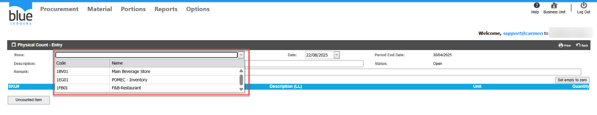
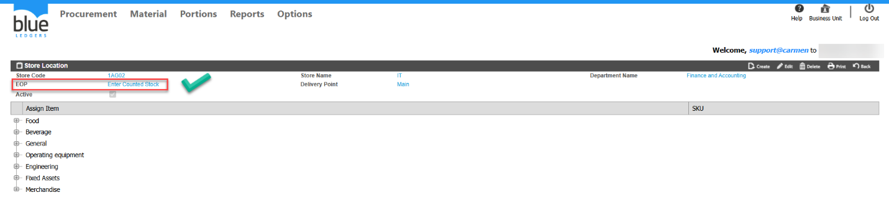
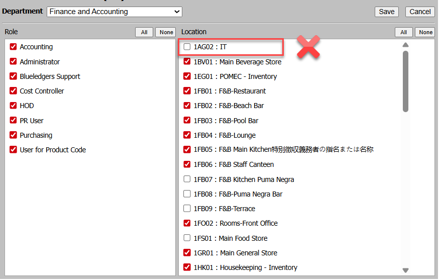
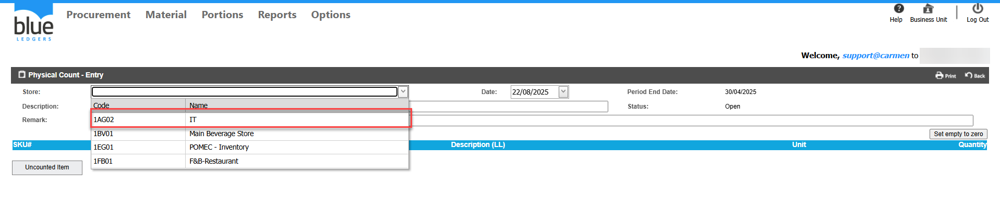

# สร้างเอกสาร Physical Count \(Closing Balance\) แล้วไม่พบ Store/Location ที่ต้องการนับ

## Sample case

ต้องการ Physical Count ของ Store “IT” แต่เมื่อกด Create แล้วไม่พบ Store ดังกล่าว  

## Cause of problems

ไม่มีการเปิดสิทธิ์การมองเห็น Store ใน User หรือ Type ของ Store  ไม่ใช่ Enter Counted Stock

## Solution

ตรวจสอบข้อมูล 2 ส่วน ดังนี้  
1\.ตรวจสอบว่าStore ดังกล่าวเป็น EOP Type Enter Counted Stock หรือไม่  
  
2\.ตรวจสอบสิทธิ์ในการเข้าถึง Store ของ User   
ไปที่  Options > Administrator > User ยังไม่มีการเปิดการมองเห็นให้ User ดำเนินการให้เรียบร้อย  
  
กด Create อีกครั้ง จะปรากฏ Store IT ขึ้นมาเรียบร้อย ดำเนินการ Physical Count ได้ตามปกติ  

## Tags

Related topics:
