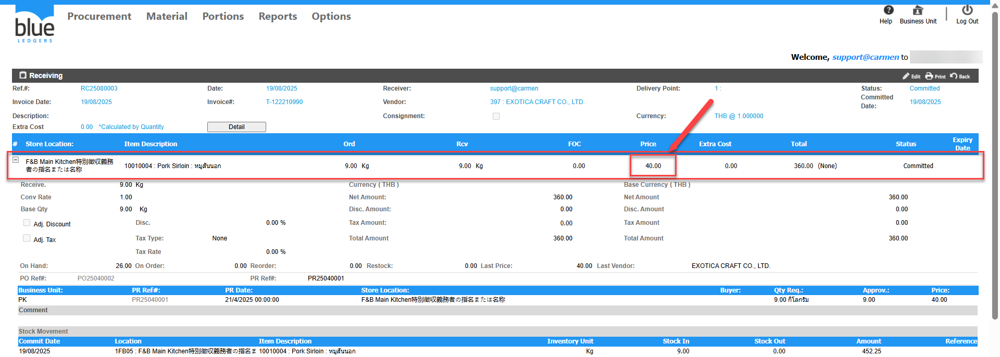

# Cost/Unit ใน Stock Out แสดงไม่เท่ากับ Receiving ที่ต้องการปรับปรุงเกิดจากอะไร

## Sample case

ต้องการทำStock Out รายการ 10010004  Store 1FB05 ด้วยCost 40 ตามเอกสาร RC25080003

## Cause of problems

เอกสาร Stock Out จะบันทึก Cost ตามการคำนวณของระบบ ไม่สามารถกำหนดเองได้  
  

## Solution

ไม่สามารถแก้ไขให้ Stock Out ออกตาม Cost/Unit ของเอกสาร RC ได้เนื่องจาก Cost/Unit จะคำนวณตามวิธีการคำนวณ Cost ที่ตั้งค่าเอาไว้   
1\.วิธีการคำนวณ Cost แบบ Average  
2\.วิธีการคำนวณ Cost แบบ Fifo

## Tags

Related topics:
