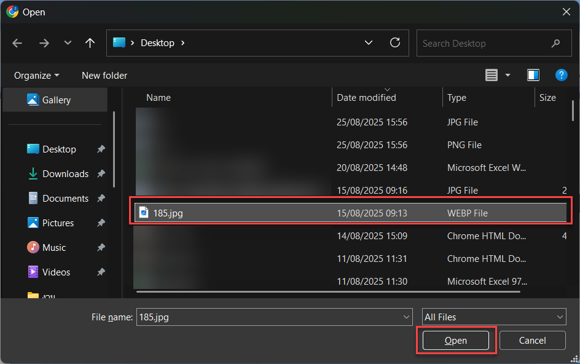
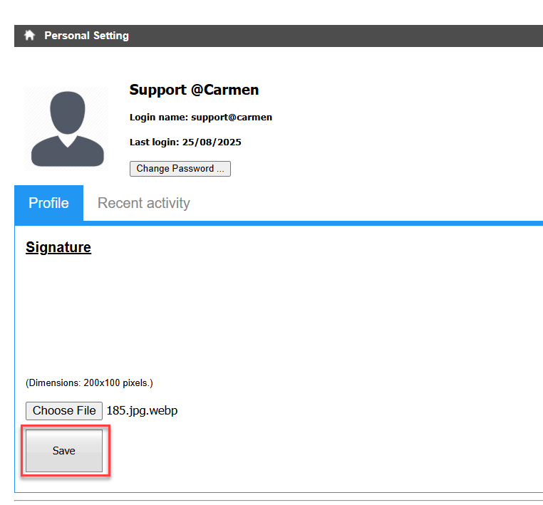
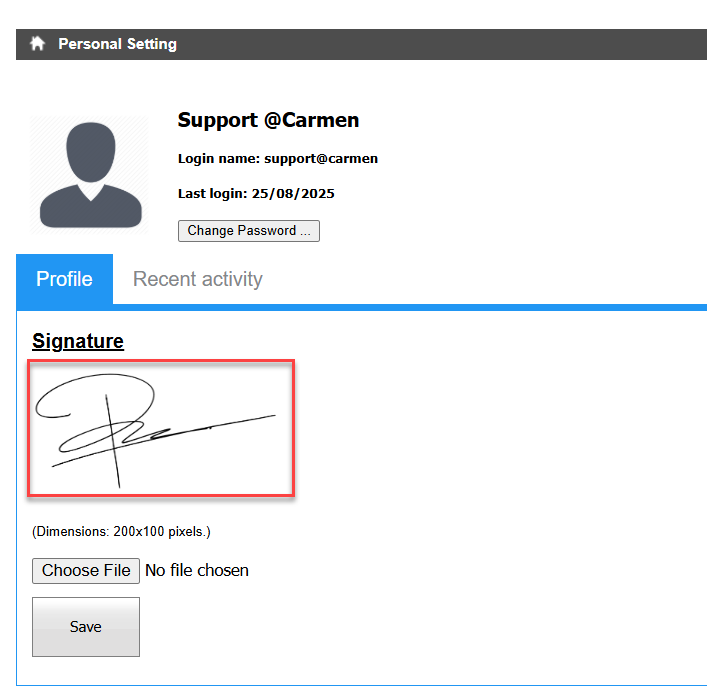

# การเพิ่มหรือเปลี่ยนลายเซ็นต์ของ User

## Sample case

ต้องการเพิ่ม หรือเปลี่ยนเลายเซ็นต์ในระบบ ทำอย่างไร

## Cause of problems

ไม่สามารถลบลายเซ็นต์เดิมได้ ต้องทำการUpdate File ลายเซ็นต์  

## Solution

กำหนดลายเซ็นต์ได้จากหน้าจอ Personal Setting

ไปที่ Options> Personal Setting> Choose File   
เลือก File รูปภาพลายเซ็นต์ ขนาดไม่เกิน \(Dimensions: 200x100 pixels\.\) กด Open และกด Save  
  
  
  
ระบบจะแสดงลายเซ็นต์ที่ทำการอัพโหลดไปจาก File  

## Tags

Related topics:
