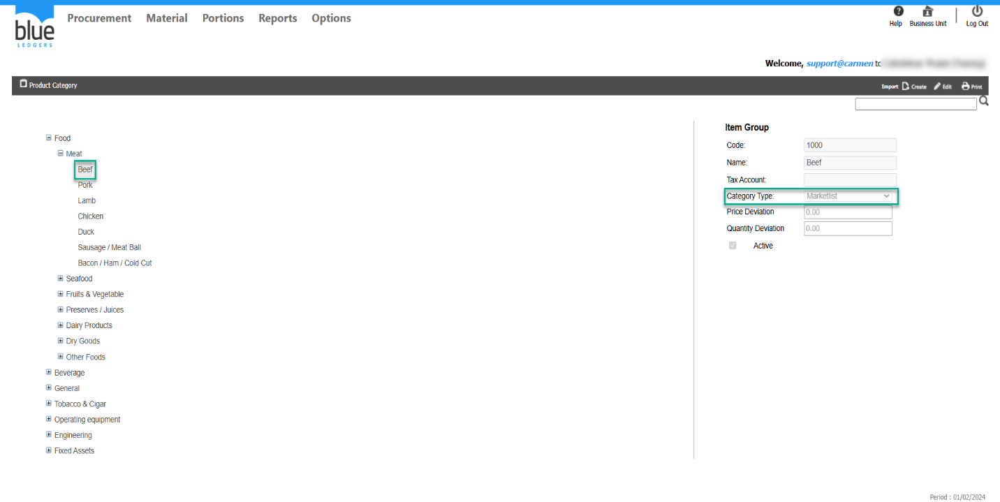

# การตรวจสอบว่าสินค้าอยู่ในหมวด PR Type อะไร

## Sample case

สร้าง PR แล้วแต่ไม่พบ Product 10000001 จึงต้องการตรวจสอบว่าอยู่ภายใต้ PR Type อะไร

## Cause of problems

Solution: ตรวจสอบข้อมูลจากหน้าจอ Category ตามขั้นตอนดังนี้ 

1\. ตรวจสอบว่า Product อยู่ใน Item group อะไร

ไปที่ Product ที่ต้องการตรวจสอบ ดูส่วนข้อมูลช่อง Item Group ว่าอยู่ Item Group ใด  
  
2\. ตรวจสอบว่า Item Group อยู่ใน PR type อะไร

ไปที่ Procurement > Configuration > Category  
เลือกดูว่า Item Group นั้นอยู่ภายใต้ Category Type ใด   
Market list หรือ General ให้เลือกสร้าง PR Type ให้ถูกต้อง เนื่องจากตัวระบบหากสร้าง PR Type General ก็จะไม่พบProduct ที่อยู่ในหมวด Category Type ประภท Market list หรือ Asset   

## Tags

Procurement
