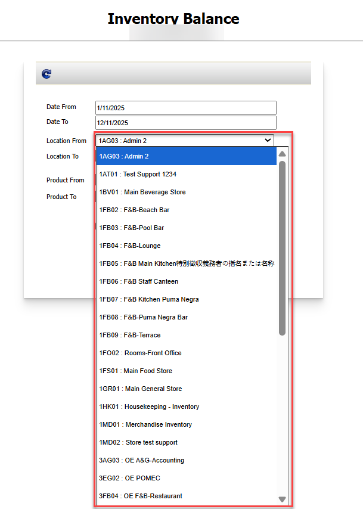
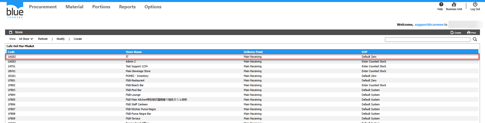

# รายงานเกี่ยวกับ Inventory ไม่แสดง Location ที่ต้องการ เกิดจากอะไร

## Sample case

เรียก Report ในระบบแล้วไม่พบข้อมูล Store  
ที่ Report Inventory Balance

## Cause of problems

เนื่องจากรายงานในส่วนของ Inventory จะแสดงเฉพาะ Store ที่มี EOP Type ประเภท Inventory เท่านั้น โดย EOP type ประเภท Inventory ประกอบด้วย  
1\. EOP : Enter Counted Stock	  
2\. EOP :  Default System  
นั้นแสดงว่า Store ที่ไม่พบที่ Report คือ Store ประเภทค่าใช้จ่าย หรือ EOP : Default Zero  

## Solution

ตรวจสอบว่า Store มี EOP type อะไร

- เข้าไปที่ Procurement > Configuration > Store/Location
- เลือก Store ที่ต้องการตรวจสอบ จากตัวอย่าง คือ Store IT  
\- ดูในช่อง EOP จะแสดงข้อมูล Type Store ดังกล่าว  
จากตัวอย่าง Store IT คือ Store Type Default Zero   
ระบบจึงไม่แสดงข้อมูล Inventory ของ Store นี้

## Tags

Procurement
