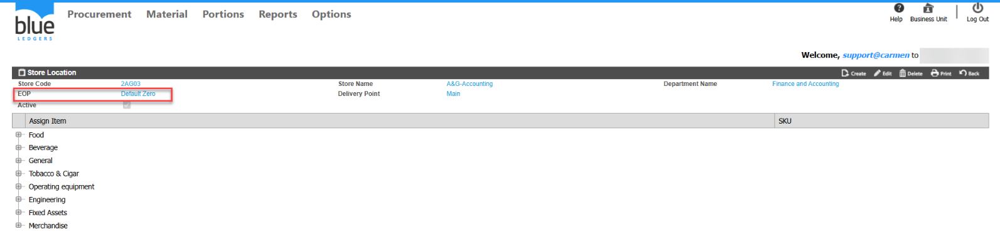
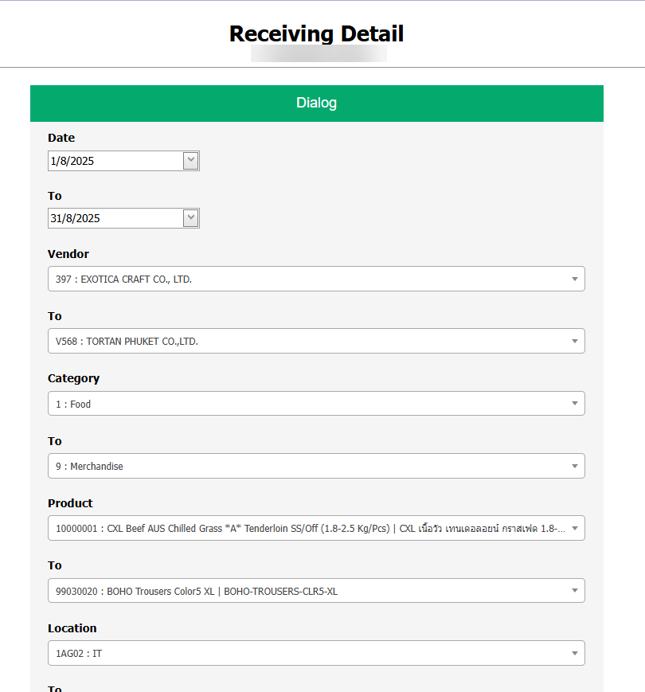

# เรียกดู Report Inventory Balance แต่ไม่พบ Store ที่ต้องการ เกิดจากอะไร

## Sample case

ต้องการเรียกดู Store 2AG03 ในรายงานแต่ค้นหาไม่พบ

## Cause of problems

Store เป็น Type แบบค่าใช้จ่าย Default Zero  

## Solution

ตรวจสอบว่าStore ดังกล่าวเป็น Enter Counted Stock หรือ Default System หรือไม่   
สังเกตุในช่อง EOP ว่าแสดงเป็นประเภทใด   
  
หากเป็น Default Zero ระบบจะไม่ปรากฏข้อมูลเนื่องจากเป็นStore ค่าใช้จ่ายครับ   
หากเป็นการทำ Receiving ให้ใช้Report Receiving Detail และเลือกวันที่ทำรับเพื่อดูข้อมูล   

## Tags

Related topics:
