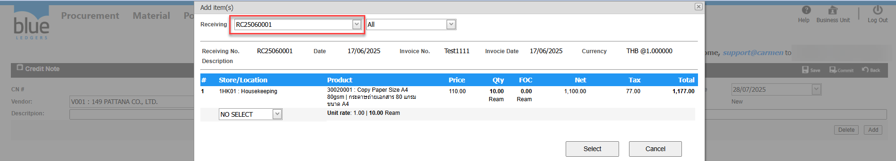

# สร้างเอกสาร Credit Note แต่หาเอกสาร Receiving ไม่พบเกิดจากอะไร

## Sample case

ต้องการทำ Credit Note จากเอกสาร RC25030019 แต่เมื่อค้นหาแล้วไม่พบเอกสารใบนี้  
  
Cause of problem : เลือก Date ใน Credit Note ก่อน วันที่ของเอกสาร Receiving

## Solution

ตรวจสอบเอกสาร Receiving ว่า Date เป็นวันที่ใด และเลือก Date ในเอกสาร CN ให้เป็นวันเดียวกัน หรือเป็นวันที่อยู่หลังจากวันที่ Receiving  
จากตัวอย่างคือ 17/06/2025 ระบบยึดจาก Date ของเอกสาร Receiving  
  
  

## Tags

Related topics:
