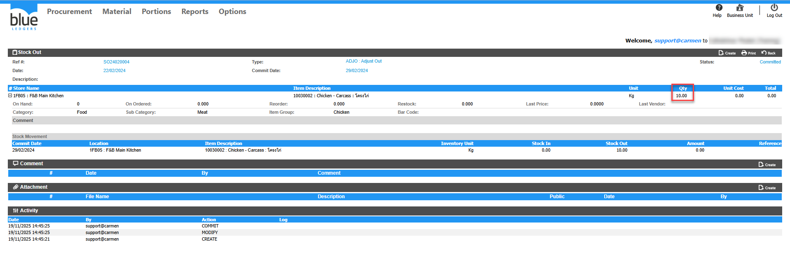
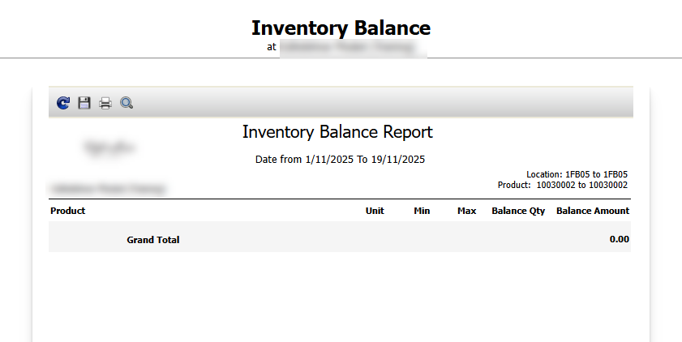

# การปรับปรุง on hand ให้เป็น 0 ก่อน ยกเลิกใช้งานใน location ที่ต้องการ จะต้องทำอย่างไร

## Sample case

Product 10030002 ปรากฏ on hand ที่รายงาน Inventory Balance ที่ location 1FB05 : F&B Main Kitchen แต่ต้องการจะเยิกเลิกการใช้สินค้าใน location นี้แล้ว

## Cause of problems

สินค้าที่มีข้อมูล On hand อยู่จะยังแสดงในรายงานแม้จะยกเลิกการ assign store/location ไปแล้ว  

## Solution

1\.ทำเอกสาร Stock Out ออกให้เป็น 0 โดยตรวจสอบยอดของคงค้างด้วย Report  Inventory Balance จากตัวอย่าง คือ Qty คงค้าง 10 Kg   
  
2\. ตรวจสอบรายงาน Inventory Balance ว่ายังมี Qty คงเหลืออีกหรือไม่  
จากตัวอย่างรายงานจะไม่แสดงสินค้าคงเหลือแล้ว  

## Tags

Related topics:
