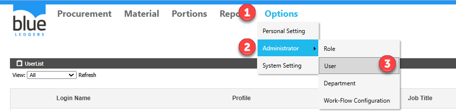
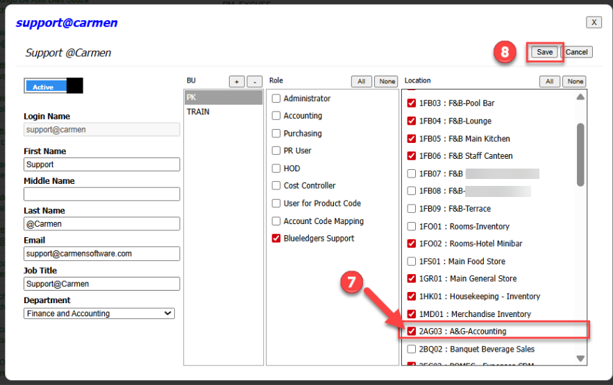

# สร้าง PR แต่ไม่พบ Location ที่ต้องการขอซื้อ

## Sample case

ต้องการสร้าง PR ของ Location A&G\-Accounting แต่ไม่พบ  A&G\-Accounting

## Cause of problems

: User ไม่ได้รับการ Assign  Location เอาไว้ ระบบจึงไม่แสดง Store/Location ขึ้นมาให้เลือก  

## Solution

Assign location ให้กับ user ที่ต้องการ

 เข้าเมนู  
1\.Options  
2\.Administrator  
3\.User  
  
4\.คลิก User ที่ติดปัญหา จากตัวอย่าง คือ User: Support   
  
  
  
  
  
  
5\.คลิกเลือก BU ที่ใช้งานจากตัวอย่างคือ BU PK   
6\.กดปุ่ม Edit  
  
7\.เลือก Store A&G\-Accounting   
8\.กด Save   
  
  
กลับมาที่เอกสาร PR ก็จะพบ Location A&G\-Accounting ให้คลิกเลือกแล้วครับ ตามรูปภาพด้านล่าง  

## Tags

Related topics:
