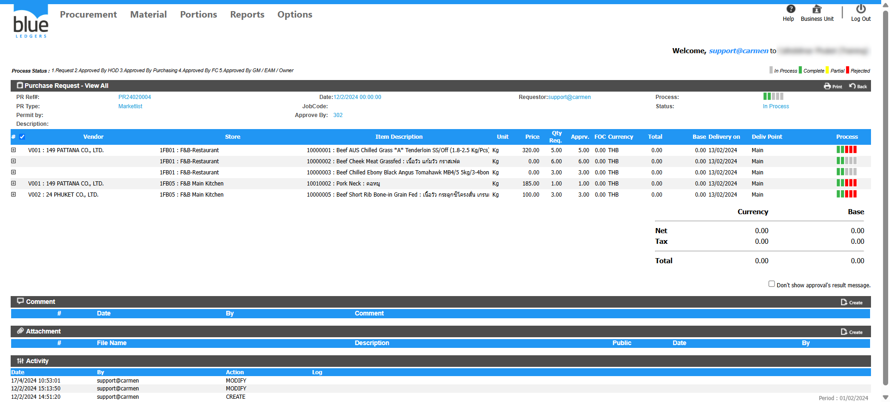
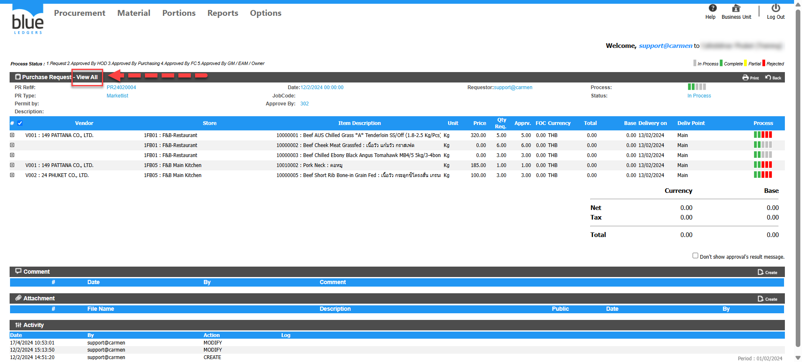
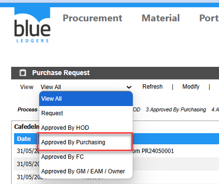
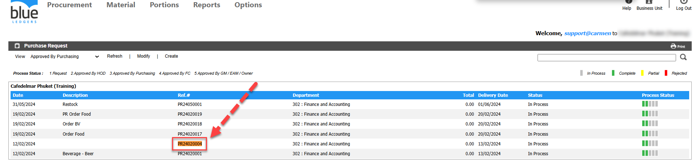

# เปิดเอกสาร PR แล้ว ไม่พบปุ่ม Approved เกิดจากอะไร

## Sample case

เปิดเอกสาร PR24020004 แล้วไม่พบปุ่มปุ่ม Approved/Reject/Send Back ให้กด  

## Cause of problems

สาเหตุเกิดจากการเปิดเอกสารเมื่ออยู่ในหมวด View All ทำให้ไม่สามารถแก้ไขหรือ approve ได้  
  
  
  
  
  
  
Solutions : ให้เลือกขั้นตอนการ Approve ก่อน ที่จะเลือกเอกสาร PR ตามขั้นตอนดังนี้

1. ไปที่หัวข้อ View 
2. เลือก Approval step ที่ต้องการ approve แล้วระบบจะแสดง list ของ PR ที่รอการ approve  
  
  
3\. ทำการคลิกที่ PR24020004 หรือหมายเลข PR ที่ต้องการ approve  
  
4\. จะพบว่าปุ่ม Approved/Reject/Send Back ปรากฏขึ้นมาแล้วตามรูปภาพ

## Tags

Procurement
