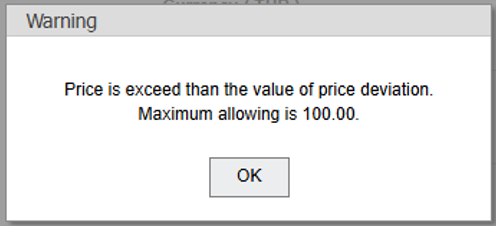
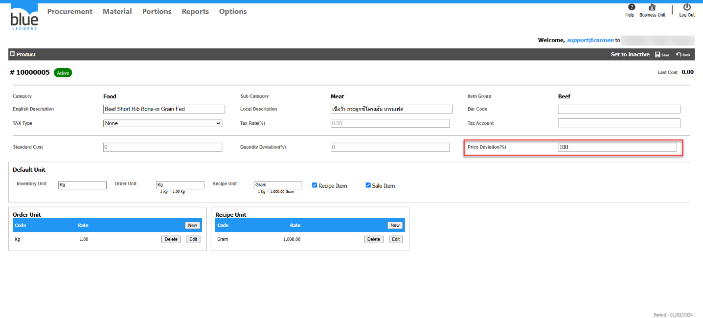
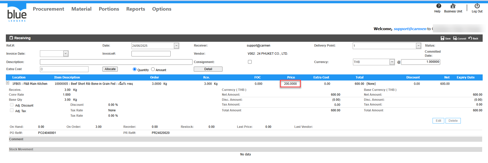

# Receiving รับเกินราคาจาก PO ไม่ได้ ระบบแจ้ง Warning “Price is exceed than the value of price deviation”

## Sample case

ต้องการทำเอกสาร Receiving เพื่อรับสินค้า 10000005 ด้วยราคามากกว่า PO คือ Price 20  

## Cause of problems

เอกสาร Receiving ทำการรับสินค้าด้วยราคาที่มากกว่า Price Deviation\(%\) ที่กำหนเอาไว้ใน Product

## Solution

กำหนด % ของ Price deviation ใน Product ให้เพียงพอต่อการรับสินค้า \(Receiving\) ตามขั้นตอนดังนี้  
1\. ไปที่ Product 10000005   ทำการแก้ไข Price Deviation\(%\) ส่วนของราคา เป็น 100% กด Save  
  
2\. กลับไปที่เอกสาร Receiving ใส่ราคาที่ต้องการ กด Save ตามปกติ  

3\. ดำเนินการทำ Receiving  ได้เสร็จเรียบร้อย 
