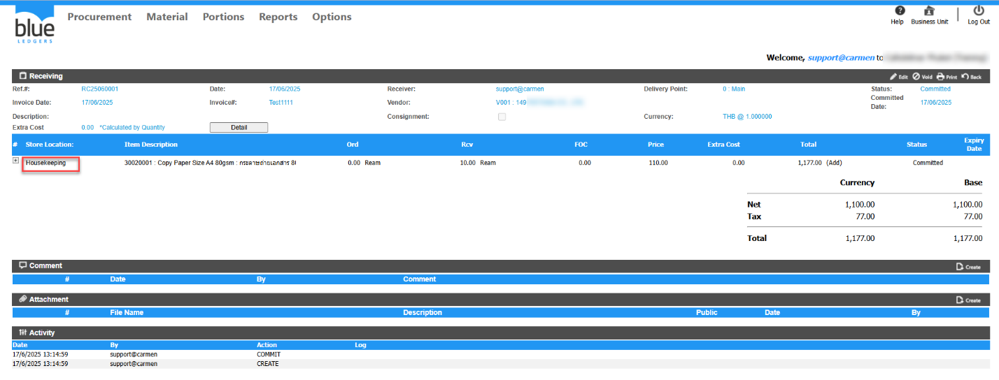
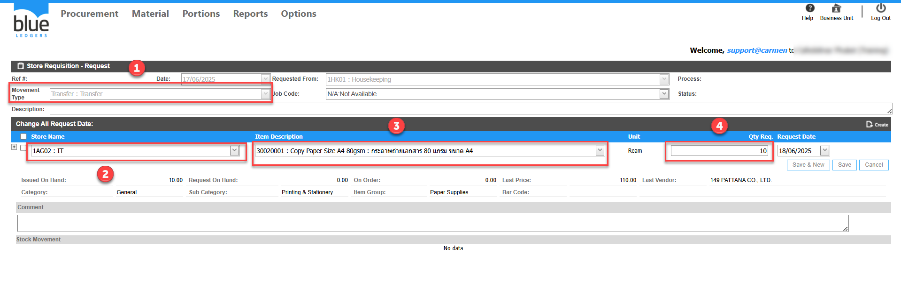
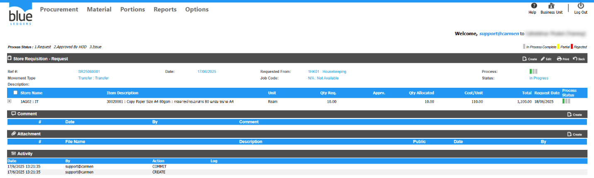
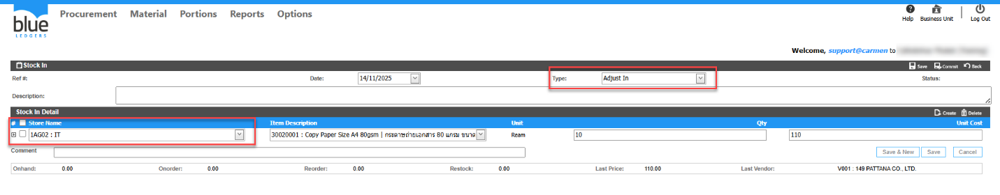

# Receiving แบบ Inventory ทำรับผิด Store จะปรับปรุงข้อมูลให้ถูกต้องได้อยางไร

## Sample case

จะซื้อของเข้า Store IT แต่รับผิดเข้าไปที่ HK Housekeeping แต่เอกสาร Receiving Commit แล้ว แก้ไขได้อย่างไร

## Cause of problems

ทำรับเข้าผิด Store   

## Solution

สามารถแก้ไขได้ 2 วิธี ดังนี้  
1\. ปรับปรุง stock สินค้าด้วยการทำ Store Requisition แบบ Transfer  
1\.1\.ทำการสร้างเอกสาร SR ในส่วนหัวข้อ Movement Type เลือกเป็นประเภท Transfer  
1\.2\.เลือก Store ที่ต้องการ  
1\.3\.เลือกรายการที่ต้องการ  
1\.4\.เลือกจำนวน Qty ของรายการ  
   
  
  
  
  
  
กด Commit เสร็จเรียบร้อย ของก็จะถูกย้ายจาก Store  Housekeeping ไปที่ Store IT เรียบร้อย  
  
2\. ปรับปรุง Stock สินค้าด้วยเอกสาร Stock in และ Stock out 

2\.1\.ทำ Stock Out ออกจาก Store  Housekeeping เพื่อตัดของออกให้ถูกต้อง  
  
2\.2\.ทำ Stock IN เข้าที่ Store IT เพื่อเพิ่มของเข้าไปที่Store ที่ถูกต้อง  
  
เมื่อดำเนินการเรียบร้อยแล้วของก็จะถูกตัดออกจากStore ที่รับผิดและทำการStock in เข้าในStore ที่ถูกต้อง จากตัวอย่างคือStore IT

## Tags

Procurement
