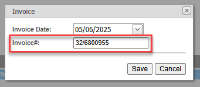

# ต้องการแก้ไข Invoice Number ของเอกสาร Receiving แต่ Status Committed แล้วทำอย่างไร

## Solution

เอกสาร Receiving ที่ Status Committed แล้วจะสามารถแก้ไขได้ 2 ส่วน ดังนี้  
1\. Invoice Date\(วันที่ของใบแจ้งหนี้\)  
2\. Invoice\#\(หมายเลขใบแจ้งหนี้\)  
วิธีแก้ไข  
ไปที่เอกสาร Receiving \(ตัวอย่าง RC25060108\)   
กดปุ่ม Edit   
  
  
  
  
  
  
  
ทำการแก้ไขหมายเลข Invoice\#: แล้วกด Save หลังแก้ไขข้อมูลให้ดำเนินการ Posting from Receiving ไปที่ AP อีกครั้ง

## Tags

Procurement
