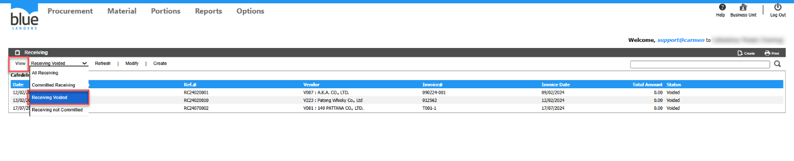
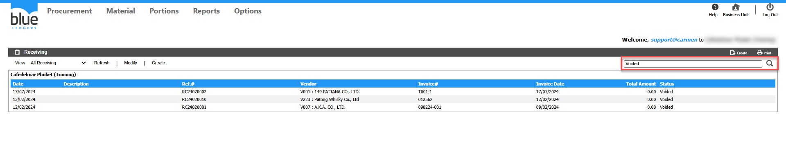

# วิธีเรียกดู Receiving ที่มี Status Void

## Sample case

ต้องการดูว่ามีเอกสาร Receiving หมายเลขใดบ้างที่ถูก Void ไป

## Cause of problems

Solution:สามารถดูได้ 2วิธี  
1\.กด View เลือก Receiving Voided ก็จะแสดงเอกสารที่มี Status Voided ในระบบทั้งหมด  
  
2\.พิมพ์ค้นหา Receiving ในช่องค้นหา ว่า “Voided” ก็จะแสดงเอกสารที่มี Status Voided ในระบบทั้งหมด  

## Tags

Related topics:
