---
title: "Receiving"
weight: 3
---
# Receiving

## Receiving (การรับสินค้า)

**Receiving** คือ function ในการสร้างใบรับสินค้าในระบบ โดยสามารถรับสินค้าจากเอกสารใบสั่งซื้อ (Purchase Order) หรือรับสินค้าแบบ Manually

สามารถเข้าถึง function นี้โดยไปที่ “Procurement” จากนั้น click “Receiving”

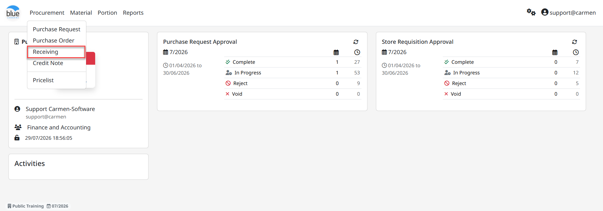

1. การสร้างเอกสารใบรับสินค้า “Receiving” สามารถทำได้ 2 วิธี

1. “From Purchase Order” การสร้างเอกสารใบรับสินค้า จาก ใบขอซื้อ

1. click “New” - “From Purchase Order”

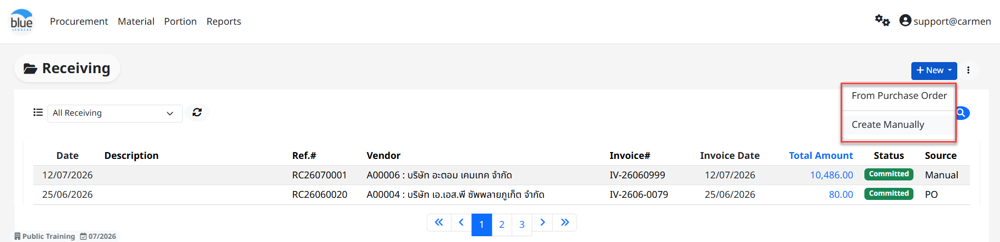

- เลือก “Vendor” ที่ต้องการ

- Click เครื่องหมายถูกที่หมายเลข PO ที่ต้องการทำ Receiving

- Click “OK” เพื่อ ตกลง

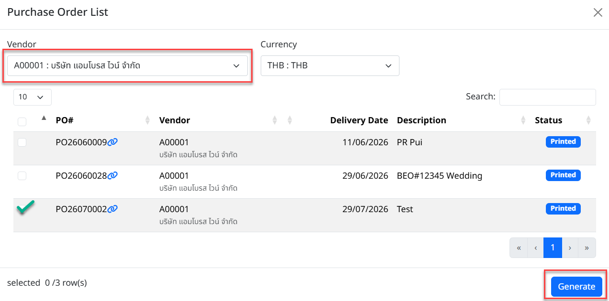

- ระบบจากแสดง Location สำหรับทำรับสินค้า และในกรณี PO มีหลาย Location และผู้ใช้งานต้องการทำรับสินค้าในครั้งเดียว สามารถ Click “All Location” เพื่อทำรับสินค้าพร้อมกันทุก Location

- Click “Create” เพื่อเข้าสู่ขั้นตอนการรับสินค้าในระบบ Receiving ต่อไป

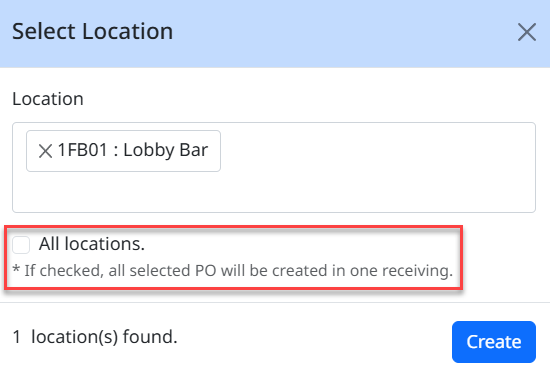

กรอกข้อมูลในส่วนของ Header ดังนี้

> **หมายเหตุ** เครื่องหมาย \* คือช่องที่จำเป็นต้องระบุ

- \*“Date” วันที่ทำ Receiving (มีผลกับ “Input Date” ใน “Invoice” ที่ Module AP)

- \*“Invoice Date” วันที่ของ Invoice ตามเอกสารจริงที่ได้รับจาก Vendor

- “Invoice No.” เลขที่ของ Invoice ตามเอกสารจริงที่ได้รับจาก Vendor

- “Delivery Point” เพื่อเลือกจุดรับสินค้า ที่ต้องการ (ในกรณี ที่มี มากกว่าหนึ่งจุด)

- “Vendor” ระบบแสดงชื่อร้านค้าจากใบสั่งซื้อ

- “Currency” หากมีการใช้สกุลเงินอื่นๆ และสามารถแก้ไข Rate ที่ต้องการได้

- “Description” เพื่อใส่คำอธิบาย เอกสารใบรับสินค้า

- Click “Active” Consignment ในกรณีที่เป็นของฝากขาย ที่ต้องการรับรู้ข้อมูลเข้าระบบ Inventory แต่ไม่ต้องการบันทึกบัญชี (ระบบจะไม่ส่งข้อมูล Receiving ไปที่ Module AP)

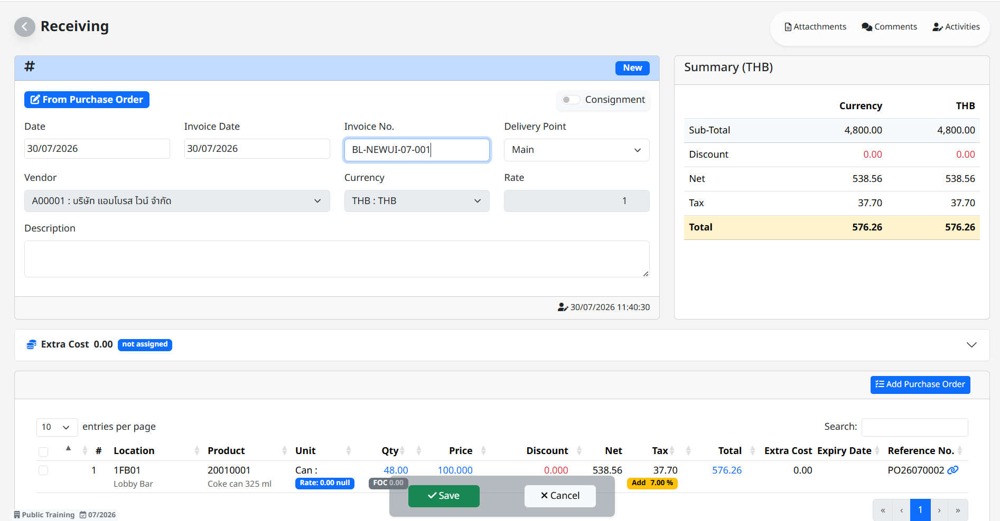

- “Extra Cost” การนำต้นทุนอื่น ๆ เช่น ค่าขนส่ง ค่าอากรขาเข้า มาบันทึกเพื่อเพิ่มต้นทุนให้กับสินค้าใน Receiving ใบนี้

- “Save” เมื่อทำการบันทึกการรับสินเค้าแล้ว เอกสาร Receiving จะอยู่ในสถานะ “Received” โดย Status สถานะของเอกสารประกอบด้วย (Received, Committed, Void)

- “Committed Date” คือวันที่ที่ทำการกด Commit

  1. การตรวจรับสินค้าในระบบ Receiving และการแก้ไขจำนวนรับสินค้าจาก PO

- Click “Edit” เพื่อแก้ไขรายข้อมูลการรับสินค้า

- Click ที่รายการสินค้าเพื่อแก้ไขจำนวนรับสินค้ารวมถึงแก้ไข

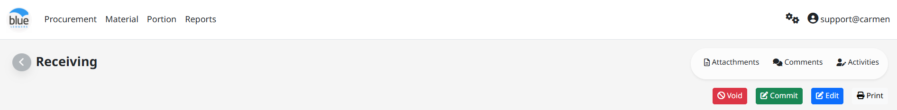

แก้ไขข้อมูลในส่วนของ detail ของ สินค้าในเอกสารใบรับสินค้าดังนี้

**หมายเหตุ** เครื่องหมาย \* คือช่องที่จำเป็นต้องระบุ

- “Location” สถานที่สั่งซื้อสินค้า และรับสินค้า (Cost Center)

- “Product” รายการสินค้า

- “Unit” เลือก Order Unit ที่ต้องการรับสินค้า

- “Price” ใส่ราคาต่อหน่วย

- “Qty” จำนวนสินค้าตามใบสั่งซื้อ

- “FOC” (Free of Charge) ใส่จำนวนของแถมเป็นหน่วยเดียวกับ Order Unit

- Click “Adj. Tax” เพื่อ แก้ไข “Tax Type” และ “Tax Rate” ที่ ต้องการ

  - Tax Type มี 3 ประเภท

- “Added” ใช้สำหรับ “Price” เป็นราคาไม่รวมภาษี

- “Included” ใช้สำหรับ “Price” เป็นราคารวมภาษี

- “None” ใช้สำหรับ “Price” ไม่รวมภาษี

  - Tax Rate ใช้กำหนด % ของภาษี

  - Tax Amount สามารถแก้ไขมูลภาษีตามที่ต้องการ

- Click “Adj. Discount” เพื่อแก้ไข

  - Discount (%) ใส่ส่วนลด % ที่ต้องการ

  - “Disc Amount” สามารถแก้ไขมูลค่าส่วนลดที่ต้องการ

- ใส่ “Comment” อธิบายข้อมูลเพิ่มเติมของสินค้า

- Click “Save” เพื่อบันทึก หรือ “Cancel” เพื่อยกเลิก

- การบันทึกข้อมูลสินค้า

  - Click “Save” เพื่อบันทึก หรือ “Cancel” เพื่อยกเลิก

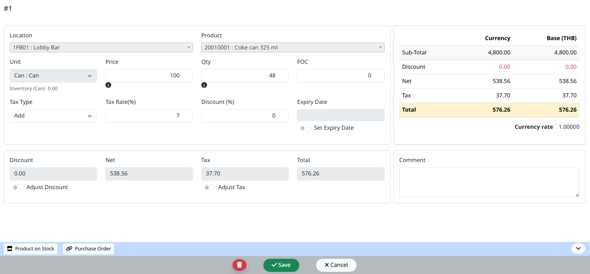

2. “Create Manually” การสร้าง เอกสารใบรับสินค้า ด้วยตนเอง

1. Click “New” - “Create Manually”

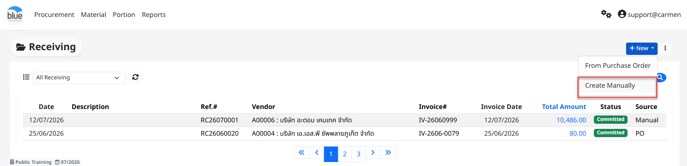

## กรอกข้อมูลในส่วนของ Header ดังนี้

- “Date” วันที่ทำ Receiving (มีผลกับ “Input Date” ใน “Invoice” ที่ Module AP)

- “Invoice Date” วันที่ของ Invoice ตามเอกสารจริงที่ได้รับจาก Vendor

- “Invoice#” เลขที่ของ Invoice ตามเอกสารจริงที่ได้รับจาก Vendor

- “Delivery Point” เพื่อเลือกจุดรับสินค้า ที่ต้องการ (ในกรณี ที่มี มากกว่าหนึ่งจุด)

- “Vendor” ระบบแสดงชื่อร้านค้าจากใบสั่งซื้อ

- “Currency” หากมีการใช้สกุลเงินอื่นๆ และสามารถแก้ไข Rate ที่ต้องการได้

- “Description” เพื่อใส่คำอธิบาย เอกสารใบรับสินค้า

- Click เครื่องหมายถูก “Consignment” ในกรณีที่เป็นของฝากขาย ที่ต้องการรับรู้ข้อมูลเข้าระบบ Inventory แต่ไม่ต้องการบันทึกบัญชี (ระบบจะไม่ส่งข้อมูล Receiving ไปที่ Module AP)

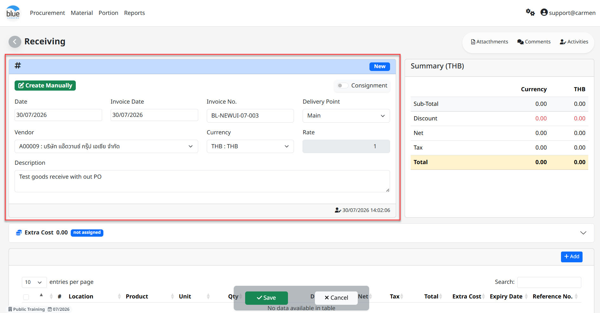

- “Extra Cost” การนำต้นทุนอื่น ๆ เช่น ค่าขนส่ง ค่าอากรขาเข้า มาบันทึกเพื่อเพิ่มต้นทุนให้กับสินค้าใน Receiving ใบนี้

## ขั้นตอนการเพิ่มรายการสินค้าใน Receiving เพื่อรับสินค้าเข้าระบบ

- กด “**+**Add” เพื่อเพิ่มสินค้าที่ต้องการทำรับ

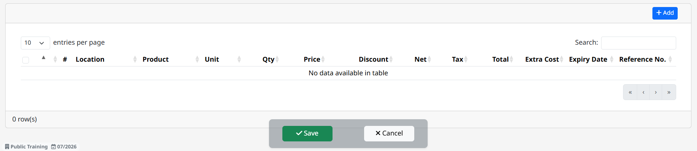

กรอกข้อมูลในส่วนของ detail ของ สินค้าในเอกสารใบรับสินค้าดังนี้

**หมายเหตุ** เครื่องหมาย \* คือช่องที่จำเป็นต้องระบุ

- “Location” สถานที่สั่งซื้อสินค้า และรับสินค้า (Cost Center)

- “Product” รายการสินค้า

- “Unit” เลือก Order Unit ที่ต้องการรับสินค้า

- “Price” ใส่ราคาต่อหน่วย

- “Qty” จำนวนสินค้าตามใบสั่งซื้อ

- “FOC” (Free of Charge) ใส่จำนวนของแถมเป็นหน่วยเดียวกับ Order Unit

- Click “Adj. Tax” เพื่อ แก้ไข “Tax Type” และ “Tax Rate” ที่ ต้องการ

  - Tax Type มี 3 ประเภท

- “Added” ใช้สำหรับ “Price” เป็นราคาไม่รวมภาษี

- “Included” ใช้สำหรับ “Price” เป็นราคารวมภาษี

- “None” ใช้สำหรับ “Price” ไม่รวมภาษี

  - Tax Rate ใช้กำหนด % ของภาษี

  - Tax Amount สามารถแก้ไขมูลภาษีตามที่ต้องการ

- Click “Adj. Discount” เพื่อแก้ไข

  - Discount (%) ใส่ส่วนลด % ที่ต้องการ

  - “Disc Amount” สามารถแก้ไขมูลค่าส่วนลดที่ต้องการ

- ใส่ “Comment” อธิบายข้อมูลเพิ่มเติมของสินค้า

- Click “Save” เพื่อบันทึก หรือ “Cancel” เพื่อยกเลิก

- การบันทึกข้อมูลสินค้า

  - Click “Save” เพื่อบันทึกรายการสินค้าที่ทำรับ หรือ “Cancel” เพื่อยกเลิก

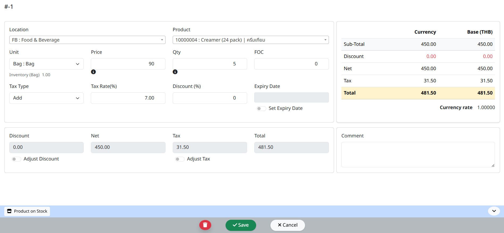

2. การบันทึกเอกสารในหน้าหลักของใบรับสินค้า

- Click “Save” เพื่อ บันทึก ใบรับสินค้า สามารถกลับมา Edit, Void หรือ Commit ภายหลังได้)

- เมื่อ Click “Save” ระบบจะแสดงข้อความตอบรับ

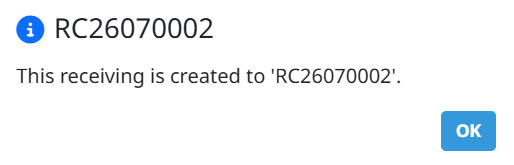

3. การ Commit เอกสาร ใบรับสินค้า

1. Click “Commit” เพื่อยืนยันเอกสารการรับสินค้า

2. เมื่อ Commit ระบบจะทำการบันทึกข้อมูลลงระบบ Inventory ให้ตาม Commit Date

3. เมื่อเอกสารถูก Commit จึงจะสามารถส่งข้อมูลไปที่ module AP Invoice ได้

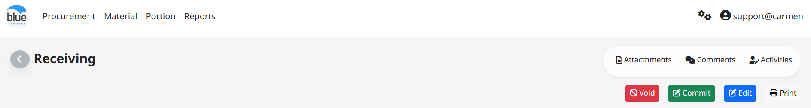

4. Function อื่น ๆ ของ Receiving

1. “Edit” ใช้สำหรับ แก้ไข เอกสารใบรับสินค้า

2. Void” ใช้สำหรับ Void เอกสารใบรับสินค้า

3. “Print” ใช้สำหรับ print แบบฟอร์ม เอกสารใบรับสินค้า ในระบบ

4. “Back” กลับสู่หน้าเมนู Receiving

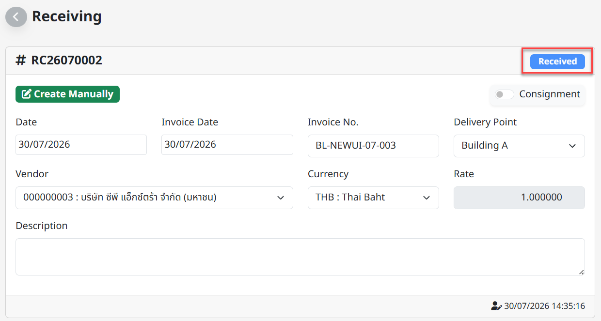

5. Extra Cost

> Function นี้ใช้กรอกข้อมูลในส่วนของ Extra Cost (หากมี) เช่น ค่าภาษีนำเข้า, ค่าขนส่งจากต่างประเทศ เป็นต้น เพื่อเพิ่มมูลค่าของ “Inventory Cost” ให้กับสินค้าในเอกสาร Receiving ใบนี้

1. ขั้นตอนการบันทึก Extra Cost

1. กด “Edit” เพื่อแก้ไขเอกสาร Receiving

2. ประเภทการคำนวณ Extra Cost

- “Quantity” คำนวณ Extra Cost โดยเฉลี่ยตามจำนวนของสินค้า

- “Amount” คำนวณ Extra Cost โดยเฉลี่ยตามมูลค่าของสินค้า

  1. “Detail” เพื่อ เลือก ประเภท “Extra Cost”

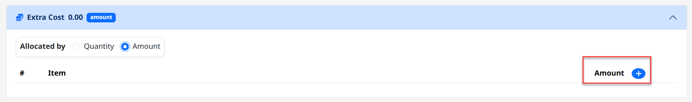

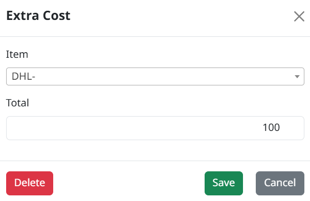

2. เลือก “Extra Cost” ที่ต้องการ

3. ใส่ มูลค่า ของ “Extra Cost”

4. Click “**+**Amount” เพื่อเพิ่มประเภทของ “Extra Cost” และสามารถเพิ่มได้มากกว่า 1 รายการ

5. Click “Save and Allocate” เพื่อ บันทึก และ Allocate หรือ “Cancel” เพื่อ ยกเลิก

6. ระบบจะทำการบันทึก Extra Cost ให้สินค้าแต่ละรายการ

7. กด “Save” เพื่อเสร็จสินการบันทึก Extra Cost ให้เอกสาร Receiving

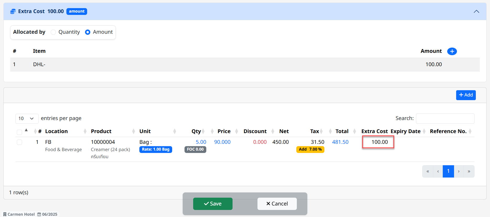

6. การ ค้นหา และ View เอกสารใบรับสินค้า

1. หลังจากที่เข้ามาในหน้า Receiving แล้วสามารถ เลือก View ได้ด้วย Status ต่างๆ

2. สามารถค้นหา เอกสารใบรับสินค้า ที่ต้องการ โดย พิมพ์ค้นหา ในช่อง Search

3. การ View เอกสารใบรับสินค้า ทำได้โดยการเลือก เอกสารใบรับสินค้า ที่ต้องการ เพื่อ แสดงรายละเอียดของ เอกสารใบรับสินค้า นั้นๆ

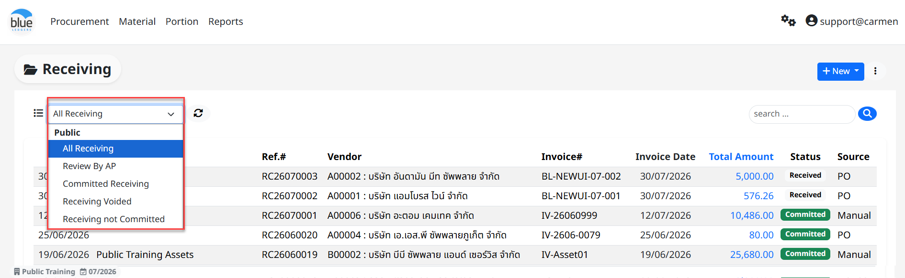

7. การ Comment หรือ แนบไฟล์ Attachment ในเอกสาร Receiving

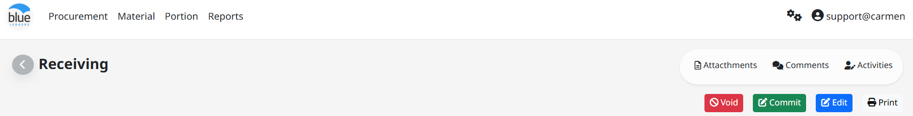

1. การเพิ่ม Comment ในเอกสาร ใบขอซื้อเพื่อเป็นการสื่อสารภายใน

- Click “Comment”

- ใส่ “Comment” ที่ต้องการ

- Click “Send” เพื่อบันทึกข้อมูล

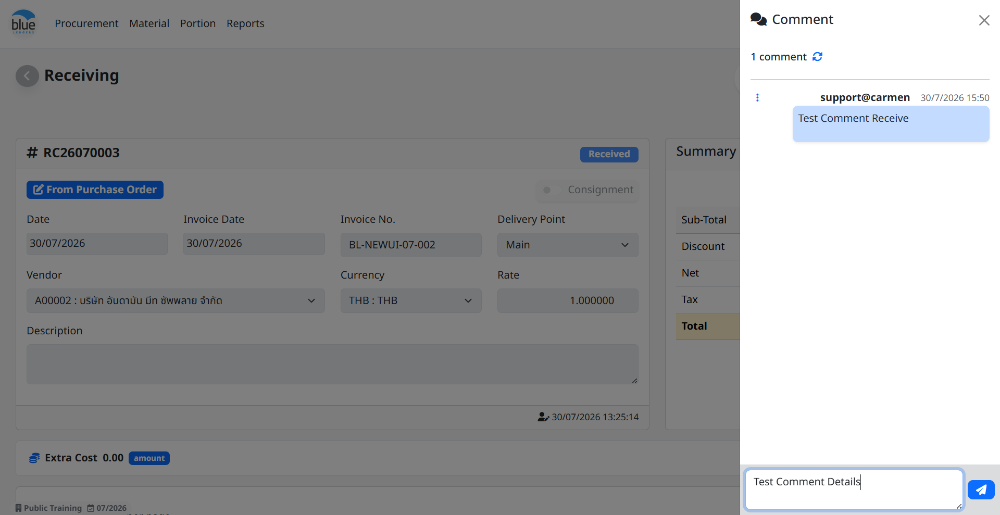

1. การแนบไฟล์ Attachment ในเอกสาร ใบขอซื้อ เพื่อแนบเอกสารประกอบการขอซื้อ

- Click “Attachment”

- เลือก “Choose File” เพื่อเลือก File ที่ต้องการแนบ

- Click “Upload” เพื่อบันทึกข้อมูล

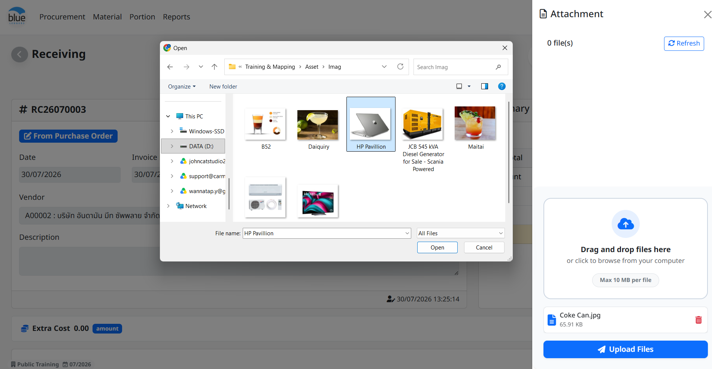
