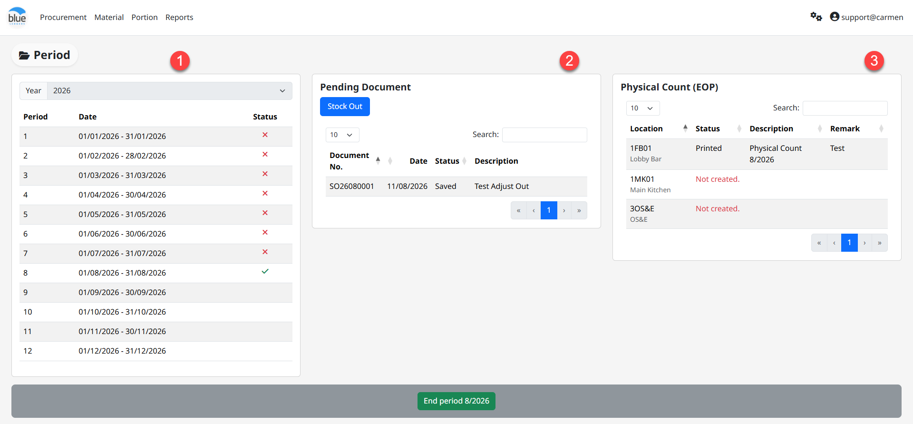

---
title: "Close Period"
weight: 5
---
# Close Period

**Close Period** คือ การปิดรอบบัญชีในระบบสินค้าคงคลัง ซึ่งมีส่วนประกอบ 3 ส่วน ดังนี้

1. Period Status แสดงสถานะ Close Period โดยมีสัญลักษณ์ “” แสดงสถานะ Current Period

2. Pending Document แสดงเอกสารค้างรับสินค้าใน “Status Received” ซึ่งต้องดำเนินการ Commit เอกสารให้เรียบร้อยเสียก่อนถึงจะสามารถ Close Period ได้

3. Physical Count (EOP) แสดงสถานะเอกสารตรวจนับ ซึ่งระบบจะตรวจสอบจาก Location ประเภท Enter Count Stock โดยมีสถานะเอกสาร ดังนี้

- Not created ยังไม่ได้สร้างเอกสารตรวจนับ

- Printed สร้างเอกสารแล้วและอยู่ระหว่างการดำเนินการ

เมื่อดำเนินการครบถ้วนใน Step ที่ 2 และ 3 เรียบร้อยแล้ว สามารถ Click “End Period” เพื่อปิดระบบ Inventory ประจำเดือน
