**Closing Balance**

**Closing Balance** (EOP) คือ การตรวจนับสินค้าคงเหลือเพื่อปิดระบบสินค้าคงคลัง (ใช้กับ Location ประเภท Enter Count Stock) โดยมีขั้นตอนในการทำงานดังต่อไปนี้

1.  Click **“**Material**”** และเลือก “Closing Balance”

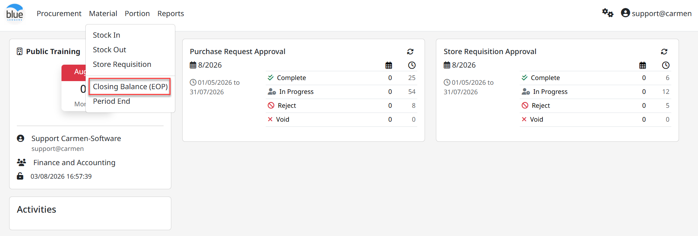

1.  Click ปุ่ม Create เพื่อสร้างเอกสารตรวจนับ (Physical count)

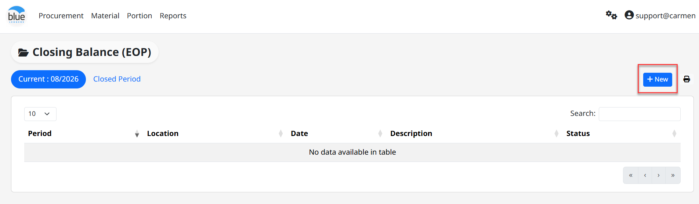

2.  Click สัญลักษณ์ “” เพื่อสร้างเอกสารตรวจนับ

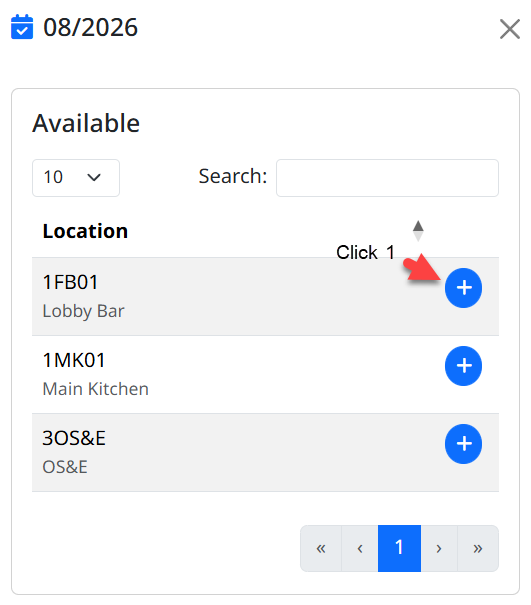

3.  ระบุข้อมูลเอกสารตรวจนับ

- Date วันที่ทำเอกสาร

- Description ระบุรายเอียดเพิ่มเติม

- Remark ระบุรายละเอียดงาน หรือระบุเงื่อนไขการจัดทำเอกสาร

  1.  Click “Save & Print” เพื่อบันทึกข้อมูลและ Print เอกสารตรวจนับ

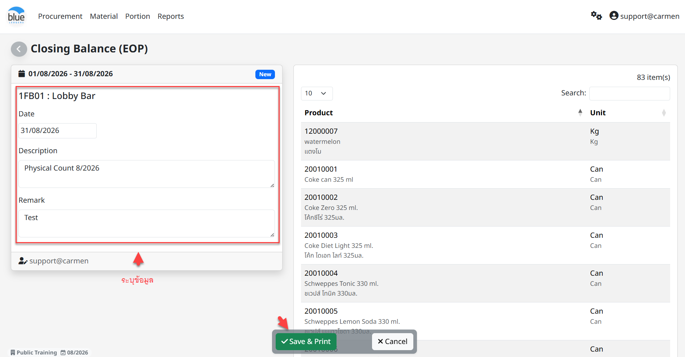

**ระบบแสดง Print Pre-View**

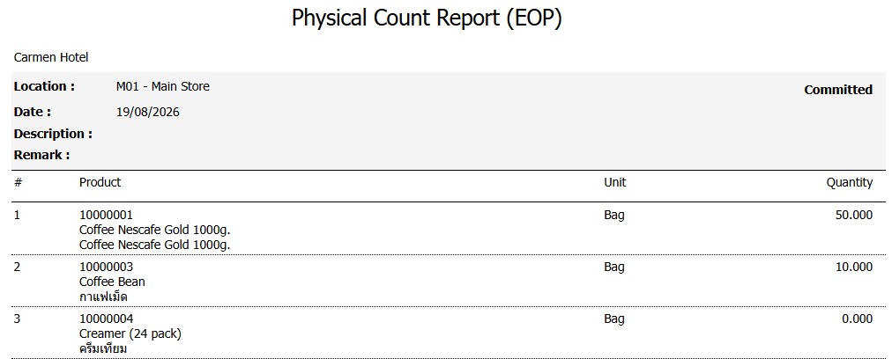

2.  ขั้นตอนการบันทึกข้อมูลการตรวจนับสินค้า โดยสามารถทำได้ 2 วิธี คือ

    1.  Manual Fill In คือ การบันทึกข้อมูลด้วยตนเอง

- Click “เอกสาร” เพื่อเข้าสู่ขั้นตอนการบันทึกยอดสินค้าคงเหลือ

- Click “Edit” เพื่อแก้ไขเอกสาร

- Click “Set Empty to Zero” เพื่อให้ทุกรายการสินค้าแสดงค่าเป็น 0

- Fill In กรอกตัวเลขสินค้าคงเหลือใสรายการสินค้าที่มียอดคงเหลือ

  1.  Export/Import คือ การบันทึกข้อมูลจากการนำเข้าข้อมูลจาก Excel File (.csv)

<!-- -->

- Click สัญลักษณ์ “” และเลือก “Export” เพื่อส่งออก Template

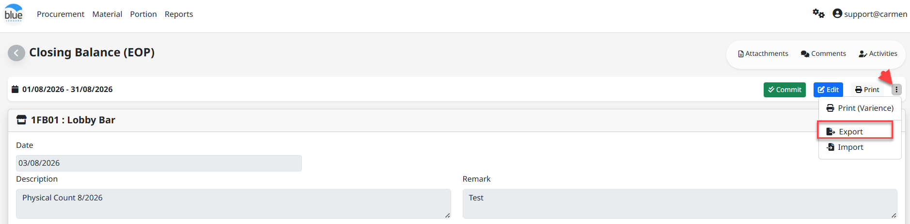

- Click “Save” เพื่อ Download เอกสารไปยัง Drive (Folder Download)

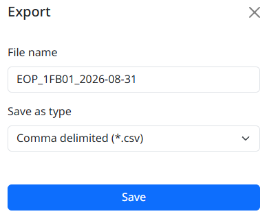

- ระบุจำนวนสินค้าคงเหลือใน Template

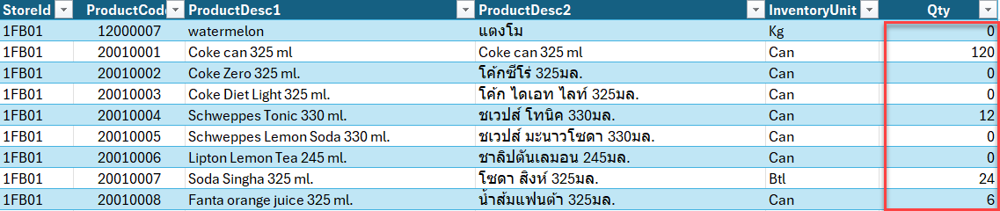

- Click “Import” เพื่อนำเข้าข้อมูลสินค้าคงเหลือจาก File Export (.csv)

- Click “Choose File” เลือกเอกสารที่บันทึกสินค้าคงเหลือไว้

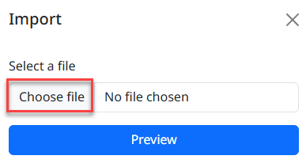

- ระบบแสดงข้อมูลการ Import เพื่อให้ตรวจสอบความถูกต้อง จากนั้น Click “Save” เพื่อบันทึกเอกสาร

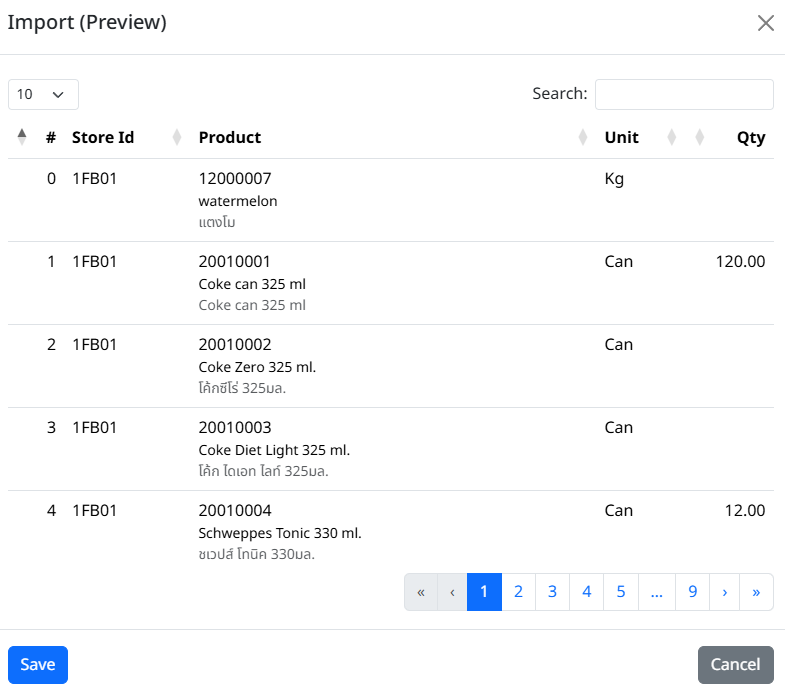

- ระบบยืนยันการบันทึกเอกสาร Click “OK”

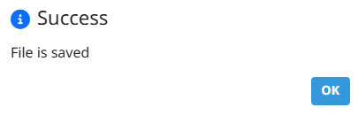

3.  เมื่อตรวจสอบเอกสารครบถ้วนแล้วให้ Click คำสั่ง “Commit” เพื่ออนุมัติเอกสาร
