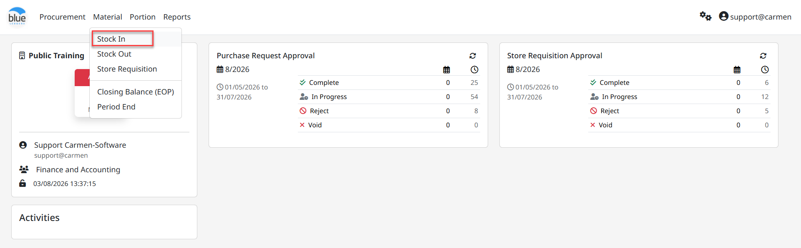
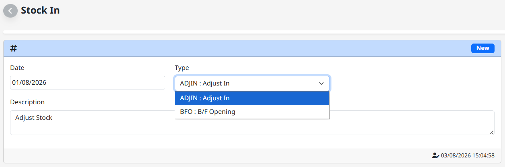
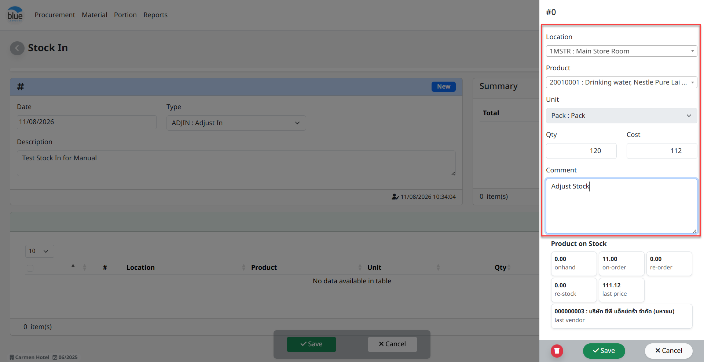
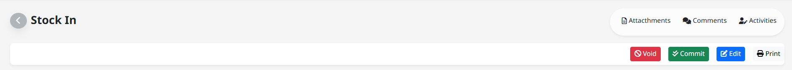
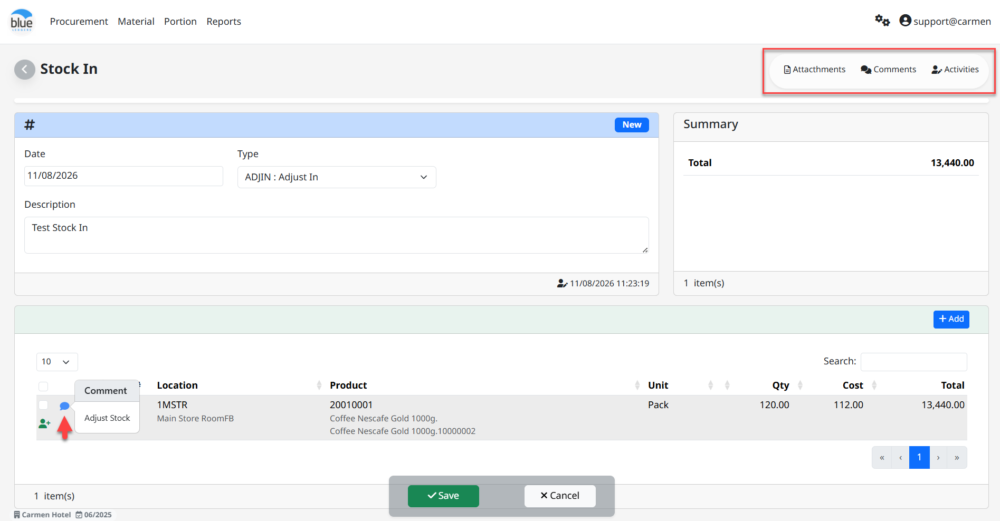

**Stock In**

**Stock In** คือ การปรับปรุงยอดเพิ่มของจำนวนสินค้าและราคาในคลังสินค้า ซึ่งการทำ Stock In สามารถแยกเป็นหลายประเภทตาม “Adjust Type” โดย “Adjust Type” จะช่วยให้สามารถบันทึกบัญชีด้วย Account code ที่ต่างกันได้ เช่น

- BF (Balance Forward) หมายถึง การยกยอดสินค้าคงคลัง

- Adjust หมายถึง การปรับเพิ่ม Stock ในสินค้าคงคลัง

**ขั้นตอนในการทำงานของระบบ Stock In ดังนี้**

1.  Click **“**Material**”** จากนั้น Click “Stock In”

> 2\. Click ปุ่ม “New” เพื่อสร้างรายการเพิ่ม Stock

- Select “Date” เพื่อระบุวันที่

- Select “Type” เพื่อเลือกประเภทในการปรับปรุงรายการ

  - ADJIN: Adjust In หมายถึง การปรับปรุงจำนวนสินค้าคงคลังแบบบันทึกรับเพิ่ม

  - BFO: B/F Opening หมายถึง การบันทึกยกยอดสินค้าคลัง (ทำครั้งเดียวในขั้นตอนการยกยอดสินค้าเข้าระบบคงคลังในระบบ)

- Click “Add” เพื่อเพิ่มรายการสินค้าสำหรับการทำ Stock In

- Location ระบุ Location สำหรับบันทึกรายการสินค้ารับเข้า

- Product เลือกรายการสินค้าเพื่อบันทึกรับสินค้า

- Unit ระบบ Default หน่วย (Inventory Unit)

- Qty จำนวนบันทึกรับ

- Cost ราคารับสินค้าต่อหน่วย

- Comment ระบุรายละเอียดเพิ่มเติม

- On Hand จำนวนสินค้าเหลือใน Location

- On-Order จำนวนสินค้าที่เป็น PO แล้ว และอยู่ใน Status ค้างรับใน Receiving

- Re-Order จำนวนสินค้าที่ต้องสั่งซื้อเพิ่มโดยยึดจาก Maximum Stock ลบกับ On Hand จะเท่ากับจำนวน Re-Order

- Re-Stock จำนวนที่ทำการสั่งซื้อจาก Function “Re-Stock”

- Last Price ราคาซื้อสินค้าล่าสุด (ยึดจาก Receiving Committed)

- Last Vendor ร้านค้าที่ซื้อสินค้าล่าสุด (ยึดจาก Receiving Committed)

3.  Click “Save” เพื่อบันทึกรายการสินค้าไปยังหน้า Stock In

4.  Click “Cancel” เพื่อยกเลิกการบันทึกรายการสินค้า

> หมายเหตุ การเพิ่มรายการที่ 2 ใน Stock In สามารถ Click “Add” อีกครั้ง

Main Function คือ ฟังก์ชั่นการใช้งานหลัก

- Edit Click “Edit” หากต้องการแก้ไขเอกสาร

- Commit Click “Commit” หากต้องการอนุมัติเอกสาร

- Void Click “Void” หากต้องการยกเลิกเอกสาร และในกรณี Void เอกสารระบบจะให้ยืนยันการ Void พร้อมให้ระบุเหตุผล

Other Function เพิ่มเติมอื่นๆ

- Attachments แนบไฟล์เอกสาร หรือรูปภาพ (ขนาดไฟล์ไม่เกิน 10 mb.)

- Comments ระบุข้อความ หรือรายละเอียดที่ใช้สื่อสารภายในองค์กร

- Activities ระบบเก็บประวัติการเพิ่มข้อมูล, แก้ไขข้อมูล และการลบข้อมูล

- Comment Click “สัญลักษณ์ข้อความ” เพื่ออ่านข้อความที่มีการระบุจาก Item

