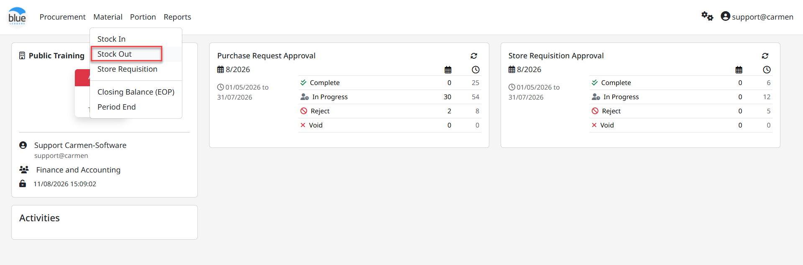
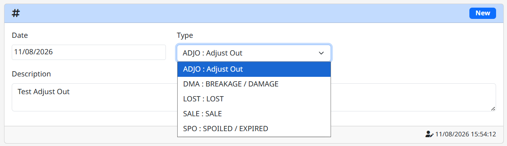
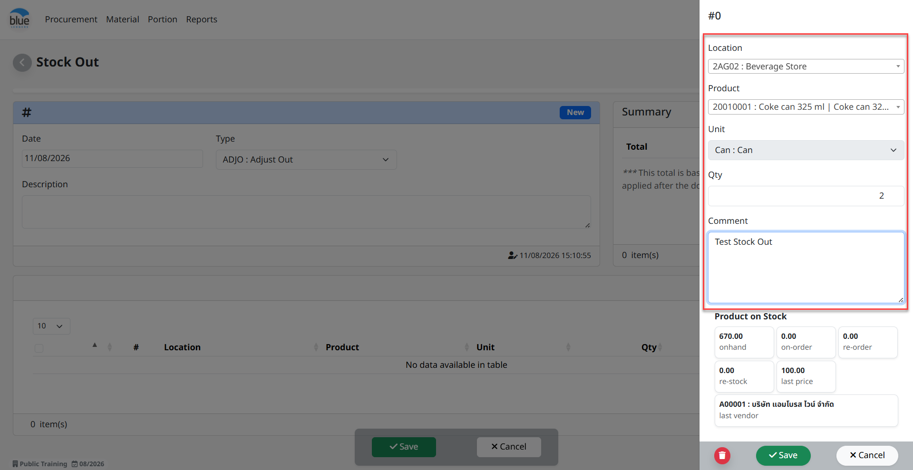
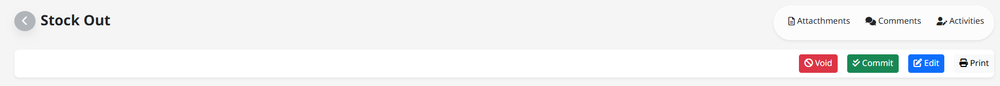
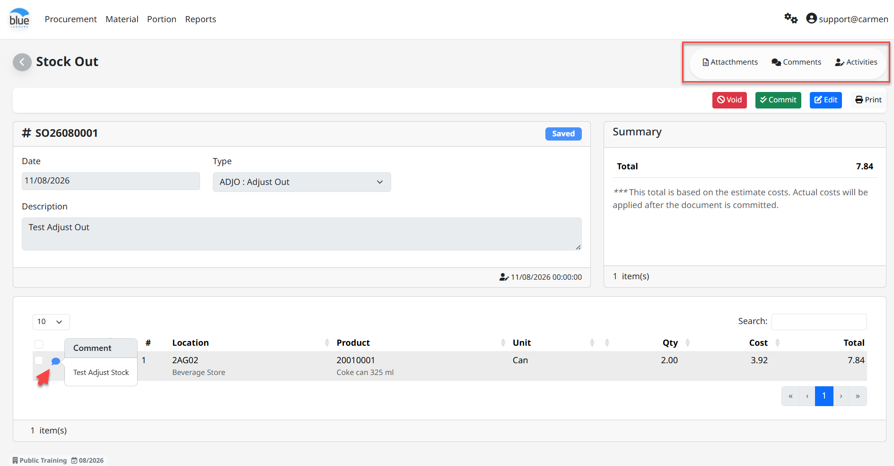

---
title: "Stock Out"
weight: 3
---
# Stock Out

**Stock Out** คือ การปรับปรุงเพื่อลดยอดจำนวนสินค้าในคลังสินค้า ซึ่งการทำ Stock Out สามารถแยกเป็นหลายประเภทตาม “Adjust Type” โดย “Adjust Type” จะช่วยให้สามารถบันทึกบัญชีด้วย Account code ที่ต่างกันได้ เช่น

1. Adjust Out คือ การปรับปรุงเพื่อลดยอดในคลังสินค้า

2. Sale คือ การตัดยอดขายโดยการ Manual Key โดยตรงในระบบ Inventory

3. Lost คือ การปรับปรุงเพื่อลดยอดlbo8hkใน Stock ในกรณีมีสินค้าสูญหาย

4. Breakage / Damage คือ การปรับปรุงเพื่อลดยอดสินค้าใน Stock ในกรณีสินค้าแตกหักเสียหาย

5. Spoiled / Expired คือ การปรับปรุงเพื่อลดยอดสินค้าใน Stock ในกรณีสินค้าหมดอายุ หรือทำลายสินค้า

## A. ขั้นตอนในการทำงานของระบบ Stock Out ดังนี้

1. Click **“**Material**”** จากนั้น Click “Stock Out”

> 2\. Click ปุ่ม “New” เพื่อสร้างรายการลด Stock

- Select “Date” เพื่อระบุวันที่

- Select “Type” เพื่อเลือกประเภทในการปรับปรุงรายการ

- Description ระบุรายละเอียดการปรับปรุง Stock

> 3\. Click “Add” เพื่อเพิ่มรายการสินค้าสำหรับการทำ Stock Stock

- Location ระบุ Location สำหรับบันทึกรายการสินค้ารับเข้า

- Product เลือกรายการสินค้าเพื่อบันทึกรับสินค้า

- Unit ระบบ Default หน่วย (Inventory Unit)

- Qty จำนวนบันทึกปรับ Stock

- Comment ระบุรายละเอียดเพิ่มเติม

- On Hand จำนวนสินค้าเหลือใน Location

- On-Order จำนวนสินค้าที่เป็น PO แล้ว และอยู่ใน Status ค้างรับใน Receiving

- Re-Order จำนวนสินค้าที่ต้องสั่งซื้อเพิ่มโดยยึดจาก Maximum Stock ลบกับ On Hand จะเท่ากับจำนวน Re-Order

- Re-Stock จำนวนที่ทำการสั่งซื้อจาก Function “Re-Stock”

- Last Price ราคาซื้อสินค้าล่าสุด (ยึดจาก Receiving Committed)

- Last Vendor ร้านค้าที่ซื้อสินค้าล่าสุด (ยึดจาก Receiving Committed)

3. Click “Save” เพื่อบันทึกรายการสินค้าไปยังหน้า Stock In

4. Click “Cancel” เพื่อยกเลิกการบันทึกรายการสินค้า

> หมายเหตุ การเพิ่มรายการที่ 2 ใน Stock In สามารถ Click “Add” อีกครั้ง

Main Function คือ ฟังก์ชั่นการใช้งานหลัก

- Edit Click “Edit” หากต้องการแก้ไขเอกสาร

- Commit Click “Commit” หากต้องการอนุมัติเอกสาร

- Void Click “Void” หากต้องการยกเลิกเอกสาร และในกรณี Void เอกสารระบบจะให้ยืนยันการ Void พร้อมให้ระบุเหตุผล

Other Function เพิ่มเติมอื่นๆ

- Attachments แนบไฟล์เอกสาร หรือรูปภาพ (ขนาดไฟล์ไม่เกิน 10 mb.)

- Comments ระบุข้อความ หรือรายละเอียดที่ใช้สื่อสารภายในองค์กร

- Activities ระบบเก็บประวัติการเพิ่มข้อมูล, แก้ไขข้อมูล และการลบข้อมูล

- Comment Click “สัญลักษณ์ข้อความ” เพื่ออ่านข้อความที่มีการระบุจาก Item

