---
title: "Store Requisition"
weight: 1
---
# Store Requisition

**Store Requisition** คือ การสร้างเอกสารขอเบิกสินค้าจาก Store จะมีอยู่ 2 ประเภท คือ

- Issue Type คือ การขอเบิกสินจาก Store ไปเป็นค่าใช้จ่าย

- Transfer Type คือ การโอนย้ายสินค้าที่เป็น Inventory ระหว่าง Location ซึ่งจะยังไม่เกิดค่าใช้จ่าย

**
1. ขั้นตอนการทำ Store Request ดังต่อไปนี้**

1.1 Click “Material” จากนั้น Click “Store Requisition”

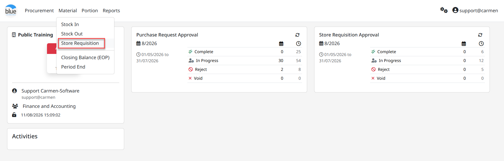

**View Status** คือ มุมมองของสถานะเอกสาร โดยจะมีสถานะดังนี้

1. Status: “View All” หมายถึง มุมมองเอกสารที่มีไว้ติดตามสถานะของเอกสารใบขอเบิก โดยมีความหมายของสัญลักษณ์เพื่อใช้ในการตรวจเช็คสถานะเอกสาร ประกอบด้วย

1. In process (**สีเทา**) หมายถึง เอกสารอยู่ระหว่างการจัดตรวจสอบ

2. Complete **(สีเขียว)** หมายถึง เอกสารได้รับการอนุมัติเรียบร้อยแล้ว

3. Partial (**สีเหลือง)** หมายถึง เอกสารได้รับการอนุมัติในบางรายการ

4. Rejected (**สีแดง)** หมายถึง การยกเลิกเอกสาร และไม่สามารถนำกลับมาดำเนินการต่อได้

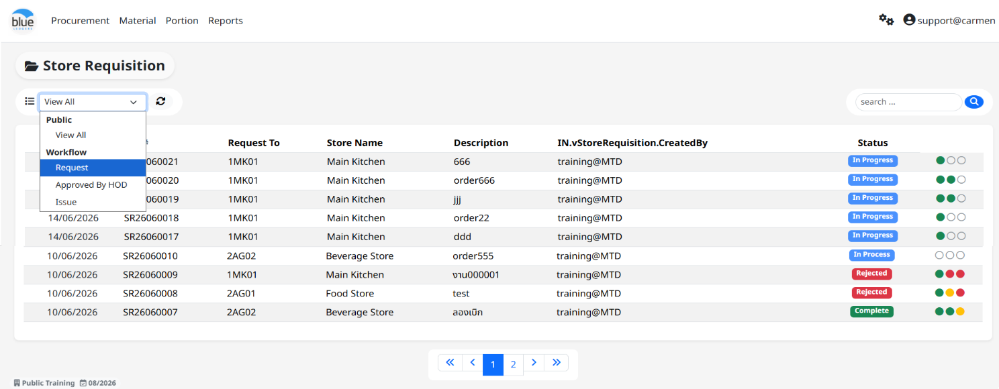

1. Status: “Request” หมายถึง สถานะบันทึกเอกสารขอเบิก (Store Requisition) หากต้องการจะทำเอกสารขอเบิกจะต้องเริ่มต้นที่ Status นี้

## ขั้นตอนการสร้างเอกสารขอเบิก

1. Click “New” จากนั้นเลือก “Issue” เพื่อเข้าสู่ขั้นตอนสร้างเอกสารใบขอเบิก

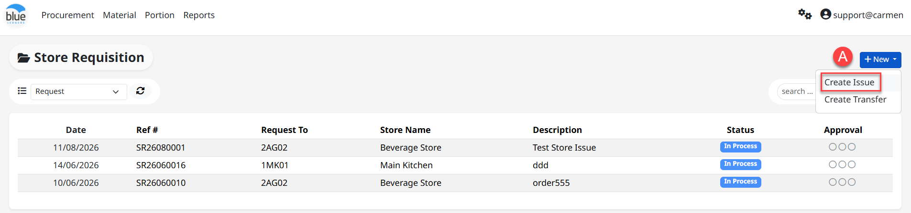

2. Input date หมายถึง วันที่ทำเอกสาร (Date Default)

3. Type หมายถึง ประเภทการขอเบิก ประกอบด้วย

- Issue เบิกสินค้าและตัดเป็นค่าใช้จ่าย

- Transfer การโอนย้ายสินค้าจากสถานที่หนึ่งไปยังอีกสถานที่หนึ่ง โดยยังคงสถานะเป็นสินค้าคงคลัง (Inventory)

4. Location หมายถึง ระบุสถานที่สำหรับขอเบิกสินค้า (Location ประเภท Store)

5. Job Code หมายถึง ระบบจะแสดงค่า N/A Not Available

6. Description หมายถึง ช่องว่างสำหรับระบุรายละเอียดของใบขอเบิก เช่น ระบุถึงวัตถุประสงค์ในการขอเบิก

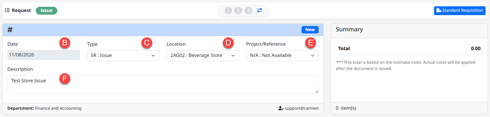

7. จากนั้น Click ปุ่ม “Add” เพื่อระบุสินค้า และจำนวนขอเบิก

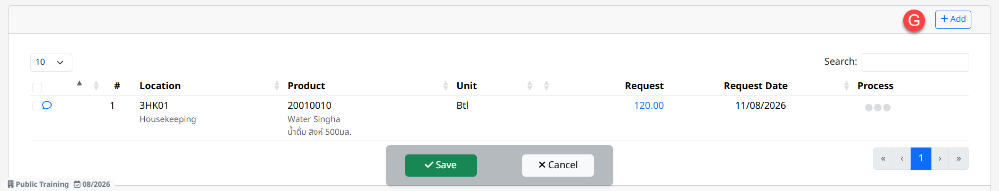

8. Location หมายถึง ให้ระบุสถานที่ปลาย หรือ Location ของผู้ทำการขอเบิก

9. Product หมายถึง ระบุสินค้าที่ต้องการขอเบิก

10. Qty. หมายถึง ระบุจำนวนที่ต้องการขอเบิก และในช่อง “Request Date” ให้ระบุวันที่รับสินค้าจากนั้นกด Save เพื่อบันทึกข้อมูล

11. Received Date หมายถึง วันที่รับสินค้า

12. Comment หมายถึง ระบุรายละเอียดเพิ่มเติม

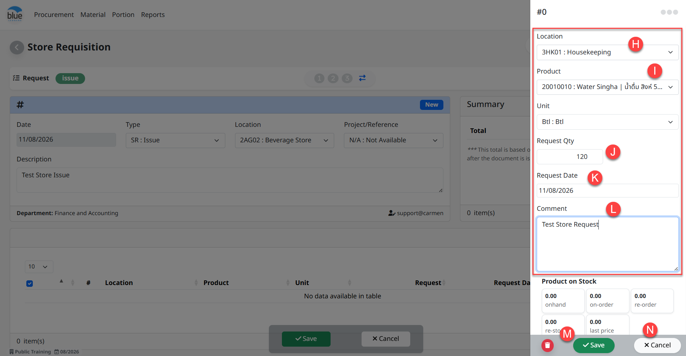

## อธิบายเพิ่มเติมสำหรับการบันทึกข้อมูล และยกเลิกรายการ

13. Save หมายถึง เมื่อมีการ Click **“**Save**”** ระบบจะทำการบันทึกการเปลี่ยนแปลงในรายการสินค้าในบรรทัดปัจจุบันเท่านั้น

14. Cancel หมายถึง เมื่อ Click **“**Cancel**”** ระบบจะทำการยกเลิกการเปลี่ยนแปลงรายการสินค้าในบรรทัดนั้นทันที

## ข้อมูลเพิ่มเติมของสินค้าเพื่อใช้ประกอบการเบิก หรือ อนุมัติ ประกอบด้วย

- On Hand จำนวนสินค้าเหลือใน Location

- On-Order จำนวนสินค้าที่เป็น PO แล้ว และอยู่ใน Status ค้างรับใน Receiving

- Re-Order จำนวนสินค้าที่ต้องสั่งซื้อเพิ่มโดยยึดจาก Maximum Stock ลบกับ On Hand จะเท่ากับจำนวน Re-Order

- Re-Stock จำนวนที่ทำการสั่งซื้อจาก Function “Re-Stock”

- Last Price ราคาซื้อสินค้าล่าสุด (ยึดจาก Receiving Committed)

- Last Vendor ร้านค้าที่ซื้อสินค้าล่าสุด (ยึดจาก Receiving Committed)

> หมายเหตุ การเพิ่มรายการที่ 2 ใน Stock In สามารถ Click “Add” อีกครั้ง

## Main Function คือ ฟังก์ชั่นการใช้งานหลัก

- Edit Click “Edit” หากต้องการแก้ไขเอกสาร

- Commit Click “Commit” หากต้องการอนุมัติเอกสาร

- Void Click “Void” หากต้องการยกเลิกเอกสาร และในกรณี Void เอกสารระบบจะให้ยืนยันการ Void พร้อมให้ระบุเหตุผล

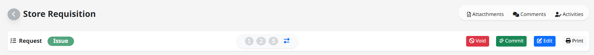

## Other Function เพิ่มเติมอื่นๆ

- Attachments แนบไฟล์เอกสาร หรือรูปภาพ (ขนาดไฟล์ไม่เกิน 10 mb.)

- Comments ระบุข้อความ หรือรายละเอียดที่ใช้สื่อสารภายในองค์กร

- Activities ระบบเก็บประวัติการเพิ่มข้อมูล, แก้ไขข้อมูล และการลบข้อมูล

- Comment Click “สัญลักษณ์ข้อความ” เพื่ออ่านข้อความที่มีการระบุจาก Item

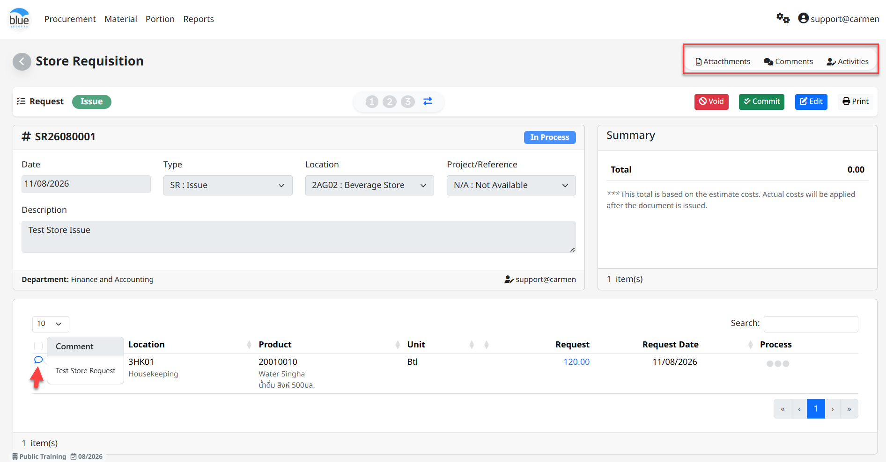

## 2. ขั้นตอนการอนุมัติเอกสารส่วนงานหัวหน้าแผนก (HOD)

2.1 Status: “HOD” หมายถึง การอนุมัติเอกสารใบขอเบิกในลำดับขั้นหัวหน้าแผนก

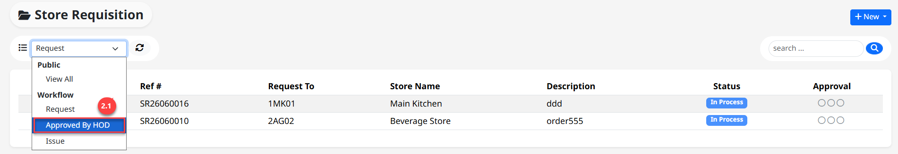

2. ระบบจะแสดงเอกสารขอเบิกที่ถูกอนุมัติคำขอจาก Request จากนั้น Click ที่เอกสารที่เพื่ออนุมัติ

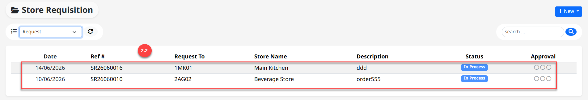

3. ขั้นตอนการแก้ไขเอกสาร

- Click “” เพื่อทำการแก้ไขจำนวนขอเบิก

- ระบุจำนวนที่ต้องการจะแก้ไขในช่อง “Qty”

- Click “Save” เพื่อบันทึกข้อมูล

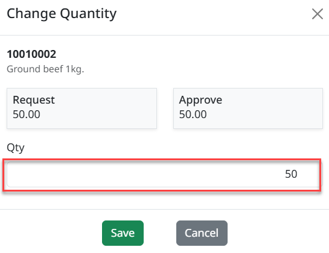

2. ขั้นตอนการอนุมัติ และคำสั่งอื่นที่เกี่ยวข้อง

- “Approve” อนุมัติเอกสาร

- “Reject” ยกเลิกเอกสาร

- “Send Back” ตีกลับเอกสาร

3\. ขั้นตอนการอนุมัติเอกสารเบิกสินค้า (Store Issue Approve)

1. Status: “Issue” หมายถึง ขั้นตอนการอนุมัติตัดจ่ายสินค้าจากคลังสินค้า โดยจะมีเจ้าหน้าที่ดูแลคลังสินค้า หรือ Store Keeper คอยตรวจสอบเอกสารใบขอเบิกและอนุมัติเอกสาร

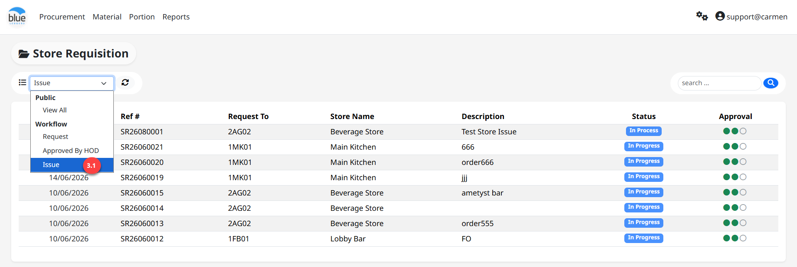

2. ระบบจะแสดงเอกสารขอเบิกที่ถูกอนุมัติคำขอจาก Request จากนั้น Click ที่เอกสารที่เพื่ออนุมัติ

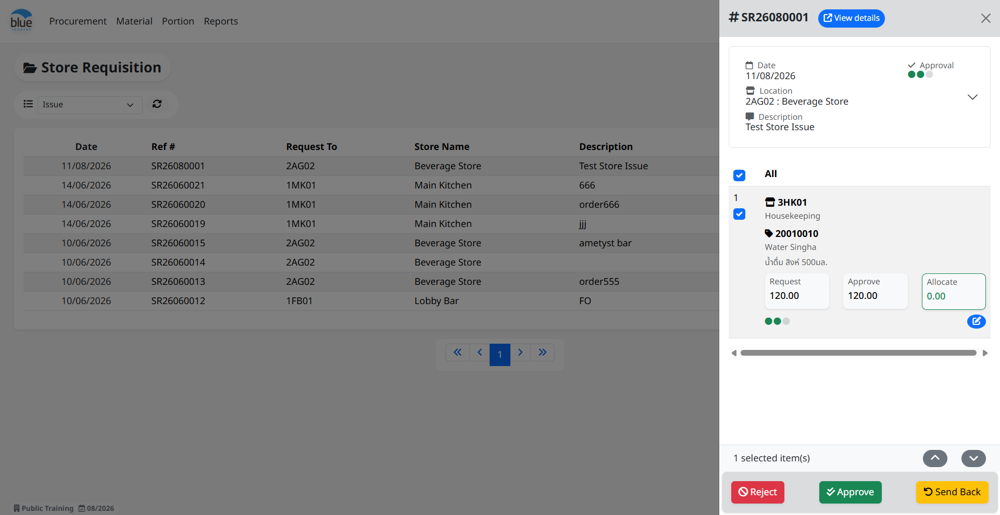

3. เมื่อตรวจสอบเอกสารเรียบร้อยแล้ว หากมีสินค้าใน Stock เจ้าหน้าที่สามารถ Click ปุ่ม “Approve“ เพื่อทำการอนุมัติใบขอเบิกได้ จากนั้น Click “Yes” เพื่อยืนยันการอนุมัติ

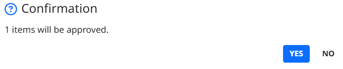
