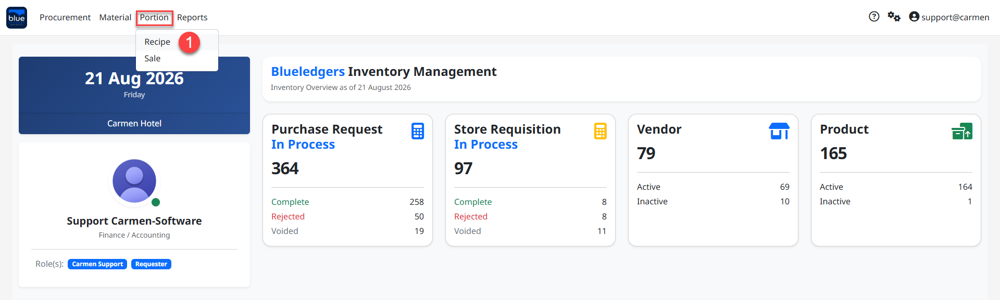
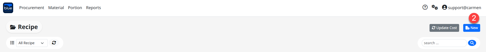
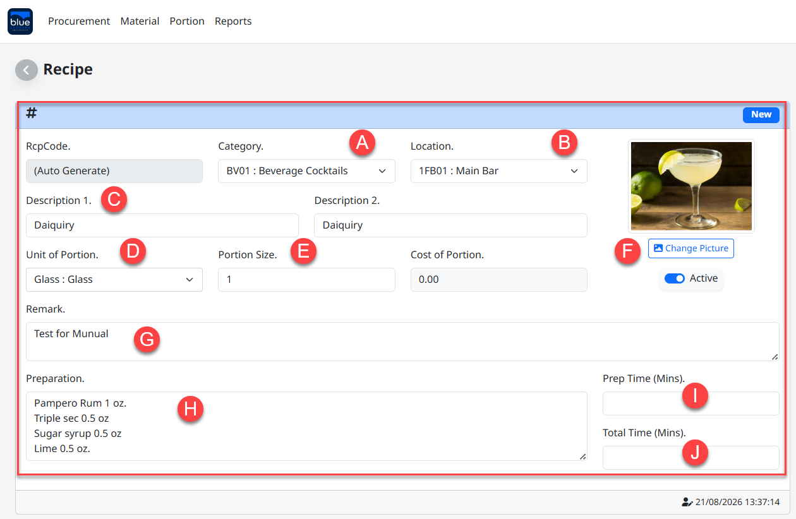
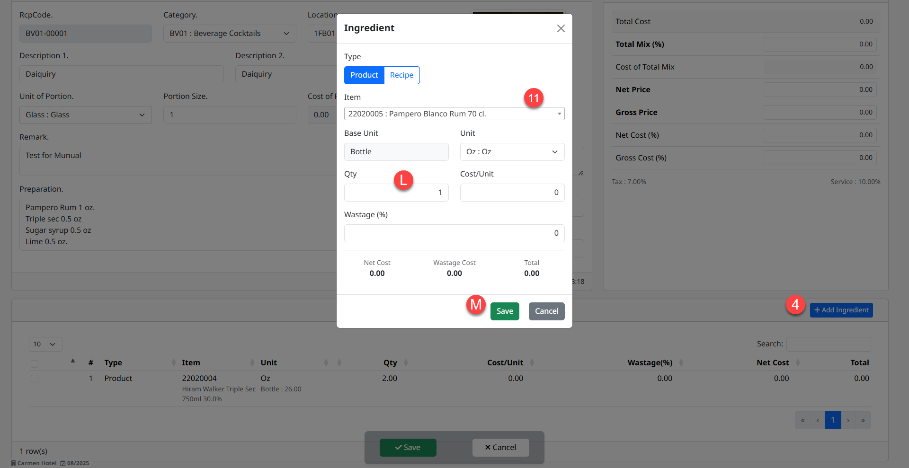
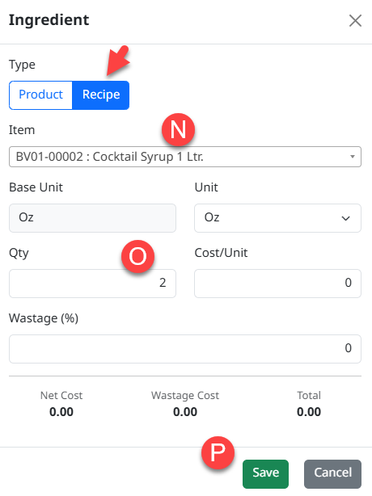
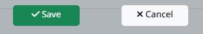
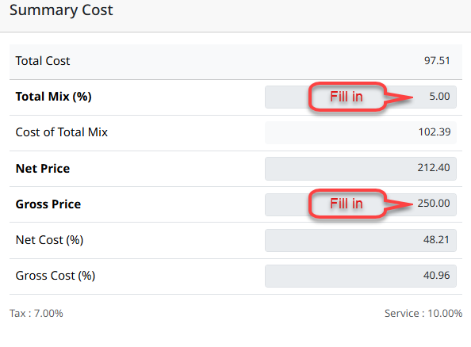
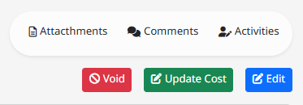

---
title: "Portions"
weight: 1
---
# Portions

Portions คือ การบันทึกเมนูอาหารและเครื่องดื่มตามวัตถุดิบที่ใช้ปรุง เพื่อให้ระบบคำนวณต้นทุนทั้งหมดจากสูตรการปรุงอาหาร และเครื่องดื่ม อีกทั้งยังสามารถใส่ราคาขาย เพื่อใช้วิเคราะห์ต้นทุนของเมนูดังกล่าวได้ โดยสามารถระบุ Portions (สัดส่วนต่อจานหรือต่อหน่วยที่ใช้เสิร์ฟ) เพื่อทราบต้นทุนต่อ Portions ได้

## ขั้นตอนการสร้าง Portions

1. สามารถเข้าใช้งานโดย Click “Portion” จากนั้น Click “Recipe”

2. Click “New” เพื่อสร้างสูตรอาหารและเครื่องดื่ม

3. Recipe คือ การบันทึกเมนูอาหารและเครื่องดื่มพร้อมด้วยวัตถุดิบที่ใช้

- **Category** ระบุหมวดของเมนูสูตรอาหารและเครื่องดื่ม

- **Location** ระบุคลังสินค้าสำหรับผูกสูตรอาหารและเครื่องดื่ม

- **Description1** ระบุชื่อสูตรอาหารภาษาอังกฤษ

- **Description2** ระบุชื่อสูตรอาหารภาษาไทย

- **Portion Size** ระบุจำนวนสัดส่วนที่ได้จากสูตรอาหารและเครื่องดื่ม เช่น สูตรเครื่องดื่มสำหรับ 1 แก้ว

- **Change Picture** เลือกรูปภาพสำหรับสูตรอาหารและเครื่องดื่ม

- **Remark** ระบุความคิดเห็นเพิ่มเติม

- **Preparation** ระบุขั้นตอนการปรุงอาหารและเครื่องดื่ม

- **Prep Time (Mins)** ระบุเวลาในการปรุงอาหารและเครื่องดื่ม

- **Total Time (Mins)** ระบุเวลาปรุงอาหารและเครื่องดื่ม

4. Click “Ingredient” เพื่อเลือกรายการสินค้าสำหรับทำเป็นสูตรอาหารและเครื่องดื่ม

**Type Product** คือการเลือกรายการสินค้า และระบุปริมาณให้กับสูตรอาหารและเครื่องดื่ม

- **Item** เลือกรายการสินค้า

- **Qty** ระบุปริมาณที่ใช้

- **Save** บันทึกรายการ

**Type Recipe** คือ การนำสูตรอาหารที่สร้างไว้แล้วนำมาเพิ่มเข้าไปในสูตรอาหารหลักที่กำลังสร้างขึ้น (Recipe ซ้อน Recipe)

- **Item** เลือกสูตร Recipe ที่สร้างไว้เพื่อนำมาเป็นส่วนผสมของเมนูหลัก

- **Qty** ระบุปริมาณที่ใช้

- **Save** บันทึกรายการ

5. Click “Save” เพื่อบันทึกเอกสาร หรือ Click “Cancel” เพื่อยกเลิก

> **หมายเหตุ:** หลังจาก “Save” เอกสารเรียบร้อยแล้ว ระบบจะแสดงต้นทุนให้ทราบ เมื่อสินค้าในสูตรมีการรับสินค้าเข้าระบบเรียบร้อยแล้ว

6. Summary Cost เมื่อสร้าง Recipe เรียบร้อยแล้วระบบจะสรุปต้นทุนให้ โดยมีหัวข้อที่สำคัญ ดังนี้

- Total Cost ต้นทุนจากสูตรอาหารและเครื่องดื่ม

- Cost of Total Mix การ Adjust ต้นทุนแฝงที่ไม่ได้ระบุเข้าไปในสูตรอาหารและเครื่องดื่ม เช่น น้ำ แก๊ส หรือต้นทุนจากการตกแต่งจาน (ระบุเป็น % เช่น 5 หมายถึง 5%)

- Net Price ราคาขาย ไม่รวม Service charge และ Vat (Adjust ได้)

- Gross Price ราคาขายรวม Service charge และ Vat (Adjust ได้)

- Net Cost (%) ต้นทุน Cost of Total Mix หารด้วย “÷” Net Price

- Net Cost (%) ต้นทุน Cost of Total Mix หารด้วย “÷” Gross Price

7. Function อื่นที่เกี่ยวข้อง

- Void การยกเลิกการใช้งาน

- Update Cost เพื่อปรับปรุงต้นทุนให้ถูกต้องอยู่เสมอ Click “Update Cost”

- Edit การแก้ไขเอกสาร

- Attachment การแนบไฟล์เอกสาร

- Comment แนบข้อความ

- Activities บันทึกสถานะเอกสาร โดยบันทึกวันเวลาที่มีการ Create, Update และ Delete

