# Sales

Sales คือ หน้าต่างแสดงรายการขายสินค้าที่มีการ Interface กับระบบ Point of Sales และทำการ Mapping เมนูขายกับรายการสูตรอาหารเข้าด้วยกัน ดังนั้นผู้ใช้งานจะสามารถทราบถึงต้นทุนขายได้ชัดเจน และแม่นยำ โดยมีขั้นตอนการใช้งานดังนี้

## 1. Sale Function

สามารถเข้าใช้งานโดย Click “Portion” จากนั้น Click “Sale”

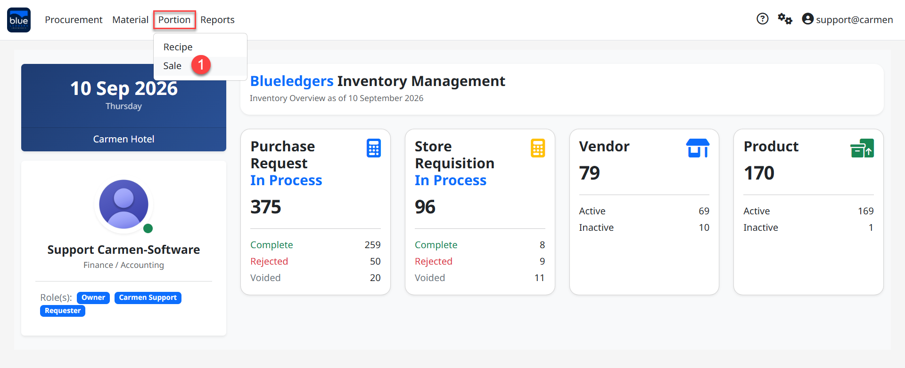

### 1.1 Click “Date” เพื่อเลือกวันที่สำหรับโพสต์ยอดขาย
### 1.2 Click “Post” เพื่อโพสต์ยอดรายการขายจากระบบ Point of Sales

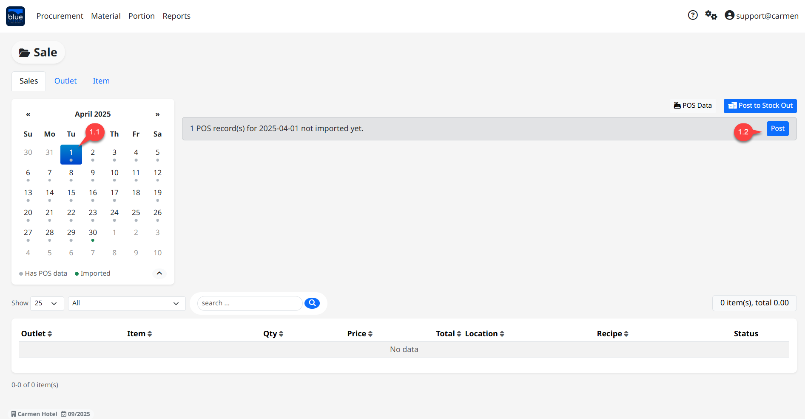

ระบบความแจ้งให้ทราบว่า “ต้องการ Post ข้อมูลจาก POS ตั้งแต่วันที่ 01/04/2025 ไปยัง Sale ใช่หรือไม่?”  โดย รายการ (Rows) ที่ถูก Post เข้า Stock Out ไปแล้ว จะถูกข้ามและไม่ทำการ Post ซ้ำ
Click “Yes” เพื่อยืนยัน
Click “No” เพื่อยกเลิก

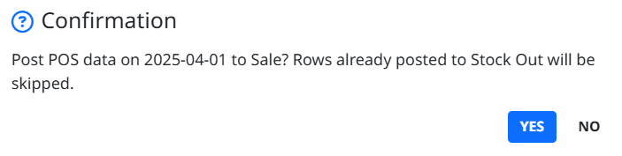

ระบบแสดงรายการสินค้าที่ถูกโพสต์ขายจากระบบ Point of Sales
ระบบจะแสดงผล 2 ส่วน ประกอบด้วย
ส่วนรายการขายจากระบบ Point of Sales โดยระบุ Outlet ขาย
ส่วน Recipe (สูตรอาหาร) และระบุ Location (สามารถ Click “” เพื่อแก้ไข Location และเปลี่ยนเมนู Recipe)

ระบบจะ นำข้อมูล mapping จากข้อ 2 และ 3 มาแสดงผลให้โดยอัตโนมัติ

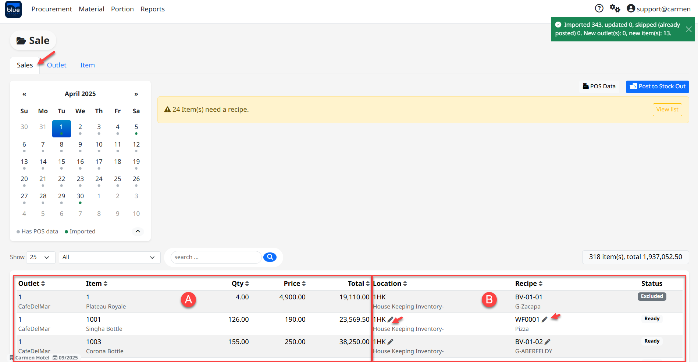

ในกรณีที่ต้องการเปลี่ยน location ในการตัด stock สามารถ Click “” เพื่อแก้ไข Location ได้ทันที โดยระบบจะให้เลือกการแก้ไขได้ 2 option

Option 1 : “Just this item” ใช้สำหรับการเปลี่ยนเพื่อให้มีผลต่อการ mapping กับ POS item ที่เลือกเท่านั้น ซึ่ง option นี้เหมาะสำหรับ กรณีที่มีอาหารบางรายการที่ต้องตัด stock จาก location อื่น ที่ไม่ใช่ outlet นี้ ยกตัวอย่างเช่น Beach bar มีการขาย Pizza แต่ Pizza ทำจาก Main Kitchen ดังนั้น ก็จะสามารถเลือกได้ว่า Pizza ที่ขายจาก Beach Bar ให้ไปตัด stock ที่ Main Kitchen แทน
Option 2 : “This outlet - all items” ใช้สำหรับการเปลี่ยนเพื่อให้มีผลต่อการ mapping กับ outlet code นี้ทั้งหมด
เลือก “Location” ที่ต้องการ
Click “Save mapping” เพื่อเสร็จสิ้นการแก้ไข

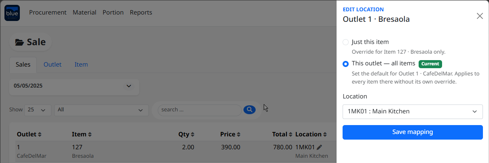

ในกรณีที่ต้องการเปลี่ยน Recipe ในการตัด stock สามารถ Click “” เพื่อแก้ไข Recipe ได้ทันที

เลือก “Recipe” ที่ต้องการ โดยระบบ จะเปลี่ยนการ mapping ของ POS Item ที่เลือกทั้งหมด
Click “Save mapping” เพื่อเสร็จสิ้นการแก้ไข

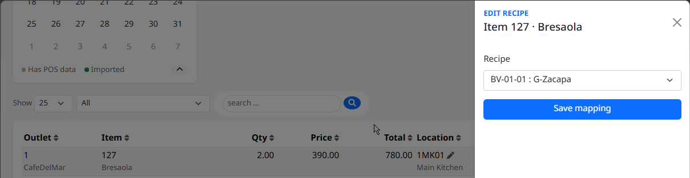

## 2. Outlet

Outlet หมายถึง จุดบริการจำหน่ายสินค้าอาหารและเครื่องดื่ม ซึ่ง Function Outlet ในระบบ Recipe คือ การ Mapping ระหว่าง POS Outlet เข้ากับ Inventory Location เพื่อเชื่อมโยงรายการขายสินค้าในและราคาขายในจุดบริการขาย (Outlet) ให้ตรงกับรายการสินค้าและต้นทุนสินค้าในสถานที่จัดเก็บสินค้าคงคลัง (Location) ซึ่งจะทำให้การคำนวณต้นทุนถูกต้อง และสามารถตัด Stock จากสูตรอาหารได้แม่นยำตรงกับสถานที่จัดเก็บ (Location)
### 2.1 Click “Outlet List” เพื่อเปิดหน้าต่าง Mapping (ระบบแสดง Outlet ให้อัตโนมัติ เมื่อมีการ Interface กับระบบ Point of Sales แล้ว)

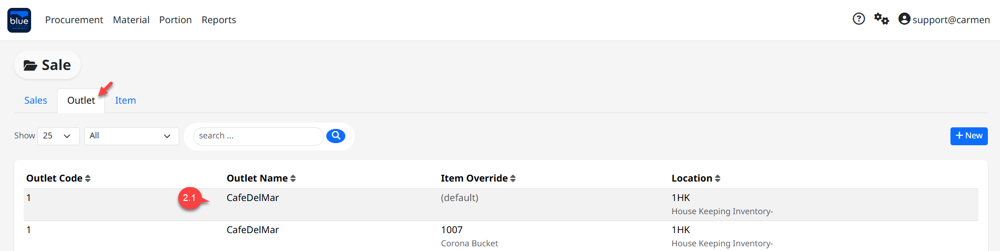

### 2.2 Click “Location Drop-Down List” เพื่อ Mapping Outlet เข้ากับ Inventory Location

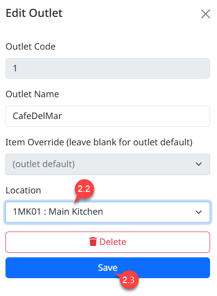

### 2.3 Click “Save” เพื่อบันทึกข้อมูล หรือ Click “Delete” เพื่อลบรายการ Mapping

## 3. Item

Item Function คือ หน้าต่าง Mapping รายการขายสินค้า (Sale Item) เข้ากับเมนูสูตรอาหาร (Recipe Menu)
### 3.1 Click “Sale Item” เพื่อเปิดหน้าต่าง Mapping (ระบบแสดง Sale Item ให้อัตโนมัติ เมื่อมีการ Interface กับระบบ Point of Sales แล้ว)

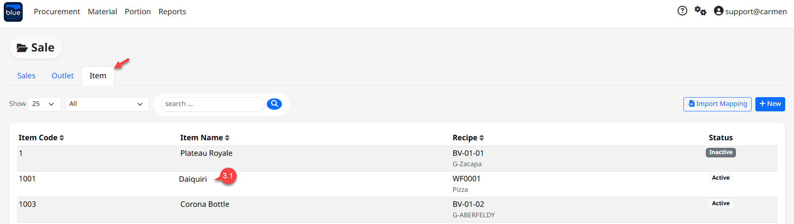

### 3.2 Click “Item Drop-Down List” เพื่อ Mapping Item Sale เข้ากับ Recipe Item

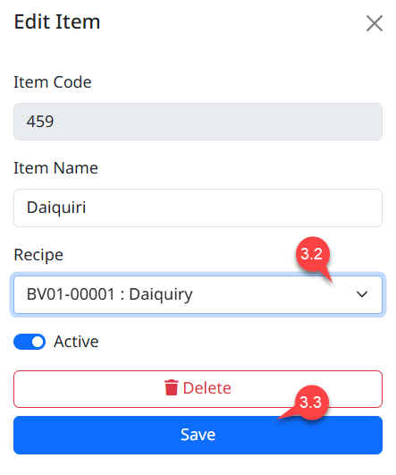

### 3.3 Click “Save” เพื่อบันทึกข้อมูล หรือ Click “Delete” เพื่อลบรายการ Mapping
### 3.4 การนำเข้าข้อมูลการ Mapping Item Sale กับ Recipe Item โดยการ Import

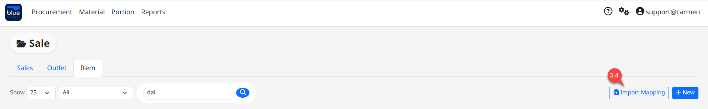

### 3.5 Click “Download Template” เพื่อส่งออก Excel File Template

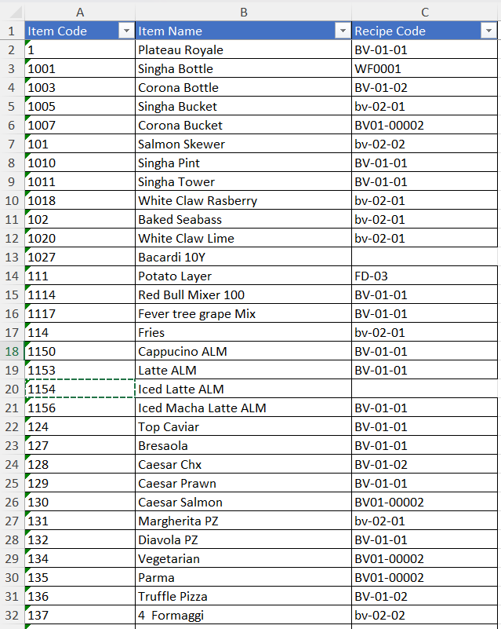

### 3.6 เมื่อทำการระบุ Recipe Item Code ตรงกับ Item Sale Code เรียบร้อยแล้ว ให้ Click” Choose File”
### 3.7 Click “Import” เพื่อนำเข้าข้อมูล Mapping หรือ Click “Close” เพื่อยกเลิก
### 3.8 เมื่อ import ข้อมูลสำเร็จแล้ว ระบบจะปิดหน้าต่างโดยอัตโนมัติ

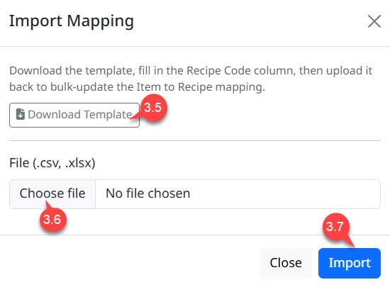
