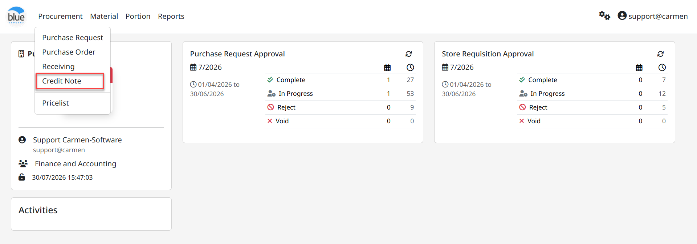
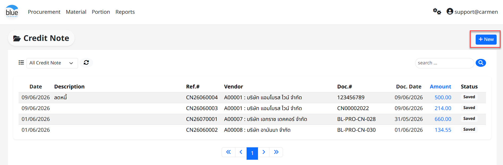
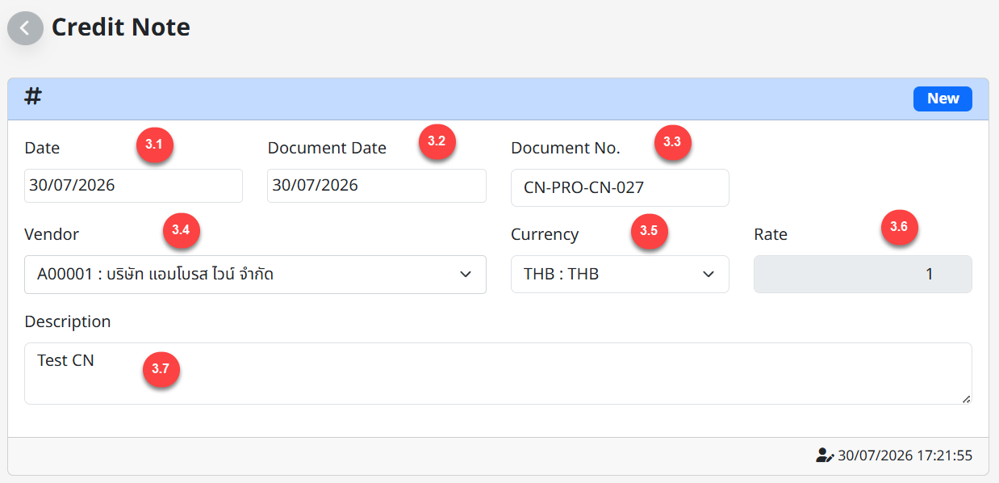
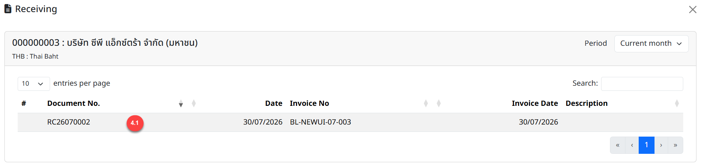
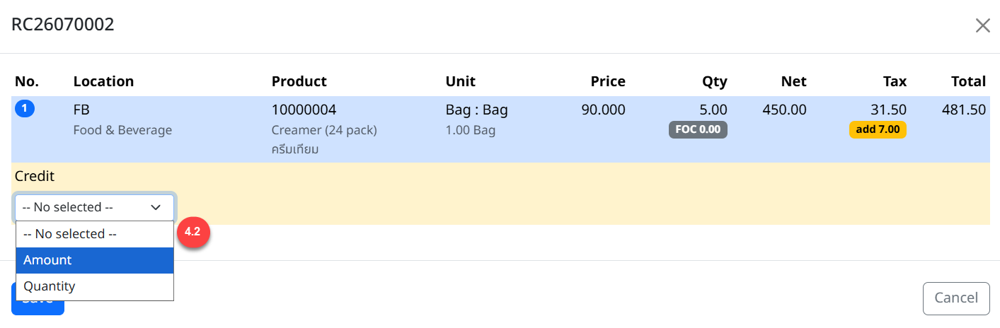
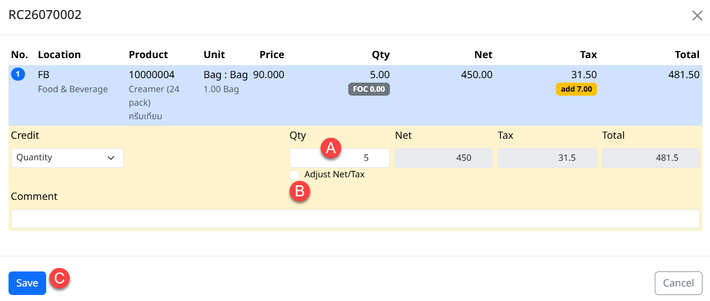
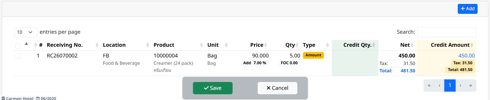
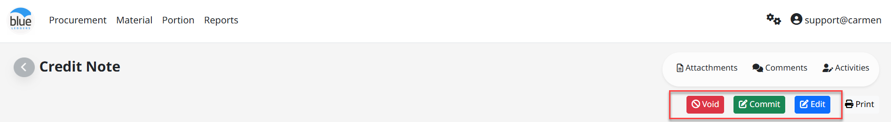
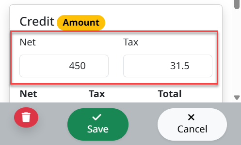
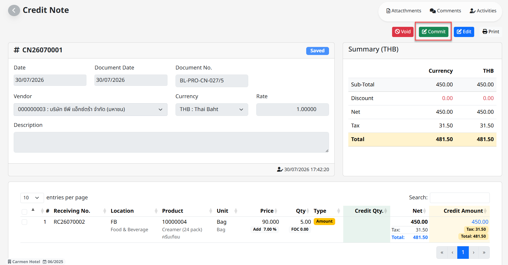

**Credit Note**

การทำลดหนี้ (Credit Note) คือ การลดหนี้จากการซื้อสินค้า ซึ่งเกิดขึ้นได้หลายกรณี เช่น การลดหนี้โดยการคืนสินค้าชำรุดเสียหายจากการขนส่งของ หรือมีการปรับปรุงราคาของสินค้า หรือนำมาใช้บันทึกลดหนี้จากสัญญาสินค้าฝากขาย (Consignment) เป็นต้น

**ขั้นตอนการทำเอกสารลดหนี้ในระบบ (Credit Note Process)**

1.  **สามารถเข้าถึง “Function” นี้โดยไปที่ Procurement จากนั้น Click “Credit Note”**

2.  **Click “New” เพื่อทำการสร้างเอกสารลดหนี้**

3.  **ในหน้าต่าง Credit Note ให้บันทึกข้อมูลดังนี้**

3.1 Date ระบบจะ Default เป็นวันที่ปัจจุบัน

3.2 Doc date ให้ระบุวันที่ใบลดหนี้

3.3 Doc no. ให้ระบุเลขที่ใบลดหนี้

3.4 Vendor ให้ระบุร้านค้าตามเอกสารลดหนี้

3.5 Currency กำหนดสกุลเงินตามเอกสารใบลดหนี้

3.6 Rate Currency ระบบจะแสดงค่าเงิน (Rate Currency) ตามสกุลเงิน (Currency) ที่เลือกใช้

3.7 Description ให้ระบุรายละเอียดของเหตุในการลดหนี้

4.  **ให้ Click “Add” เพื่อทำการ Add Item สำหรับลดหนี้**

    1.  เลือกเอกสารรับสินค้าที่ต้องการจะทำลดหนี้ (Receiving no.)

2.  เลือกประเภทเอกสารลดหนี้ โดยจะมีให้เลือก 2 ประเภทเอกสาร คือ

- Quantity คือ การลดหนี้จากจำนวนสินค้า (หากต้องการให้จำนวนสินค้าในระบบ Inventory ลดตามเอการลดหนี้ให้เลือกหัวข้อนี้)

- Amount คือ การลดหนี้จากยอดเงินรวม

**ขั้นตอนการลดหนี้ประเภท Quantity (ลดหนี้จากจำนวนสินค้า)**

1.  Qty. ระบุจำนวนสินค้าที่ต้องการทำลดหนี้

> (\* ระบบ จะไม่ให้บันทึก Qty ที่มากกว่า Receiving ได้)
>
> Unit ในกรณีที่เป็นการรับคืนสินค้าด้วย หน่วยที่ต่างจาก Receiving
>
> สามารถเปลี่ยนเป็นหน่วยอื่นได้ และสามารถแก้ไข Net และ Tax ให้ตรงกับเอกสาร CN ได้

2.  Adjust Net/Tax ในกรณี Tax ในระบบไม่ตรงกับใบกำกับภาษี สามารถทำการแก้ไข Tax โดยClick เครื่องหมาย √ ที่ Check Box และทำการแก้ไขยอด Tax ให้ถูกต้อง

3.  Click “Select” เมื่อตรวจสอบความถูกต้องเรียบร้อยแล้ว

**ขั้นตอนการลดหนี้ประเภท Amount (ลดหนี้จากยอดเงินรวม)**

4.  เลือกประเภทเอกสารเป็น “Amount”

5.  ระบุจำนวนเงินก่อนภาษี ในช่อง “Net”

6.  ระบุยอดภาษีในช่อง “Tax”

7.  Click “Select” เมื่อข้อมูลครบถ้วน

8.  Click เครื่องหมาย “X” เพื่อกลับสู่หน้าหลัก และ Click “Save” เพื่อบันทึกเอกสาร

4.  **การแก้ไขรายการลดหนี้**

    1.  Click “+” หน้ารายการลดหนี้

    2.  จากนั้น Click “Edit”

3.  จากนั้นในช่อง “Qty.” หรือ “Amount” ให้ทำการแก้ไขจำนวนสินค้าให้ถูกต้อง

4.  เมื่อตรวจสอบความถูกต้องเรียบร้อยแล้ว ให้ทำการ Click “Save”

5.  หากตรวจสอบแล้วว่าเอกสารถูกต้องและครบถ้วน ให้ทำการ Click “Commit” ยืนยันการทำรายการ (เมื่อทำการ Commit เอกสารไปแล้วจะไม่สามารถแก้ไขข้อมูลใดๆได้อีก)

