**Price List (ใบเสนอราคา)**

**Configuration** คือ Module ที่ใช้สำหรับตั้งค่าการใช้งานต่างๆ ที่เกี่ยวข้องกับ Module Procurement

**Price List** คือ Function ในการบันทึกใบเสนอราคาสินค้า จาก Vendor โดยระบบจะนำข้อมูลไปใช้เปรียบเทียบราคาสินค้าจากใบเสนอราคาของหลายๆ Vendor ในขั้นตอนจัดซื้อบนเอกสาร PR โดยการนำเข้าข้อมูลผ่านระบบ Price List มีอยู่ 2 วิธี คือ

- นำเข้าข้อมูลสินค้าและราคาด้วยวิธี Manual Key

- นำเข้าข้อมูลสินค้าและราคาด้วยวิธี Export/Import Template

**ขั้นตอนการนำเข้าข้อมูลด้วยการ Manual Key ดังนี้**

1.  Click “Procurement” จากนั้นเลือก “Price List”

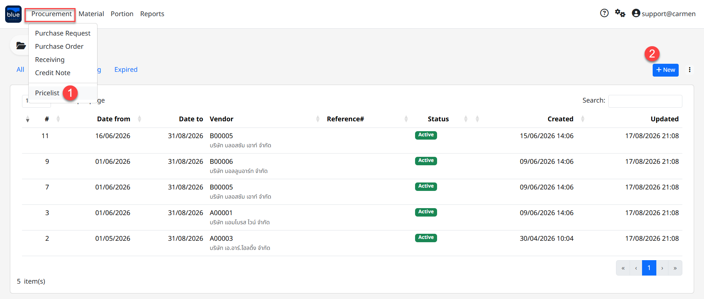

2.  Click “New” เพื่อสร้างเอกสาร

3.  ระบุรายละเอียด Vendor

    - Vendor ระบุร้านค้า

    - Reference No. ระบุรหัสใบเสนอราคา (ใส่หรือไม่ก็ได้)

    - Date from ระบุรอบเวลาในการเปรียบเทียบราคา

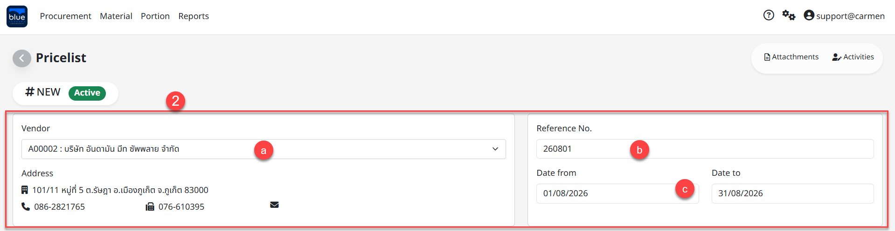

4.  Click “Add” เพื่อเลือกรายการสินค้าสำหรับบันทึกราคา

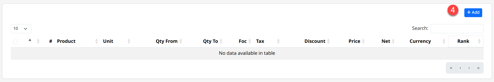

> กรอกข้อมูลในส่วนของ Detail ดังนี้

- “Product” เลือก รายการสินค้า

- “Unit” เลือก หน่วยการสั่งซื้อ

- “Qty From” เพื่อใส่จำนวนเริ่มต้น ของการแจ้งราคา

- “FOC” เพื่อใส่จำนวนของแถม (เป็นหน่วยเดียวกันกับหน่วยซื้อ)

- “To” เพื่อใส่จำนวนสิ้นสุด ของการแจ้งราคา

<!-- -->

- การระบุ “Qty From” และ “To” เพื่อกำหนดราคาของสินค้าตามปริมาณการสั่งซื้อได้ เช่น สั่ง ซื้อสินค้าตั้งแต่ 0 – 100 ชิ้น จะได้ราคา 100 บาท ต่อชิ้น

> หากซื้อสินค้าตั้งแต่ 101 – 9999 จะได้ราคา 90 บาท ต่อชิ้น เป็นต้น

- แนะนำให้ระบุ “Qty From” เริ่มต้นจาก 0

- แนะนำให้ระบุ “To” สิ้นสุดที่ 9999

<!-- -->

- “Tax Type” เพื่อเลือกประเภทภาษี

- “Rate” เพื่อใส่จำนวนเปอร์เซ็นต์ภาษี

- “Discount (%)” เพื่อใส่จำนวนเปอร์เซ็นต์ที่ลดราคา

- “Price” เพื่อใส่ราคาที่ vendor เสนอมา

- “Comment” เพื่ออธิบายรายการสินค้า

- “Amount” เพื่อระบุ discount เป็นจำนวนเงิน

- “Currency” เพื่อเลือกสกุลเงิน

> การบันทึกข้อมูลสินค้าใน Price List

- Click “Save” เพื่อ ยืนยัน หรือ “Cancel” เพื่อยกเลิก

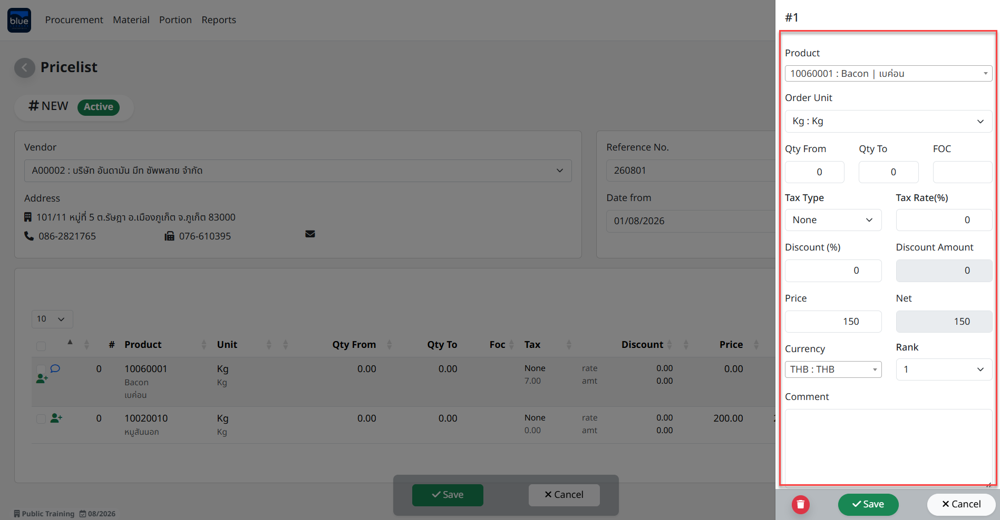

เมื่อ Click “Save” เพื่อบันทึกรายการสินค้าเรียบร้อยแล้ว หากต้องการสร้างสินค้ารายการที่ 2 ให้ ทำตามขั้นตอนที่ 4 อีกครั้งตามลำดับ

5.  หากบันทึกรายการสินค้าที่ครบตามต้องการแล้วให้ Click “Save” เอกสารเพื่อบันทึก Price List

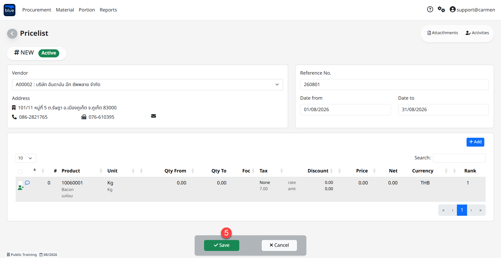

6.  ในกรณีต้องการแก้ไขรายการใน Price List

    - Click เอกสารที่บันทึก Price List

    - Click “Edit” เพื่อแก้ไขรายการสินค้า

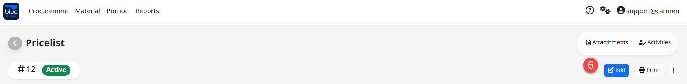

- เลือกรายการที่ต้องการลบจาก Price List จากนั้น Click “Delete”

- Click “Save” เพื่อบันทึกเอกสาร

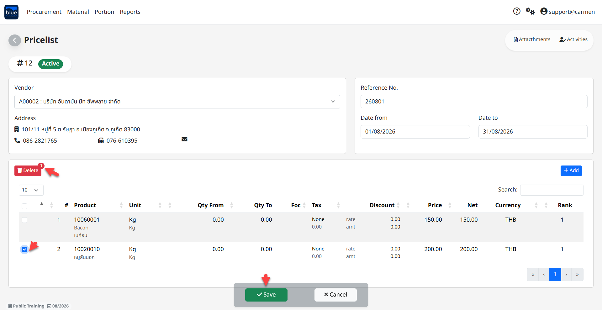

7.  Click “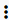” หากต้องการลบเอกสาร

    - Click “Delete” เพื่อลบเอกสาร

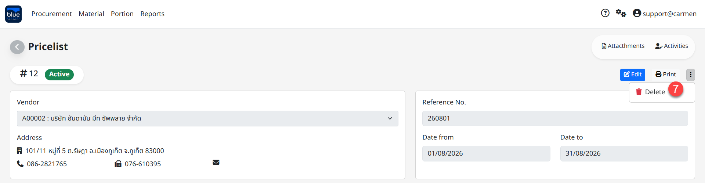

**ขั้นตอนการสร้าง** **Price List Tempate** **ด้วย Function “Export”**

1.  ในหน้าหลักของ Price List ให้ Click **“**” จากนั้น Click **“**Export**”**

2.  ระบุข้อมูลสินค้าในการ Export Price List ดังนี้

<!-- -->

1.  Category เลือกหมวดสินค้าที่ต้องการ

2.  Sub Category เลือกหมวดย่อยสินค้าที่ต้องการ

3.  Item Group เลือกกลุ่มสินค้าที่ต้องการ

4.  Click “” เพื่อเลือก Product ที่ต้องการ หรือ check box ที่หัว column เพื่อเลือกสินค้าทั้งหมด

5.  Click “Create” เพื่อ Download เอกสาร PriceList.csv

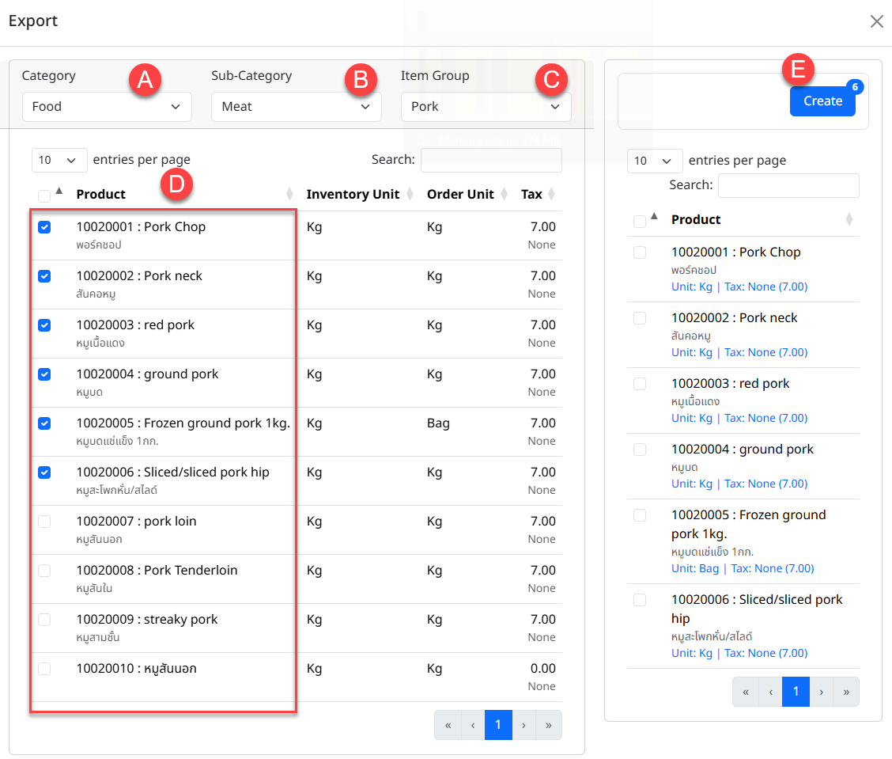

6.  Click “Yes” เพื่อยืนยันการ Create Price List และ Click “” เพื่อปิดหน้าต่าง Export

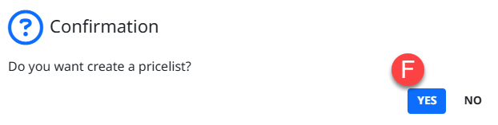

> หมายเหตุ :

- file ที่ export ไปจะเป็นนามสกุล .csv ที่สามารถเปิดผ่าน excel ได้

- เมื่อกรอกข้อมูลเสร็จแล้วต้อง save file เป็นนามสกุล .csv เท่านั้น

- ห้ามเพิ่มหรือลบ column

**การนำเข้าข้อมูล Price List ด้วย Function “Import”**

1.  ในหน้าหลักของ Price List ให้ Click **“**” จากนั้น Click **“**Import**”**

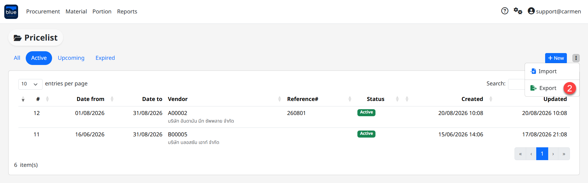

2.  การกรอกข้อมูลใน Excel มีขั้นตอนดังนี้

<!-- -->

7.  “Qty From” เพื่อใส่จำนวนเริ่มต้น ของการแจ้งราคา

8.  “Qty To” เพื่อใส่จำนวนสิ้นสุด ของการแจ้งราคา

9.  “Quote Price” เพื่อใส่ราคาที่แจ้ง

10. “FOC” เพื่อใส่จำนวนของแถม

11. “Discount Percent” เพื่อใส่จำนวนเปอร์เซ็นต์ของส่วนลด

12. “Discount Amount” เพื่อใส่ราคาส่วนลด

13. “Tax Type” เพื่อเลือกประเภทภาษี (N=None, A=Add, I=Include)

14. “Tax Rate” เพื่อใส่จำนวนเปอร์เซ็นต์ภาษี

15. “Comment” เพื่ออธิบายรายการสินค้า

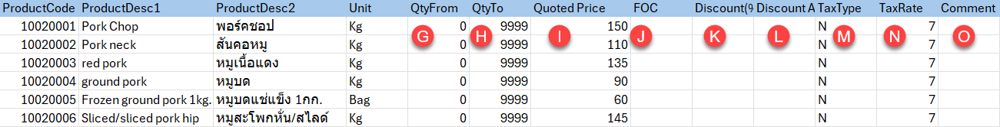

3.  ขั้นตอนการ Import Price List

<!-- -->

16. Vendor ระบร้านค้า

17. Currency ระบุสกุลเงิน (ระบบ Default ให้แล้ว)

18. Date from-Date to ระบวันที่หรือรอบของการยืนเปรียบเทียบราคา

19. Reference No. ระบุเลขที่เอกสารอ้างอิง (ถ้ามี)

20. Rank ระบบจัดอันดับการยืนเปรียบเทียบราคา

21. Click “Upload File” เพื่อดำเนินการนำเข้าข้อมูล

22. Click “Save” เพื่อ บันทึก หรือ “Back” เพื่อกลับสู่เมนู Price List

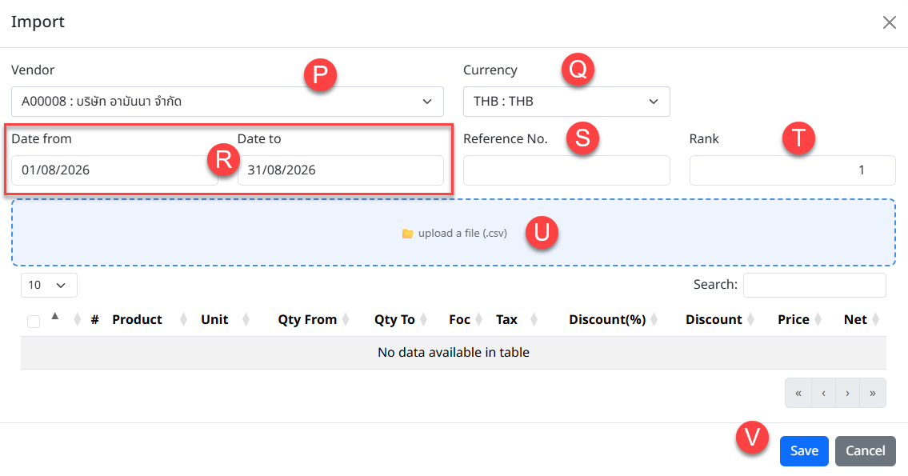

23. Click “Print” หากต้องการพิมพ์เอกสาร

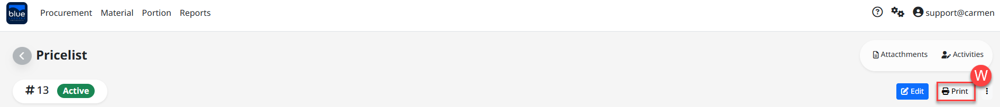

4.  การแก้ไข Price List

4.1 Click “Edit” เพื่อแก้ไขเอกสาร

4.2 หากต้องการลบรายการสินค้าให้ Click “” จากนั้น Click “Delete”

3.  Click “Save” เพื่อบันทึกข้อมูล

<!-- -->

2.  

3.  

4.  

<!-- -->

5.  มุมมองสถานะของเอกสาร Price List ประด้วยด้วย

    1.  All แสดงเอกสาร Price List ทั้งหมด

    2.  Active แสดงเอกสาร Price List ที่ใช้งานอยู่และอยู่ในรอบการเปรียบเทียบราคา

    3.  Upcoming แสดงเอกสาร Price List ที่เกิดขึ้นในเดือนถัดไป หรือรอบถัดไป

    4.  Expired แสดงเอกสาร Price List ที่หมดอายุ หรือไม่อยู่ในรอบการเปรียบเทียบราคาแล้ว

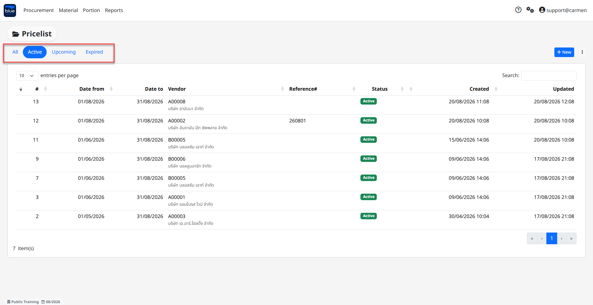
