---
title: "Purchase Request"
weight: 1
---
# Purchase Request

## Purchase Request (ใบขอซื้อ)

**Purchase Request** คือ Function ในการสร้างใบขอซื้อในระบบ โดยสามารถสร้างเอกสารได้ 2 วิธี

1. Create Manually สร้างใบขอซื้อ Purchase Request ด้วยตนเอง

2. From Template สร้างใบขอซื้อ Purchase Request โดยใช้ Template แบ่งได้ 2 ประเภท คือ

1. Market List เป็น Template ที่สร้างด้วย Product ที่อยู่ในหมวด Market list

2. Standard Order เป็น Template ที่สร้างด้วย Product ที่อยู่ในหมวด General และ Asset

สามารถเข้าถึง function นี้โดยไปที่ “Procurement” จากนั้น click “Purchase Request”

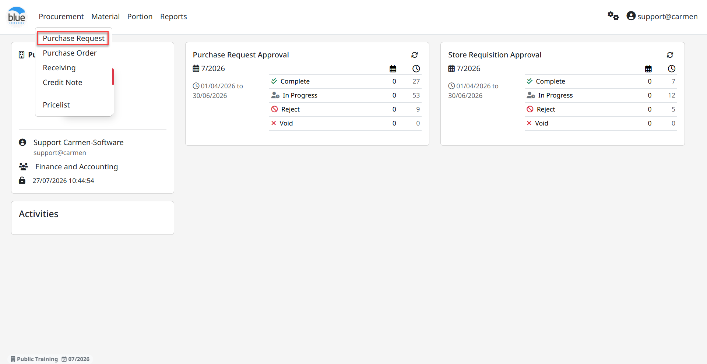

## 1. การสร้าง เอกสาร ใบขอซื้อ (PR)

1. การสร้าง เอกสาร ใบขอซื้อ ด้วยวิธี “Create Manually”

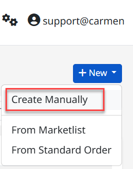

## ระบุข้อมูลในส่วนของ Header ดังนี้

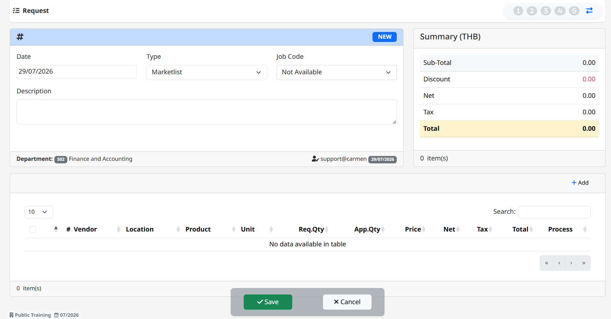

- “Date:” วันที่ทำเอกสาร

- “Type” กำหนดประเภทของ PR (Marketlist, General, Asset) ซึ่งมีผลต่อขั้นตอนการ approve ที่ต่างกัน

> 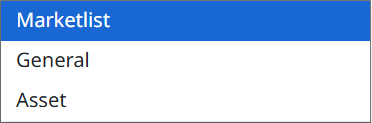

- “Job Code:” กำหนด PR Project (ระบบจะ Default Not Available)

- “Description” ใส่คำอธิบายให้กับ เอกสาร ใบขอซื้อ

## 2. Click “+Add” เพื่อระบุข้อมูลในส่วนของรายการขอซื้อ ดังนี้

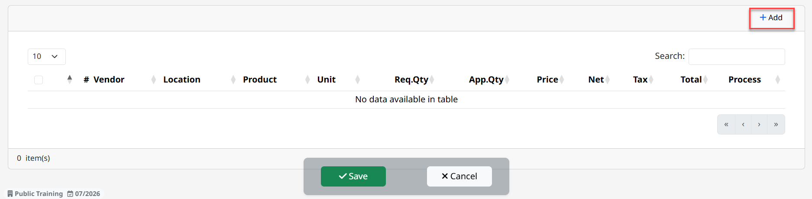

- “Location” เลือกสถานที่สำหรับขอซื้อสินค้า

- “Product” เลือกรายการสินค้าเพื่อขอสั่งซื้อ

- “Order Unit” ระบบจะ Default หน่วยสินค้าอัตโนมัติ (User สามารถเลือกหน่วยสินค้าได้)

- “Request Qty” ระบุจำนวนขอซื้อ

- “Delivery Date” วันที่ส่งสินค้า

- “Comment” ระบุรายละเอียดเพิ่มเติมเพื่อให้ร้านค้าจัดหาให้ตรงกับความต้องการมากยิ่งขึ้น

- “Inventory Unit /Rate” ระบบแสดงให้ผู้ใช้งานทราบถึงจำนวนสินค้าจากการแปลงหน่วย

## 3. Product on Stock

- “On hand” ระบบแสดงจำนวนสินค้าคงเหลือสำหรับรายการขอซื้อใน Location นั้น

- “On Order” ระบบแสดงจำนวนสั่งซื้อที่ค้างรับในระบบ Receiving

- “Re Order” ระบบแสดงจำนวนครั้งในการขอซื้อซ้ำในสินค้ารายการเดียวกัน

- “Re Stock” ระบบแสดงจำนวนของสินค้าที่จะต้องขอซื้อเพิ่มเพื่อให้จำนวนสินค้าเท่ากับ Maximum Par Stock

- “Last Price” ราคาซื้อสินค้าล่าสุด (จากระบบ Receiving)

- “Last Vendor” ร้านค้าที่ซื้อสินค้าล่าสุด

4. Save เพื่อบันทึกรายการสั่งซื้อ (เป็นการบันทึกรายการขอซื้อเท่านั้น)

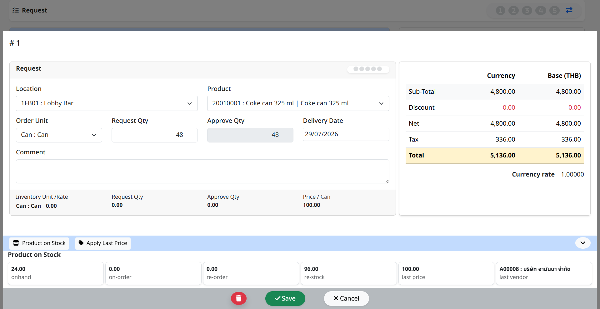

5. การบันทึกใบ PR และการเพิ่มรายการสินค้า

- Click “Save” เพื่อบันทึกเอกสารใบขอซื้อในกรณีไม่ต้องการเพิ่มรายการขอซื้อแล้ว (เอกสารยังไม่ส่งไปขอพิจารณา ที่ลำดับถัดไป)

- Click “Cancel” เพื่อ ยกเลิก

- Click “Add” เพื่อเพิ่มรายการสินค้าในใบขอซื้อ

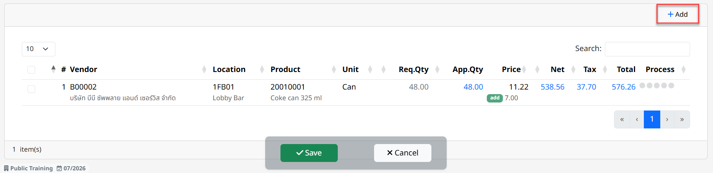

6. การบันทึกเอกสาร ใบขอซื้อ Purchase Request

- Click “Save” เพื่อ บันทึก ใบขอซื้อ (ยังไม่ส่งไป ขอพิจารณา ที่ลำดับถัดไป

- สามารถกลับมา Edit ,Void หรือ Commit ภายหลังได้)

- Click “Back” เพื่อยกเลิกการบันทึก ใบขอซื้อ

- การ Commit เอกสาร ใบขอซื้อ Purchase Request

- Click “Commit” เพื่อ ยืนยัน เอกสาร ใบขอซื้อ ขอพิจารณาที่ลำดับถัดไป (เมื่อ Commit แล้วจะไม่สามารถกลับมา Edit หรือ Void ได้อีก)

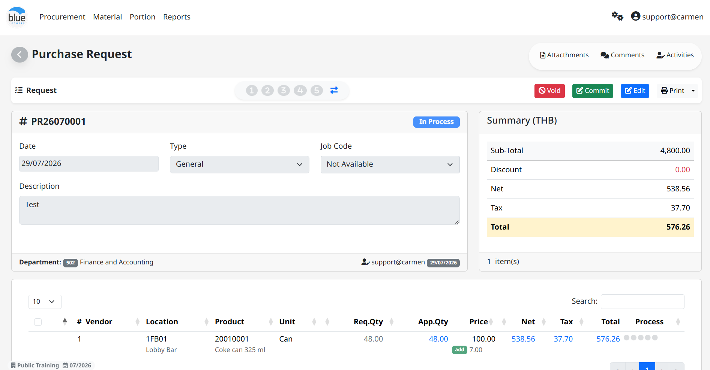

7. หลังจาก Save เอกสารใบขอซื้อแล้วระบบจะแสดง Function อื่น ๆ ของ Purchase Request

- “Void” ใช้สำหรับ Void เอกสารใบขอซื้อ

- “Commit” ใช้สำหรับยืนยันเอกสารใบขอซื้อ จากผู้สร้างเอกสารใบขอซื้อดังกล่าวเพื่อขอพิจารณาที่ลำดับถัดไป

- “Edit” ใช้สำหรับแก้ไขเอกสารใบขอซื้อ

- “Print” ใช้สำหรับพิมพ์แบบฟอร์มใบขอซื้อ Purchase Request ในระบบ

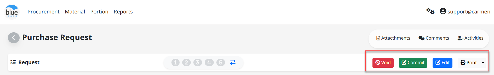

8. การสร้างเอกสารใบขอซื้อ ด้วย Template มี 2 แบบ คือ1. Market List และ 2. Standard Order

- Click “Create” - “From Market List” หรือ “From Standard Order”

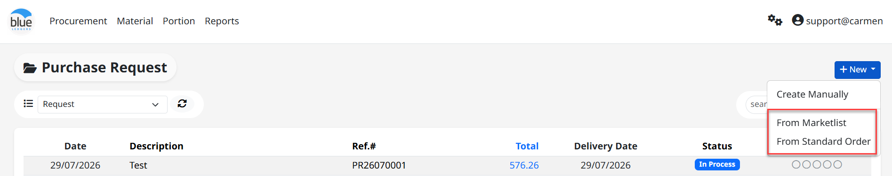

- Click เครื่องหมายถูก ที่ Template ที่ต้องการ จากนั้น Click “Select”

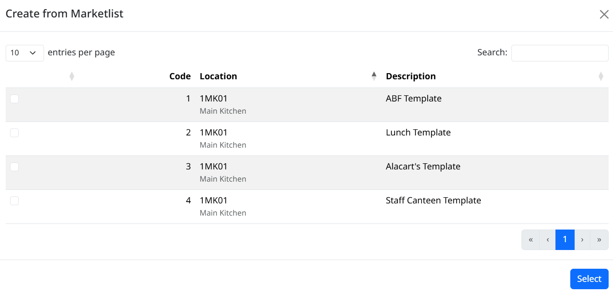

## การระบุข้อมูลในการสร้าง Template มีขั้นตอนดังต่อไปนี้

**หมายเหตุ** เครื่องหมาย \* คือช่องที่จำเป็นต้องระบุ

- Delivery Date เพื่อเปลี่ยนวันที่ Delivery Date ที่ต้องการ

- Description ระบบจะแสดงคำอธิบายตาม template ที่สร้างไว้

- Qty Req. เพื่อ กรอกจำนวน ที่ต้องการขอซื้อ ในรายการสินค้า ที่ต้องการ

- Click “Create” เพื่อ สร้าง เป็น เอกสาร ใบขอซื้อ หรือ “Back” เพื่อกลับสู่หน้าเมนู PR

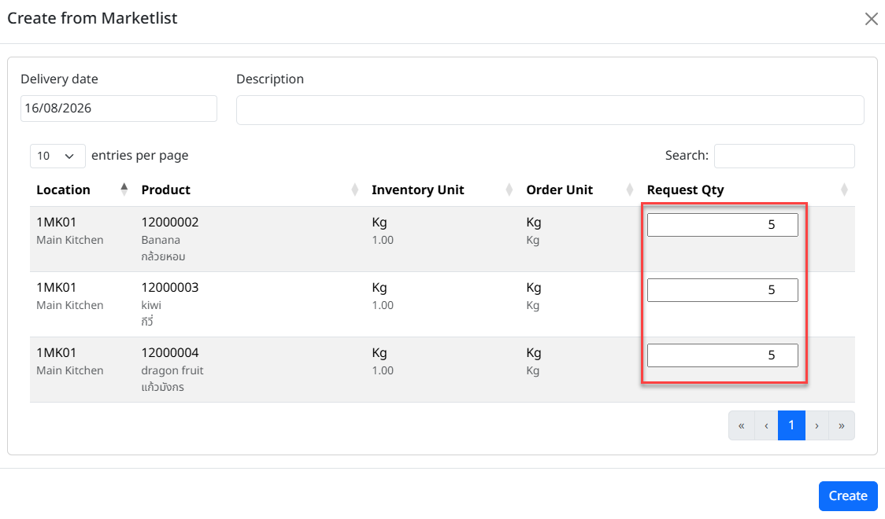

- ระบบทำการ Generate PR อัตโนมัติ Click “OK”

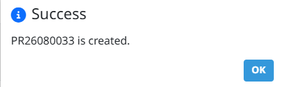

9. การ ค้นหา และ View เอกสาร ใบขอซื้อ

1. หลังจากที่เข้ามาในหน้า PR แล้วสามารถ เลือก View ได้ด้วย “View All” หรือ View ตามลำดับอนุมัติ โดย user จะเห็น view ตามที่ได้รับการ assign ใน workflow เท่านั้น (สามารถค้นหาใบขอซื้อที่ต้องการ โดย พิมพ์ค้นหาในช่อง Search)

2. การ View เอกสาร ใบขอซื้อ ทำได้โดยการเลือกเอกสารใบขอซื้อ ที่ต้องการเพื่อแสดงรายละเอียดของ เอกสาร ใบขอซื้อ นั้นๆ

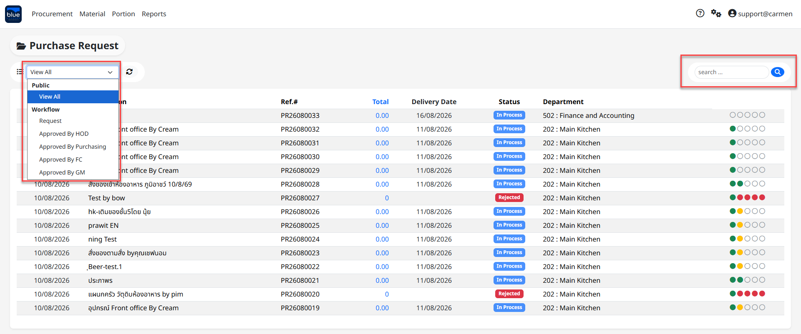

10. การ Comment หรือ แนบไฟล์ Attachment ในเอกสาร ใบขอซื้อ

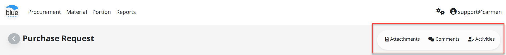

<u>การแนบไฟล์ Attachment ในเอกสาร ใบขอซื้อ เพื่อแนบเอกสารประกอบการขอซื้อ</u>

1. Click “**Drag and drop files here**” (หรือลากไฟล์ที่ต้องการแนบมาวางในช่องสี่เหลี่ยม)

2. เลือก “Choose File” เพื่อเลือก File ที่ต้องการแนบ

3. Click “Open” เพื่อ บันทึก หรือ “Cancel” เพื่อ ยกเลิก

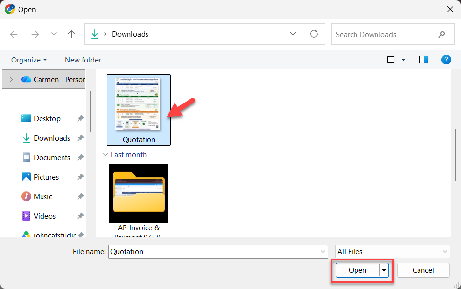

4. Click “Upload” เพื่อนำส่งไฟล์เข้าระบบ

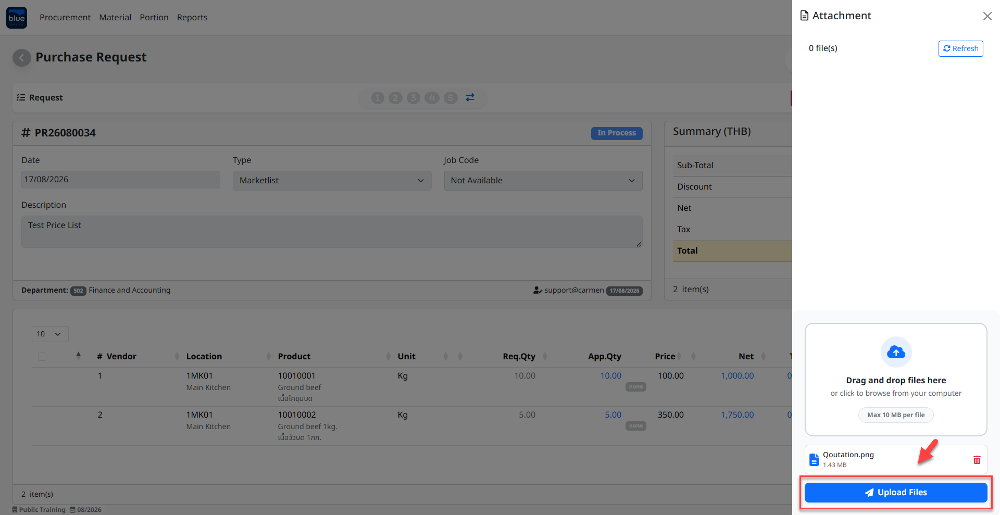

> การเพิ่ม Comment ในเอกสาร ใบขอซื้อเพื่อเป็นการสื่อสารภายใน

5. Click “Comment”

6. ใส่ “Comment” ที่ต้องการ

7. Click “Update” เพื่อ บันทึก หรือ “Cancel” เพื่อ ยกเลิก

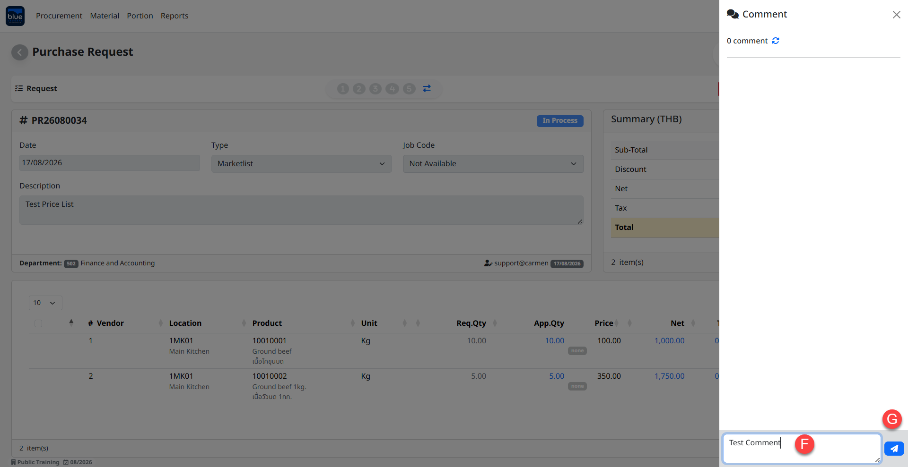

11. การ Approve PR - เลือก View ตามสิทธิ์อนุมัติ ของ User จากนั้นเลือกเอกสารใบขอซื้อที่ต้องการ (สามารถพิมพ์ค้นหา เอกสาร ใบขอซื้อ ที่ต้องการได้ ที่ช่อง Search) และ ทำตามขั้นตอนต่อไปนี้

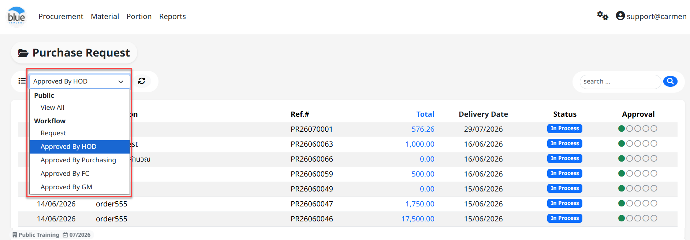

1. Click เครื่องหมายถูก ที่ รายการสินค้า ที่ต้องการ

<!-- -->

1. “Approve” เพื่ออนุมัติรายการสั่งซื้อ ที่เลือกไว้

2. “Reject” เพื่อ ปฏิเสธรายการสั่งซื้อ ที่เลือกไว้ (สามารถใส่ Comment ที่ Reject ได้)

3. “Send Back” เพื่อส่งรายการสั่งซื้อที่เลือกไว้กลับไปยังลำดับก่อนหน้าที่ต้องการ

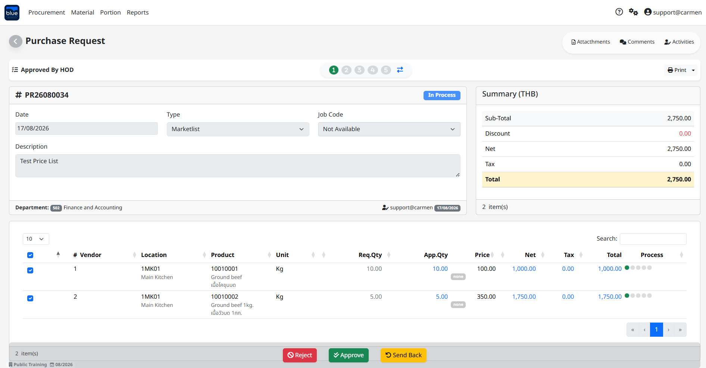

> (สามารถระบุเหตุผลใน Comment ที่ Reject และ Send Back ได้)

12. การ Assign ร้านค้า และ ราคา (ระบบจะแสดง function นี้ ในขั้นตอนของจัดซื้อเท่านั้น)

1. การ Assign ร้านค้า และ ราคา สามารถ Assign ได้ 3 วิธี

1. “Auto Allocate” คือการ assign vendor และ ราคา จาก price list ที่ได้สร้างไว้ โดยระบบจะเลือกจาก Rank ในลำดับที่ 1 ก่อน ตามด้วยราคาที่ถูกที่สุด สามารถทำตามขั้นตอนดังนี้

2. Click “Auto Allocate” ระบบจะทำการใส่ ร้านค้า และ ราคา รวมถึง ประเภทภาษี ตาม Price List ที่ได้บันทึกเอาไว้ และเป็น Price list ในช่วงเวลาที่สามารถใช้งานได้อยู่

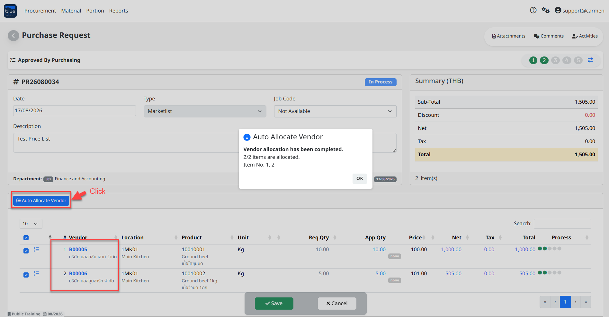

3. Manual Assign การเลือก Vendor จาก Price List ใบอื่นที่ไม่ได้อยู่ใน Ranking และ ราคาถูกที่สุด

4. เลือก เอกสาร ใบขอซื้อ ที่ต้องการ จากนั้น Click “Edit”

5. กดปุ่ม “Assign” ที่ Price List ที่ต้องการเลือก

6. ระบบจะทำการบันทึกข้อมูล Vendor ราคา Tax type และข้อมูลอื่นๆ ให้โดยอัตโนมัติ

7. การบันทึกสินค้า

<!-- -->

1. Click “Save” เพื่อ บันทึก หรือ “Cancel” เพื่อ ยกเลิก

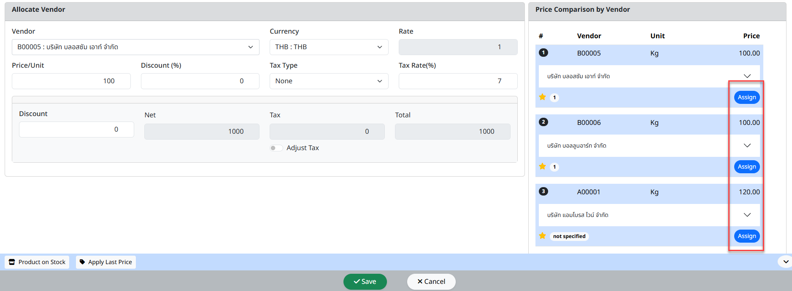

8. Manual Allocate การเลือก Vendor และ ราคาด้วยตนเองในกรณีที่ไม่มีการบันทึก Price List

<!-- -->

1. เลือก เอกสาร ใบขอซื้อ ที่ต้องการ จากนั้น Click “Edit”

2. จากนั้น ใส่รายละเอียด ดังต่อไปนี้

1. “Vendor” เพื่อเลือก ร้านค้า ที่ต้องการสั่งซื้อ

2. “Price” เพื่อใส่ราคา

3. “Discount%” หากมีส่วนลด

4. Click เครื่องหมายถูก ที่ “Adj. Tax” เพื่อเลือกประเภท ภาษี (None, Add, Included)

5. ใส่ “Tax Rate” หากมี ภาษี ด้วย จำนวน %

6. ใส่ “Discount Amount” หากต้องการใส่มูลค่าส่วนลดด้วยตนเอง

7. “Net” คือมูลค่าก่อนหักส่วนลด และ ภาษี

8. “Total” คือมูลค่ารวมส่วนลด และ ภาษี

3. การบันทึกสินค้า

1. Click “Save” เพื่อ บันทึก หรือ “Cancel” เพื่อ ยกเลิก

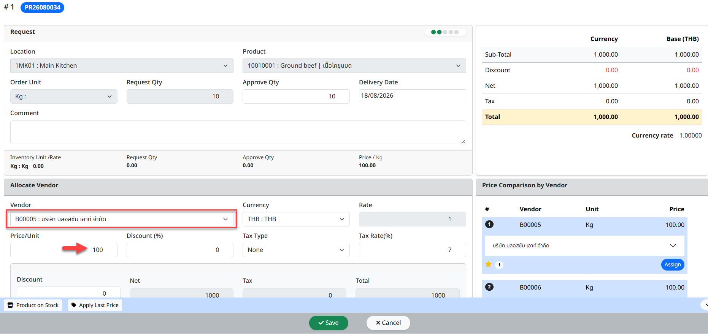

13. การ Split & Reject รายการสินค้า

Function นี้ใช้ในกรณีที่ต้องการนำสินค้าที่สามารถกำหนด Vendor และ ราคาได้เรียบร้อยแล้วไปทำการ approve เพื่อออก PO ก่อน

เลือก View ตาม สิทธิ์อนุมัติ ที่สามารถ Assign ร้านค้า และ ราคา ได้ (โดยทั่วไป คือ ตำแหน่งจัดซื้อ)

จากนั้น เลือก เอกสาร ใบขอซื้อ ที่ต้องการ

1. ขั้นตอนการ Split & Reject รายการสินค้า

<!-- -->

7. Click เครื่องหมายถูก ที่รายการสั่งซื้อ ที่ต้องการ Split & Reject

8. Click “Split & Reject” จากนั้น Click “Approve”

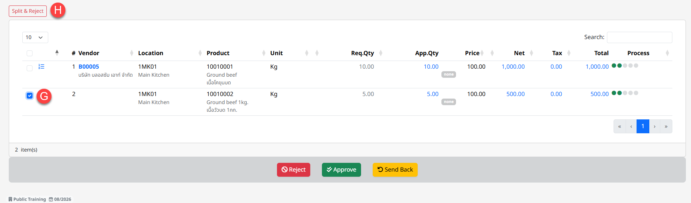

9. ระบบจะแสดง Popup – Click “OK” เพื่อ ตกลง หรือ “Cancel” เพื่อ ยกเลิก

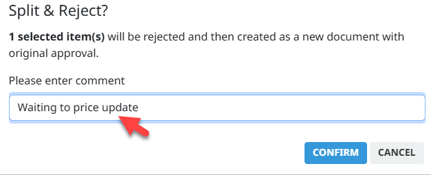

10. ระบบแสดงข้อความยืนยันการ Reject และแสดงสถานะการ Reject รายการสั่งซื้อ จาก PR เดิม

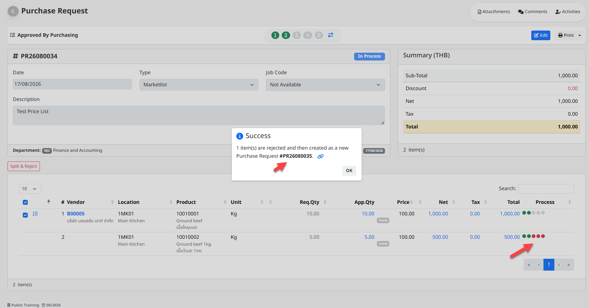

11. ระบบได้ Split PR ขึ้นอีก 1 เอกสาร โดยแยกรายการที่ถูก Reject ออกไว้เพื่อรอการระบุร้านค้าและราคาต่อไป

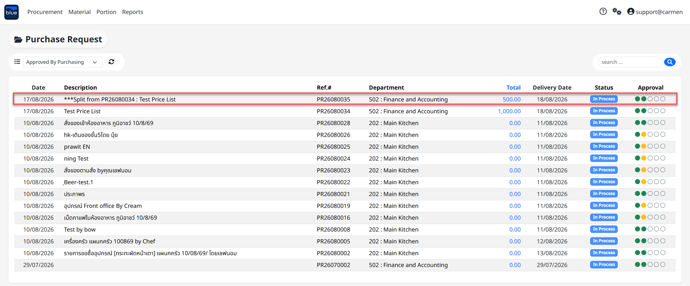
