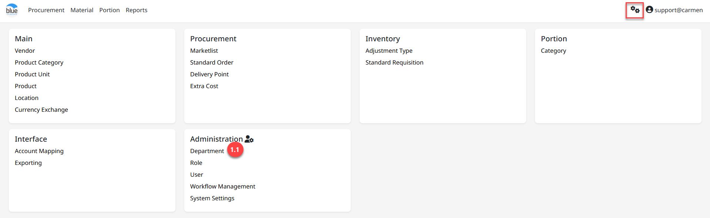
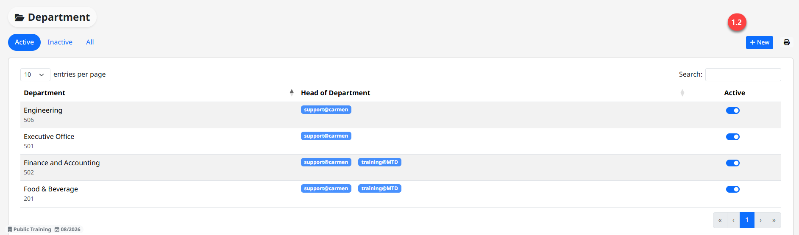

**Department**

**Department** คือ แผนกที่ใช้ในการกำหนด Workflow เพื่อจัดการเกี่ยวกับสิทธิ์การอนุมัติ
Purchase Request และ Purchase Order

สามารถเข้าใช้งานโดย Click “” เพื่อเข้าสู่หน้าต่างตั้งค่า

1.  **ขั้นตอนการสร้าง Department**

    1.  Click “Department” เพื่อเข้าสู่หน้าต่างการสร้าง Dept.

    2.  Click “New” เพื่อสร้าง Dept.

3.  ระบุรายละเอียดข้อมูลสำหรับสร้าง Standard Requisition Template

- Code ระบุรหัสแผนก

- Name ระบุชื่อแผนก

- Head Department ระบุ User ที่เป็นหัวหน้าแผนก โดยการ Click ช่องสี่เหลี่ยม
  (ตามลูกศร)

Note: ในกรณีหยุดใช้งาน Adjust Type แล้ว ให้ทำการ Click สัญลักษณ์
“” เพื่อ Inactive

4.  Click “Crate” เพื่อสร้าง Department

หลังจาก Create แล้ว ในส่วนของ User ระดับ HOD จะแสดงในแต่ละแผนก
เพื่อแสดงให้ทราบว่า User ดังต่อไปนี้มีสิทธิ์อนุมัติ PR และ PO ในแต่ละแผนก

