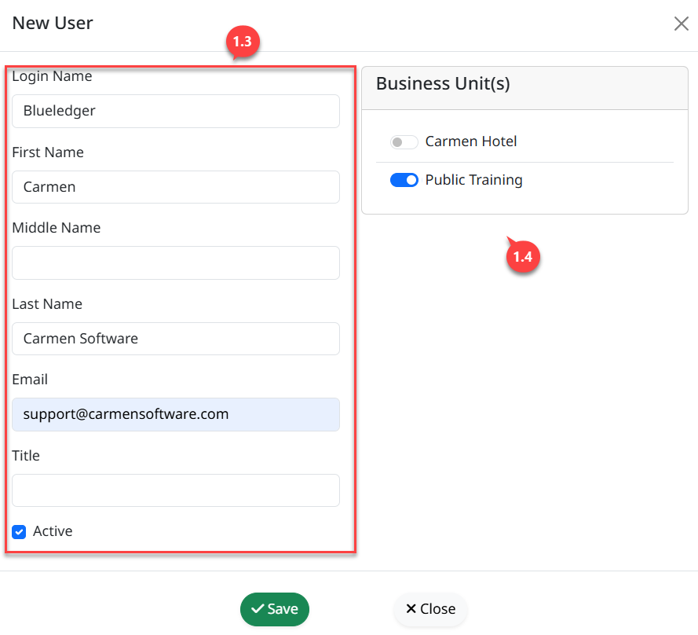
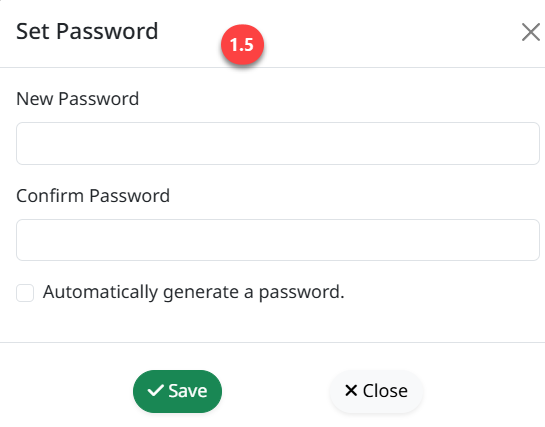
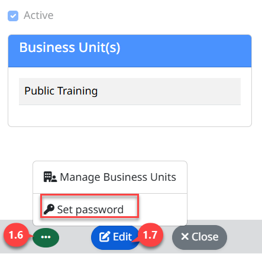
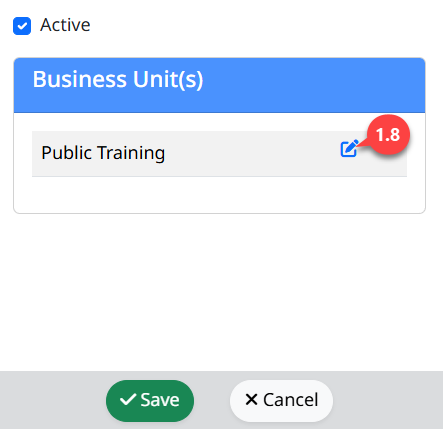
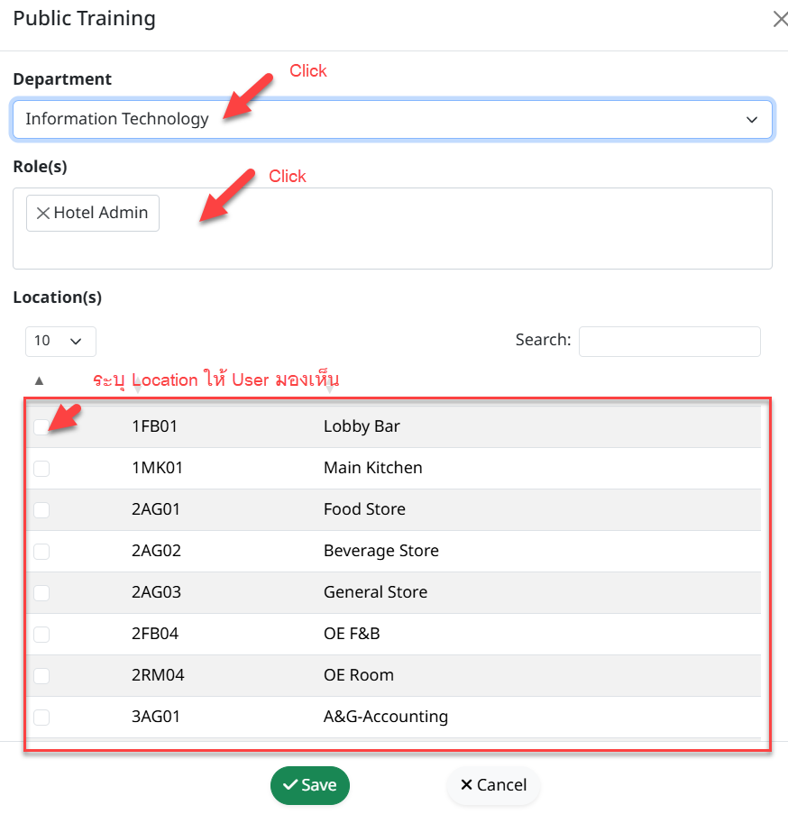
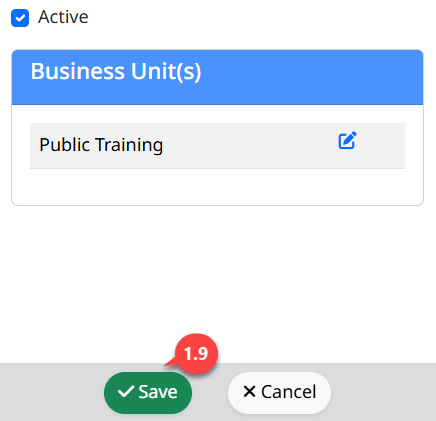

**User**

**User** คือ การสร้างรายชื่อผู้มีสิทธิ์เข้าใช้งานให้กับระบบ ดังนี้

สามารถเข้าใช้งานโดย Click “” เพื่อเข้าสู่หน้าต่างตั้งค่า

1.  **ขั้นตอนการสร้าง User**

    1.  Click “User” เพื่อเข้าสู่หน้าต่างการสร้างสิทธิ์การใช้งาน

    2.  Click “New” เพื่อสร้าง User

    3.  ระบุข้อมูลสำหรับสร้าง User

        - Login Name ชื่อ (User) สำหรับใช้ Login

        - First Name ชื่อผู้ใช้งาน (จำเป็นต้องระบุ)

        - Middle Name ชื่อกลาง (ถ้ามี)

        - Last Name นามสกุล (จะระบุหรือไม่ก็ได้)

        - Email อีเมล์ (จำเป็นต้องระบุ)

        - Title รายละเอียดงาน (ระบุหรือไม่ก็ได้)

    4.  Click สัญลักษณ์
        “”
        เพื่อเปิดใช้งาน Business Unit ให้กับ User ที่สร้าง

5.  Click “Save” เพื่อบันทึกข้อมูล

    - เมื่อบันทึกข้อมูลแล้วระบบจะแสดงหน้าต่างให้ทำการ Set Password

    - ระบุรหัสผ่าน และยืนยังอีกครั้งให้ทำการ Click “Save” หรือ “Cancel” เพื่อยกเลิก
      หรือ Click “” Automatically
      Generate a Password เพื่อเลือกให้ระบบสร้างรหัสผ่านให้

- Click “Save” เพื่อบันทึกรหัสผ่าน

6.  หากต้องการแก้ไขรหัสผ่าน Click “” เพื่อ set Password

7.  Click “Edit” เพื่อแก้ไขรายละเอียด หรือเพื่อระบุแผนก

8.  Click “” เพื่อระบุ Department ให้กับ
    User

- ระบุ Department

- กำหนด Role ให้กับ User

- กำหนด Location ให้ User มองเห็น จากนั้น Click “Save”

1.  Click “Save” เพื่อบันทึกข้อมูลการเปลี่ยนทั้งหมด

