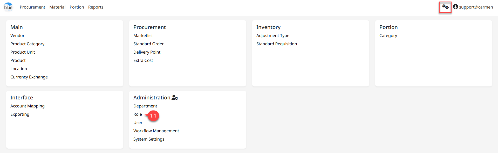
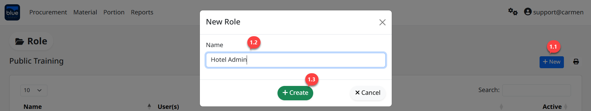
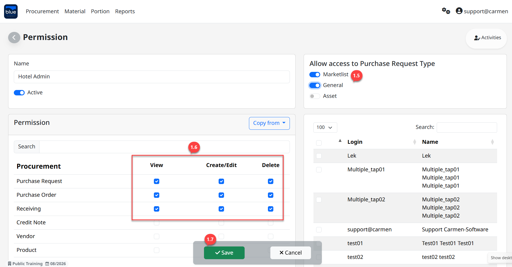

---
title: "Role"
weight: 2
---
# Role

**Role** คือ การกำหนดสิทธิ์การเข้าใช้งานระบบ โดยมี Permissions ดังนี้

- View กำหนดให้สามารถมองเห็นเอกสารได้แต่ไม่สามารถสร้าง หรือแก้ไขข้อมูลได้

- Create/Edit กำหนดให้สามารถสร้างเอกสาร และแก้ไขเอกสารได้

- Delete กำหนดให้สามารถสร้างเอกสาร แก้ไขเอกสาร และลบเอกสารได้

สามารถเข้าใช้งานโดย Click “” เพื่อเข้าสู่หน้าต่างตั้งค่า

## 1. ขั้นตอนการสร้าง Role

1. Click “Role” เพื่อเข้าสู่หน้าต่างการสร้างสิทธิ์การใช้งาน

2. Click “New” เพื่อสร้าง Role

3. Click “Create” เพื่อบันทึก Role

4. Click “Edit” เพื่อแก้ไขการกำหนด Role

5. Click สัญลักษณ์
“”
เพื่อเปิดใช้งานระบบ ประกอบด้วย

- Market List คือ ใบขอซื้อประเภทรายการของสด

- General คือ ใบขอซื้อประเภทสินค้าทั่วไป

- Asset คือ ใบขอซื้อประเภทสินทรัพย์

6. ระบุสิทธิ์โดย Click “”
เพื่อเพิ่มสิทธิ์การมองเห็นและการใช้งาน ซึ่งความหมายของการกำหนดสิทธิ์ ดังนี้

- View กำหนดให้เพียงมองเห็นแต่ไม่สามารถดำเนินการใดๆ ได้

- Create/Edit กำหนดให้มองเห็นเอกสาร สร้างเอกสาร และแก้ไขเอกสารได้

- Delete กำหนดให้มองเห็นเอกสาร สร้างเอกสาร แก้ไขเอกสาร และลบเอกสารได้

7. Click “Save” เพื่อบันทึกข้อมูล

