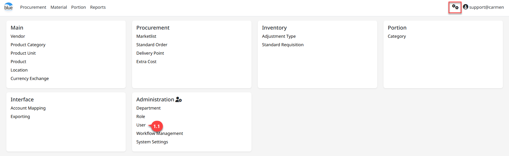

---
title: "User"
weight: 1
---
# User

**User** คือ การสร้างรายชื่อผู้มีสิทธิ์เข้าใช้งานให้กับระบบ ดังนี้

สามารถเข้าใช้งานโดย Click “” เพื่อเข้าสู่หน้าต่างตั้งค่า

## 1. ขั้นตอนการสร้าง User

1. Click “User” เพื่อเข้าสู่หน้าต่างการสร้างสิทธิ์การใช้งาน

2. Click “New” เพื่อสร้าง User

3. ระบุข้อมูลสำหรับสร้าง User

- Login Name ชื่อ (User) สำหรับใช้ Login

- First Name ชื่อผู้ใช้งาน (จำเป็นต้องระบุ)

- Middle Name ชื่อกลาง (ถ้ามี)

- Last Name นามสกุล (จะระบุหรือไม่ก็ได้)

- Email อีเมล์ (จำเป็นต้องระบุ)

- Title รายละเอียดงาน (ระบุหรือไม่ก็ได้)

4. Click สัญลักษณ์
“”
เพื่อเปิดใช้งาน Business Unit ให้กับ User ที่สร้าง

5. Click “Save” เพื่อบันทึกข้อมูล

- เมื่อบันทึกข้อมูลแล้วระบบจะแสดงหน้าต่างให้ทำการ Set Password

- ระบุรหัสผ่าน และยืนยังอีกครั้งให้ทำการ Click “Save” หรือ “Cancel” เพื่อยกเลิก
  หรือ Click “” Automatically
  Generate a Password เพื่อเลือกให้ระบบสร้างรหัสผ่านให้

- Click “Save” เพื่อบันทึกรหัสผ่าน

6. หากต้องการแก้ไขรหัสผ่าน Click “” เพื่อ set Password

7. Click “Edit” เพื่อแก้ไขรายละเอียด หรือเพื่อระบุแผนก

8. Click “” เพื่อระบุ Department ให้กับ
User

- ระบุ Department

- กำหนด Role ให้กับ User

- กำหนด Location ให้ User มองเห็น จากนั้น Click “Save”

1. Click “Save” เพื่อบันทึกข้อมูลการเปลี่ยนทั้งหมด

