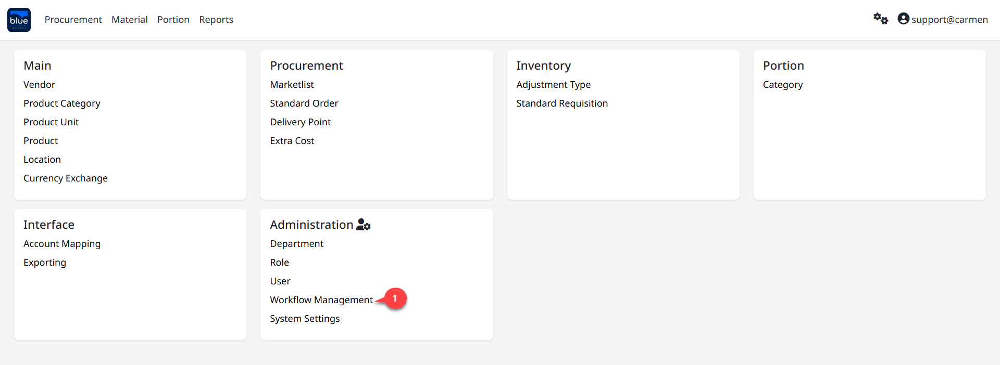
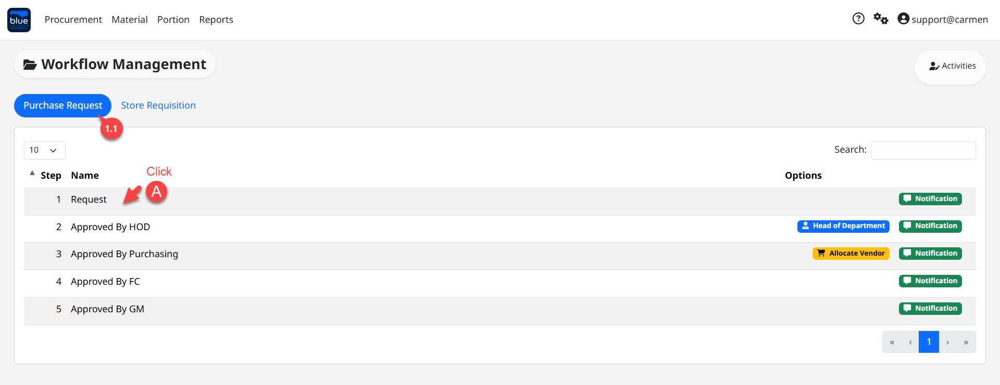
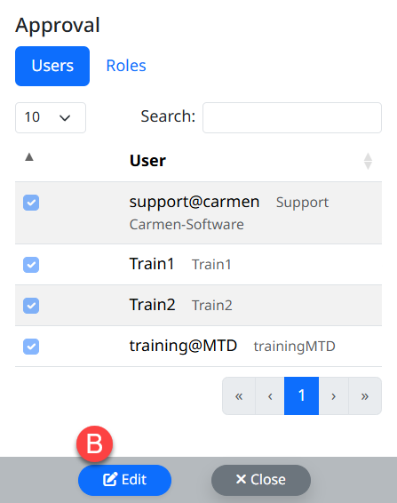
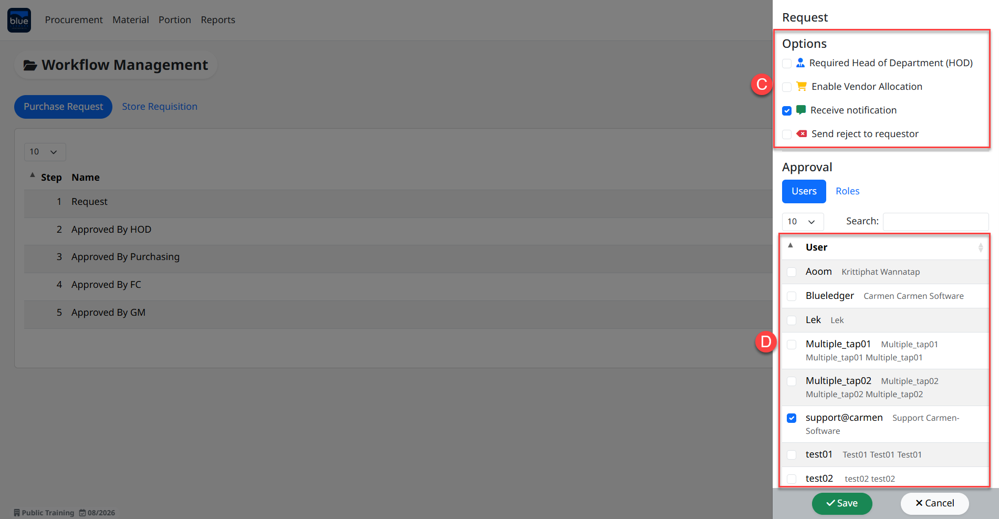
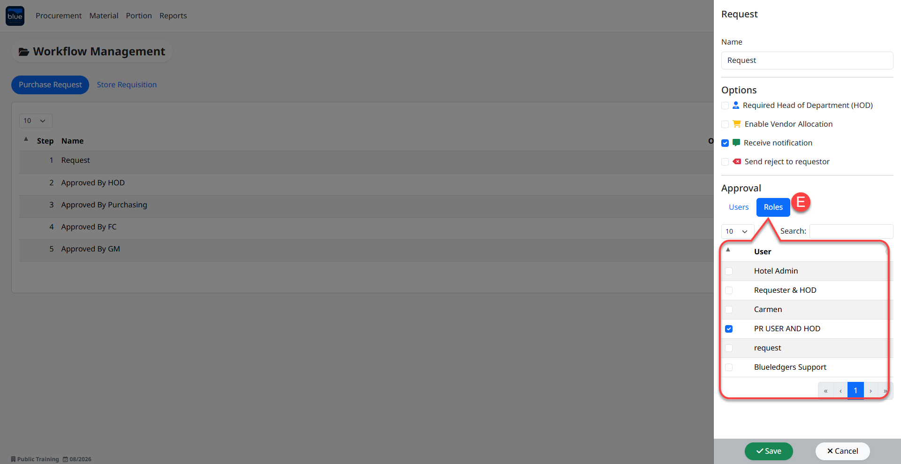
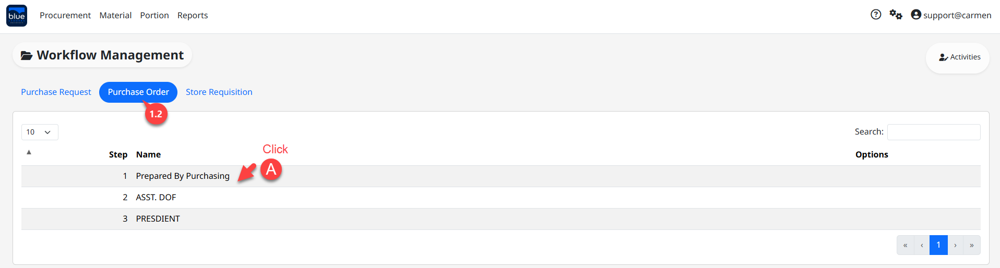
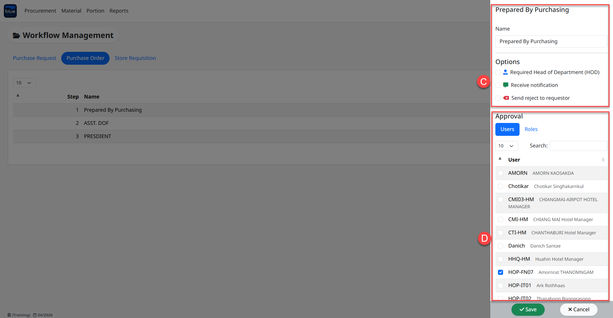
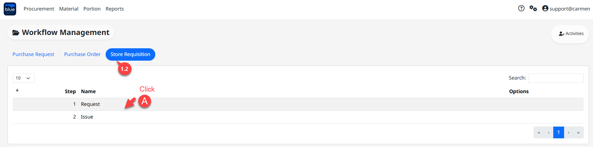
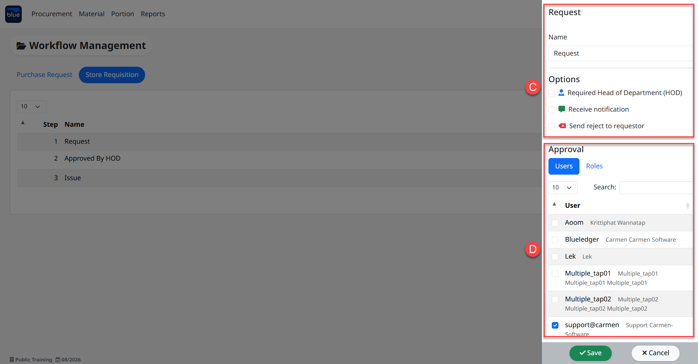

---
title: "Workflow Management"
weight: 4
---
# Workflow Management

**Workflow** คือ การกำหนดขอบเขตการมองเห็น และลำดับขั้นในการอนุมัติเอกสาร ซึ่งประกอบไปด้วย เอกสารใบขอซื้อ (Purchase Request) และเอกสารใบขอเบิก (Store Requisition)

สามารถเข้าใช้งานโดย Click “” เพื่อเข้าสู่หน้าต่างตั้งค่า

## ขั้นตอนการสร้าง Workflow

1. Click “Workflow Management” เพื่อเข้าสู่หน้าต่างการสร้าง Workflow ซึ่งประกอบไปด้วย 2 ส่วนคือ

1. Purchase Request Workflow หมายถึง ขั้นตอนการทำงานของเอกสารใบขอซื้อ มีขั้นตอนดังต่อไปนี้

1. Click “Workflow Step”

2. Click “Edit” เพื่อเข้าสู่ขั้นตอนการกำหนด หรือแก้ไขกำหนดเงื่อนไขการทำงาน

3. Option กำหนดสถานะให้กับผู้ใช้งาน

- Required Head of Department (HOD) กำหนดให้ User อยู่ในตำแหน่งหัวหน้าแผนก

- Enable Vendor Allocation กำหนดให้ User อยู่ในตำแหน่ง Purchasing

- Receive notification กำหนดให้ User สามารถรับ Email จากการอนุมัติใบขอซื้อ

- Send reject to requestor กำหนดให้ User สามารถรับ Email จากการยกเลิกใบขอซื้อ

4. Approval กำหนดสิทธิ์การอนุมัติใบขอซื้อ

- Click “” เพื่อเลือก User ให้อยู่ใน Workflow Step

- Click “Save” เพื่อบันทึกข้อมูล

5. Approval Assign by Roles คือ การนำสิทธิ์การใช้งานที่ได้จากกำหนด Permission มาตั้งค่าให้กับ User ในแต่ละ Workflow เพื่อกำหนด User สามารถมองเห็นและใช้งานตามที่ได้ถูกกำหนดสิทธิ์ไว้

- Click “” เพื่อเลือก Role ให้กับ User

- Click “Save” เพื่อบันทึกข้อมูล

1. Purchase Order Workflow หมายถึง ขั้นตอนการทำงานของเอกสารใบสั่งซื้อ มีขั้นตอนดังต่อไปนี้

1. Click “Workflow Step”

2. Click “Edit” เพื่อเข้าสู่ขั้นตอนการกำหนด หรือแก้ไขกำหนดเงื่อนไขการทำงาน

3. Option กำหนดสถานะให้กับผู้ใช้งาน

- Required Head of Department (HOD) กำหนดให้ User อยู่ในตำแหน่งหัวหน้าแผนก

- Receive notification กำหนดให้ User สามารถรับ Email จากการอนุมัติใบขอซื้อ

- Send reject to requestor กำหนดให้ User สามารถรับ Email จากการยกเลิกใบขอซื้อ

4. Approval กำหนดสิทธิ์การอนุมัติใบขอซื้อ

- Click “” เพื่อเลือก User ให้อยู่ใน Workflow Step

- Click “Save” เพื่อบันทึกข้อมูล

1. Store Requisition Workflow หมายถึง ขั้นตอนการทำงานของเอกสารใบขอเบิก มีขั้นตอนดังต่อไปนี้

1. Click “Workflow Step”

2. Click “Edit” เพื่อเข้าสู่ขั้นตอนการกำหนด หรือแก้ไขกำหนดเงื่อนไขการทำงาน

3. Option กำหนดสถานะให้กับผู้ใช้งาน

- Required Head of Department (HOD) กำหนดให้ User อยู่ในตำแหน่งหัวหน้าแผนก

- Receive notification กำหนดให้ User สามารถรับ Email จากการอนุมัติใบขอซื้อ

- Send reject to requestor กำหนดให้ User สามารถรับ Email จากการยกเลิกใบขอซื้อ

4. Approval กำหนดสิทธิ์การอนุมัติใบขอซื้อ

- Click “” เพื่อเลือก User ให้อยู่ใน Workflow Step

- Click “Save” เพื่อบันทึกข้อมูล

