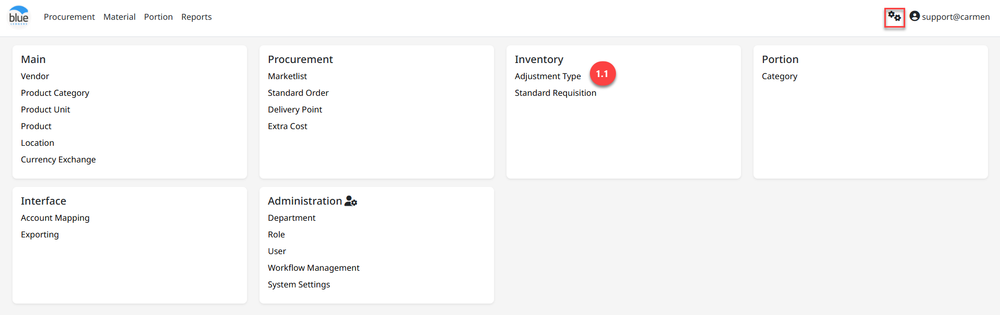

---
title: "Adjustment Type"
weight: 31
---
# Adjustment Type

**Adjustment Type** คือ การสร้างประเภทเอกสารเพื่อใช้ในการปรับปรุง **Stock** ทั้งในกรณีเพิ่มยอด และลดยอดใน **Stock**

สามารถเข้าใช้งานโดย **Click “****”** เพื่อเข้าสู่หน้าต่างตั้งค่า

## 1. ขั้นตอนการสร้าง Adjustment

1. Click “Adjustment Type”

2. Click “New” เพื่อสร้าง Adjust Type

3. ระบุรายละเอียดข้อมูลสำหรับสร้าง Adjust Type

- Type เลือกประเภทการ Adjust

- Code ระบุรหัสสำหรับ Adjust Type

- Name ระบุชื่อ Adjust Type

4. Click “Save” เพื่อบันทึก

Note: ในกรณีหยุดใช้งาน Adjust Type แล้ว ให้ทำการ Click สัญลักษณ์ “” เพื่อ Inactive
