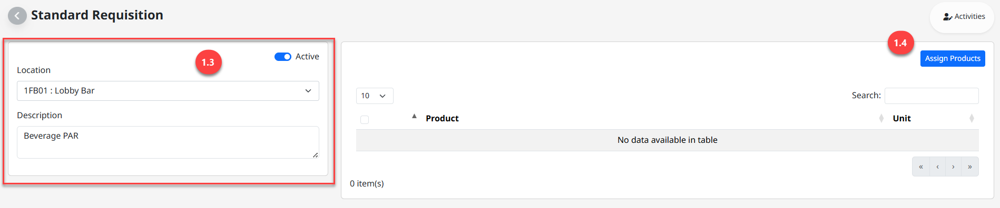

---
title: "Standard Requisition"
weight: 32
---
# Standard Requisition

**Standard Requisition** คือ การสร้างเอกสารแม่แบบสำหรับการสร้าง Store Request

สามารถเข้าใช้งานโดย Click “” เพื่อเข้าสู่หน้าต่างตั้งค่า

## 1. ขั้นตอนการสร้างเอกสาร Standard Requisition

1. Click “Standard Requisition”

2. Click “New” เพื่อสร้างเอกสาร

3. ระบุรายละเอียดข้อมูลสำหรับสร้าง Standard Requisition Template

- Location เลือก Location ของผู้ขอเบิก

- Description ระบุชื่อ Template

Note: ในกรณีหยุดใช้งาน Adjust Type แล้ว ให้ทำการ Click สัญลักษณ์ “” เพื่อ Inactive

4. Click “Assign Product” เพื่อเลือกรายการสินค้า

5. วิธีการเลือกสินค้าเพื่อให้แสดงใน Template

- Click สัญลักษณ์ Drop Down List “  ” เพื่อค้นหารายการสินค้าที่ต้องการ

- Click “” รายการสินค้าที่ต้องการ

6. Click “Select” เพื่อบันทึกรายการสินค้า

7. Click “Save” เพื่อบันทึก Template หรือ Click “Cancel” เพื่อยกเลิกการสร้างเอกสาร

