---
title: "Product"
weight: 1
---
# Product

## Product (รายการสินค้า)

**Product** คือ Function ในการสร้างรหัสสินค้าและชื่อสินค้าเพื่อใช้งานในระบบ Blueledgers

สามารถเข้าใช้งานโดย **Click “ “** เครื่องหมายตั้งค่า

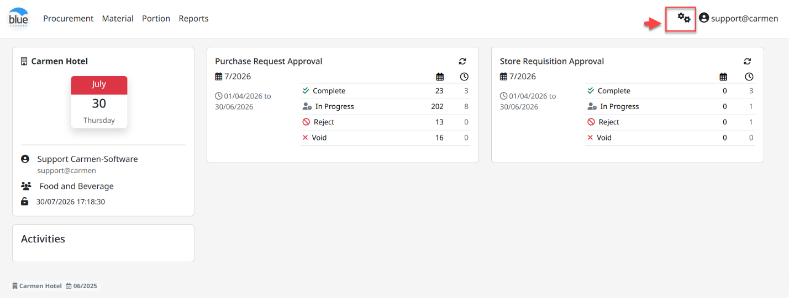

1. ขั้นตอนการสร้าง Product

- Click “Product” เพื่อสร้างรายการสินค้า

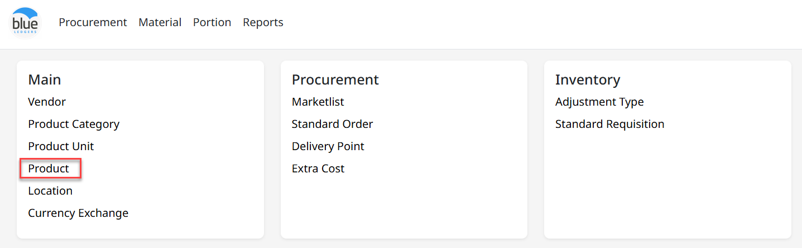

- เข้าสู่หน้าหลักสำหรับสร้างรายการสินค้า จากนั้น Click “**New**”

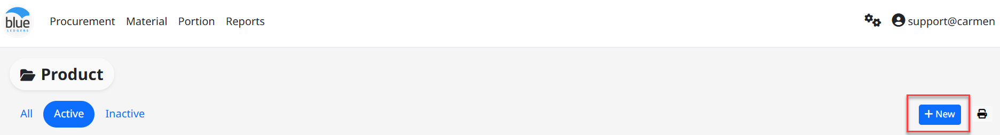

การกรอกข้อมูลของ Product มีดังนี้

**หมายเหตุ** เครื่องหมาย \* คือช่องที่จำเป็นต้องระบุ

- \# รหัสสินค้า ระบบจะทำการสร้างรหัสให้โดยอัตโนมัติ โดย running ด้วย รหัส item group + running number 4 หลัก

- \*“Category” กำหนดกลุ่มของสินค้า

- \*“Sub Category” กำหนดหมวดหมู่ของสินค้า

- \*“Item Group” กำหนดหมวดหมู่ย่อยของสินค้า

- \*“English Description” กำหนดชื่อของสินค้าเป็นภาษาอังกฤษ

- “Local Description” กำหนดชื่อของสินค้าเป็นภาษาอื่นตามการใช้งาน เช่นภาษาไทย

- \*“Inventory Unit” หน่วยที่ใช้ในการนับ inventory เช่น Can

- \*“Tax Type” กำหนดวิธีคำนวรณภาษี

  - None คือไม่มีภาษี

  - Included คือคำนวณราคาแบบรวมภาษี

  - Add คือคำนวณราคาแบบไม่รวมภาษี

- \*“Tax Rate(%)” กำหนดอัตราภาษี

- “Standard Cost” ราคามาตรฐานของสินค้า

- “Quantity Deviation” กำหนด % ที่อนุญาตให้รับสินค้าด้วยจำนวนมากกว่า PO ได้

- “Price Deviation” กำหนด % ที่อนุญาตให้รับสินค้าด้วยราคามากกว่า PO ได้

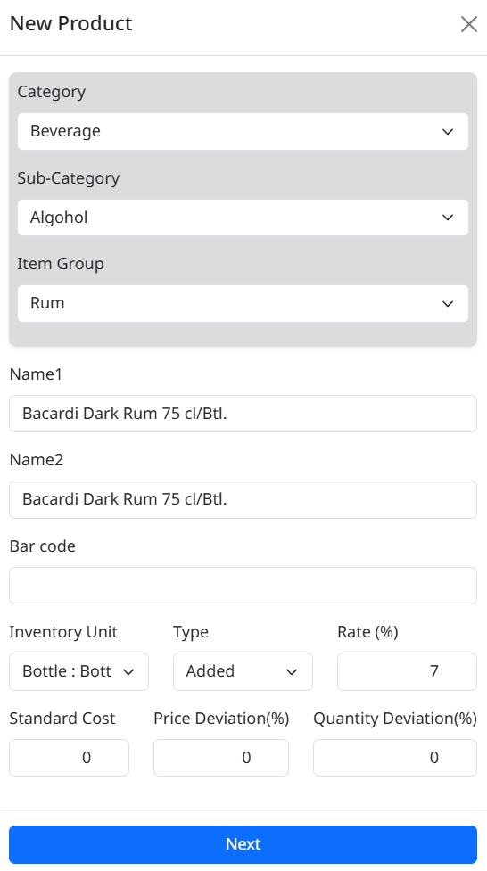

- \*“Order Unit” หน่วยในการสั่งซื้อสินค้า สามารถกำหนดได้มากกว่า 1 หน่วย

  - Click “Add” จะปรากฏ Popup

  - เลือก “Order Unit” ที่ต้องการ เช่น Case

  - กำหนด Conversion Rate เช่น case = 24 Can

  - Click เครื่องหมายถูก ที่ “Set as default”

  - Click “Save” เพื่อบันทึก Order Unit

  - Click “Edit” เพื่อแก้ไข Order Unit

  - Click “Delete” เพื่อลบ Order Unit

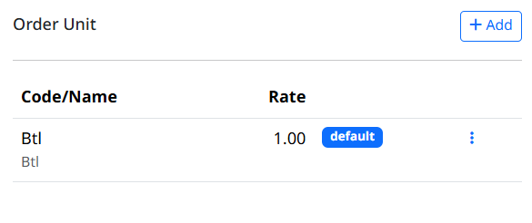

- “Recipe Item” ให้ใส่เครื่องหมายถูกหากต้องการให้สินค้านี้สามารถใช้ใน Recipe ได้

- “Recipe Unit” (หากมี)

  - Click “New” จะปรากฏ Pop up

  - เลือก “Recipe Unit” ที่ต้องการเช่น ML

  - กำหนด Conversion Rate เช่น 1 Can = 500 ML

  - Click เครื่องหมายถูกที่ “Set as default”

  - Click “Save” เพื่อบันทึก Recipe Unit

  - Click “Edit” เพื่อแก้ไข Recipe Unit

  - Click “Delete” เพื่อลบ Recipe Unit

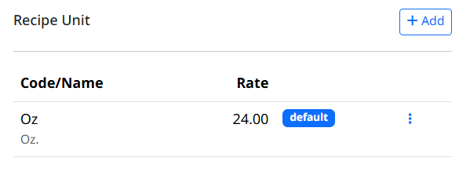

- การบันทึกสินค้า

  - Click “Save” เพื่อบันทึก

  - Click “Cancel” เพื่อยกเลิก

2. การ Assign Store/Location ให้กับ Product สามารถทำตามขั้นตอนดังนี้

1. หลังจาก Save “Product” เสร็จแล้ว ระบบจะแสดงกล่อง Store/Location

2. Click “Assign” เพื่อเลือก Location ที่สามารถใช้งาน Product ได้

3. ระบบจะแสดงกล่อง “Store/Location” ให้เลือก สามารถเลือกได้มากกว่า 1 location และสามารถกำหนด “Min” “Max” แตกต่างกันไปตามความเหมาะสมการใช้งาน

- Click เครื่องหมายถูก ที่ Store/Location ที่ต้องการ

- “Min” กำหนดจำนวนสินค้าขั้นต่ำที่จะต้อง Stock สินค้าเอาไว้

- “Max” กำหนดจำนวนสินค้ามากที่สุดที่สามารถ Stock สินค้าได้

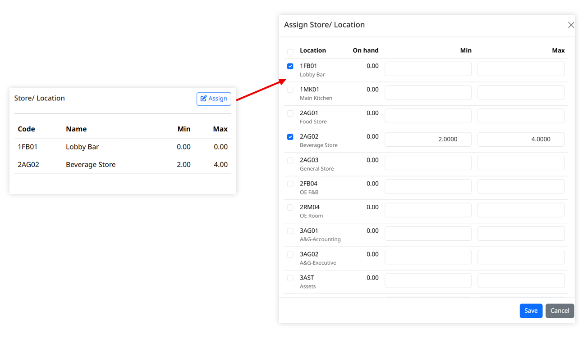

1. การบันทึก Store/Location

- Click “Save” เพื่อ บันทึก

- Click “Cancel” เพื่อ ยกเลิก

3. Function อื่น ๆ ของ “Product”

1. “Create” สร้างสินค้าใหม่

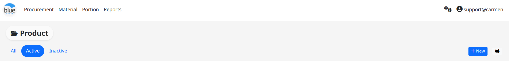

2. “Edit” แก้ไขข้อมูลสินค้า

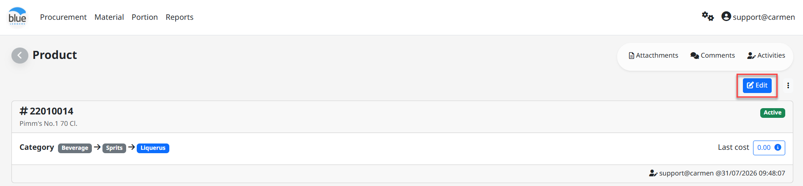

3. “Delete” ลบสินค้า (ใช้ได้ในกรณีที่สินค้ายังไม่ได้ใช้เท่านั้น)

4. “Print” พิมพ์หน้าจอสินค้า

5. “Back” กลับไปหน้าจอ Product List

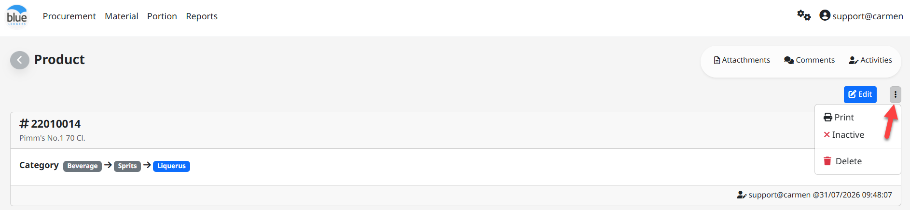

6. “Last Purchase” แสดงประวัติ PO และการรับสินค้า (Receiving)

<!-- -->

4. วิธี Inactive Product

1. หลังจาก Click สัญลักษณ์ “จุด 3 จุด” ระบบจะแสดงปุ่ม “Set to inactive”

2. Click “Set to inactive” เพื่อเปลี่ยน status

3. Click “Active” เพื่อคืนสถานะการใช้งาน

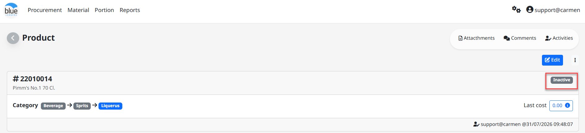
