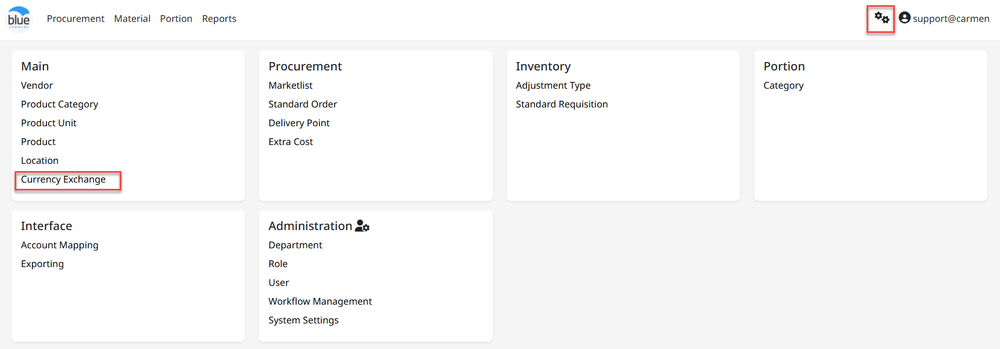
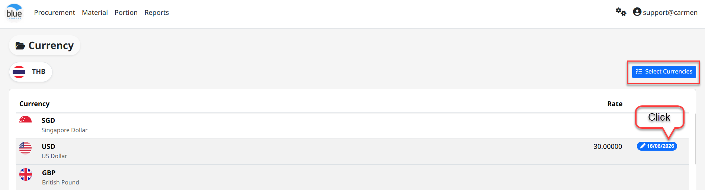
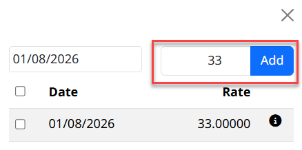
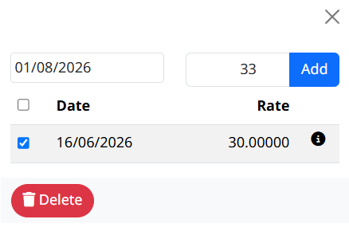

---
title: "Currency Exchange"
weight: 2
---
# Currency Exchange

## Currency Exchange (กำหนดค่าแลกเปลี่ยนสกุลเงิน)

Currency Exchange คือ Function ในการสร้างอัตราแลกเปลี่ยนของสกุลเงินต่าง ๆ

สามารถเข้าใช้งานโดย **Click “****”** เพื่อเข้าสู่หน้าต่างตั้งค่า จากนั้นเลือก **“**Currency Exchange**”** ซึ่งระบบจะ **Default Currency “TH”** เป็นค่าเงินเริ่มต้น

## ขั้นตอนการเลือกสกุลเงิน

- Click **“**Select Currencies**”** เพื่อเลือกสกุลเงิน

- เลือกสกุลเงินจาก Currency List และ Click “” เพื่อเปิดใช้งาน

- Click “ในสกุลเงินที่ต้องการเพื่อทำการตั้งค่าหรือเพื่อแก้ไขค่าเงิน”

- แก้ไข Currency Rate (ค่าเงิน) และ Click “Add” เพื่อตั้งค่า

- หากต้องการลบค่าเงินเดิม สามารถ Click “” (Delete)

