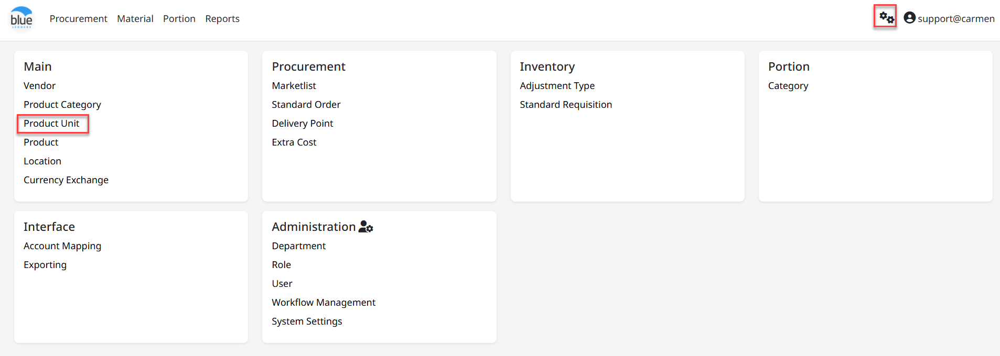
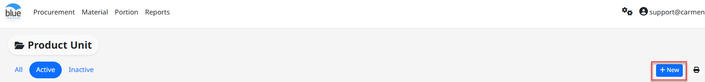
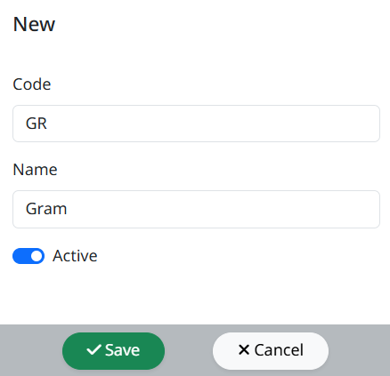
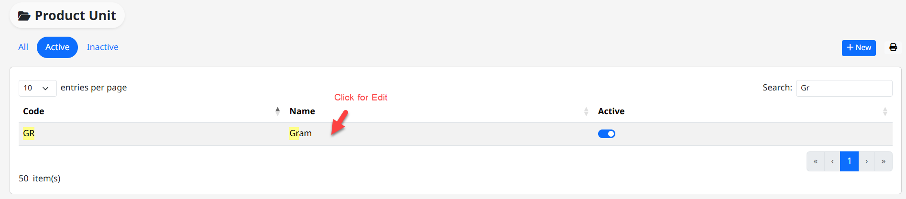
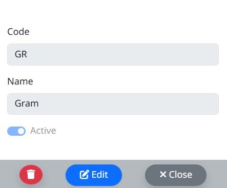

**Product Unit (**หน่วยรายการสินค้า**)**

**Product Unit** คือ Function ในการสร้าง หน่วยของรายการสินค้าเพื่อใช้เป็น Inventory Unit, Order Unit และ Recipe Unit เพื่อใช้งาน ในการสั่งซื้อ, การเบิก, การโอน, การนับของ

สามารถเข้าใช้งานโดย **Click “****”** เพื่อเข้าสู่หน้าต่างตั้งค่า

**ขั้นตอนการสร้าง Unit**

- Click **“**New**”** เพื่อทำการสร้าง Unit

- “Code” เพื่อใส่ รหัส Unit

- “Name” เพื่อใส่ ชื่อ Unit

- Click เครื่องหมายถูก ที่ “Active”

- Click “Save” เพื่อ บันทึก หรือ “Cancel” เพื่อ ยกเลิก

**ขั้นตอนการ Edit** **Unit**

- Click เลือกหน่วยสินค้าที่ต้องการแก้ไข Product Unit

- เมื่อเข้าสู่หน้าต่างสำหรับแก้ไข Product Unit ให้ Click “Edit”

- “Name” เพื่อแก้ไขชื่อ Unit

- Click เครื่องหมายถูก ออก ที่ “Active” หากไม่ต้องการใช้งาน Unit ดังกล่าว

- Click “Save” เพื่อ บันทึก หรือ “Cancel” เพื่อ ยกเลิก

- หากต้องการลบ Product Unit สามารถ Click “Delete”

- Click “Yes” เพื่อ ยืนยัน หรือ “No” เพื่อ ยกเลิก

