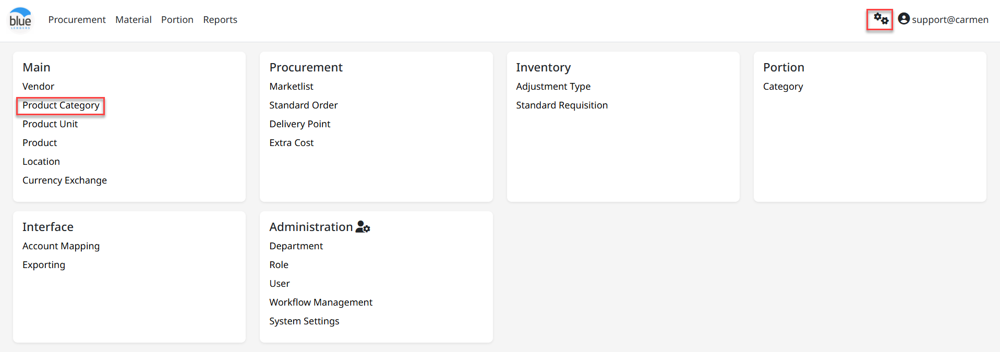
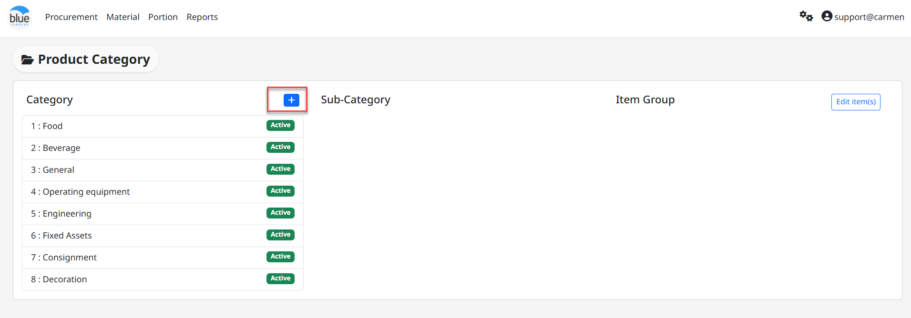
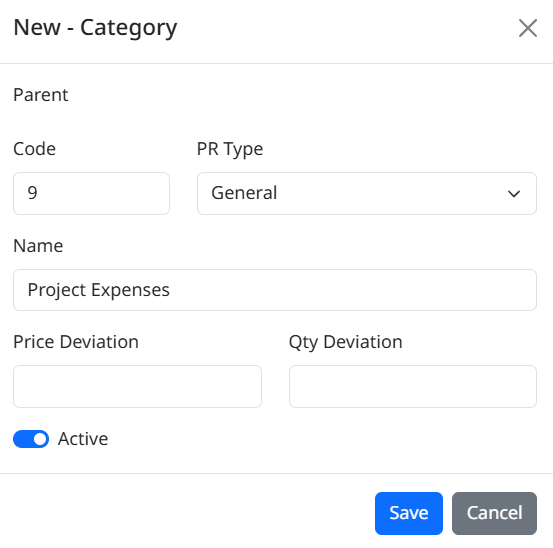
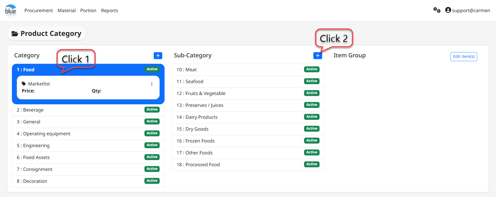
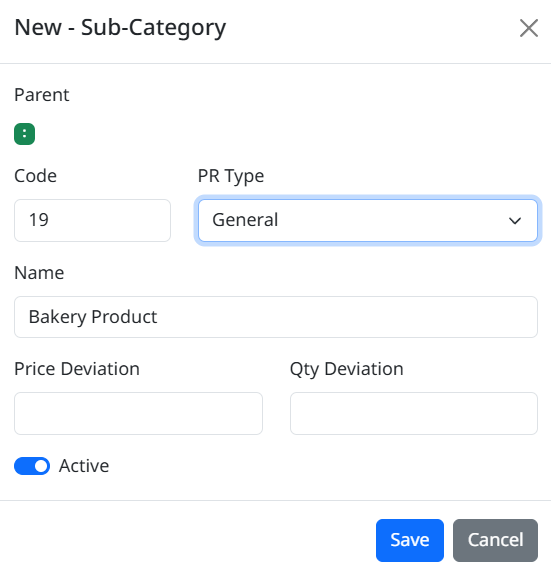
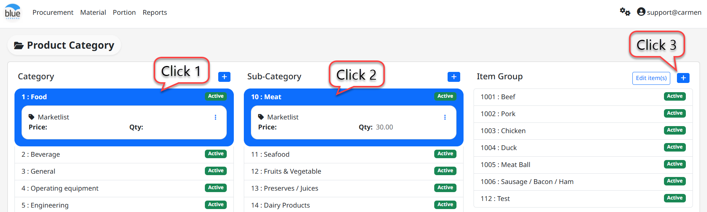
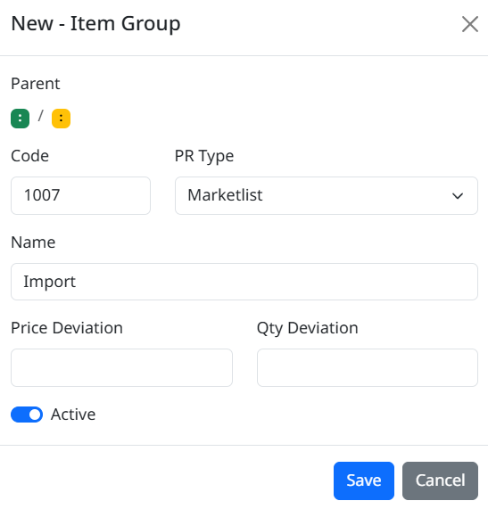
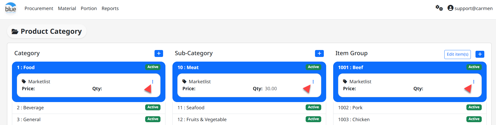
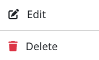

**Product Category (**หมวดหมู่รายการสินค้า**)**

**Product Category** คือ Function ในการสร้าง หมวดหมู่ ของ รายการสินค้า เพื่อ จัดกลุ่มในการใช้งาน

สามารถเข้าใช้งานโดย **Click “****”** เพื่อเข้าสู่หน้าต่างตั้งค่า

ขั้นตอนการสร้าง Category, Sub Category, Item Group

1.  สร้าง Category

- Click “**+**” เพื่อสร้าง Category

- “Code” กำหนดรหัสของ Category ที่ต้องการ

- “PR Type” กำหนดประเภทของเอกสารขอซื้อให้กับหมวดสินค้าที่ต้องการสร้าง (Market List, General, Asset)

- “Name” เพื่อใส่ชื่อ Category ที่ต้องการ

- “Price Deviation” กำหนด % ที่อนุญาตให้รับสินค้าด้วยราคามากกว่า PO ได้

- “Quantity Deviation” กำหนด % ที่อนุญาตให้รับสินค้าด้วยจำนวนมากกว่า PO ได้

- Click “Active” เพื่อให้สามารถใช้งานได้

- Click “Save” เพื่อบันทึกหรือ “Cancel” เพื่อยกเลิก

> 

2.  Sub**-**Category

- Click ที่ Category ที่เป็นหมวดสินค้าหลัก จากนั้นปรากฏเมนู Sub-Category ให้ Click “**+**” เพื่อสร้างหมวดสินค้าย่อย

- “Code” กำหนดรหัสของ Category ที่ต้องการ

- “PR Type” กำหนดประเภทของเอกสารขอซื้อให้กับหมวดสินค้าที่ต้องการสร้าง (Market List, General, Asset)

- “Name” เพื่อใส่ชื่อ Sub-Category ที่ต้องการ

- “Price Deviation” กำหนด % ที่อนุญาตให้รับสินค้าด้วยราคามากกว่า PO ได้

- “Quantity Deviation” กำหนด % ที่อนุญาตให้รับสินค้าด้วยจำนวนมากกว่า PO ได้

- Click “Active” เพื่อให้สามารถใช้งานได้

- Click “Save” เพื่อบันทึกหรือ “Cancel” เพื่อยกเลิก

3.  Item Group

- Click “Category” ที่เป็นหมวดสินค้าหลัก และ Click “Sub-Category” เพื่อเลือกหมวดสินค้าย่อย จากนั้นปรากฏเมนู Item Group ให้ Click “**+**” เพื่อสร้างกลุ่มสินค้า

- “Code” กำหนดรหัสของ Category ที่ต้องการ

- “PR Type” กำหนดประเภทของเอกสารขอซื้อให้กับหมวดสินค้าที่ต้องการสร้าง (Market List, General, Asset)

- “Name” เพื่อใส่ชื่อ Item Group ที่ต้องการ

- “Price Deviation” กำหนด % ที่อนุญาตให้รับสินค้าด้วยราคามากกว่า PO ได้

- “Quantity Deviation” กำหนด % ที่อนุญาตให้รับสินค้าด้วยจำนวนมากกว่า PO ได้

- Click “Active” เพื่อให้สามารถใช้งานได้

- Click “Save” เพื่อบันทึกหรือ “Cancel” เพื่อยกเลิก

**ขั้นตอนการ Edit** **Category**, Sub Category, **Item Group**

- Click สัญลักษณ์ “” เมื่อต้องการแก้ไข Category, Sub Category หรือ Item Group

- Click “Edit”

- Click เครื่องหมายถูก ออก ที่ “Active” หากไม่ต้องการใช้งาน Category, Sub Category, Item Group ดังกล่าว

- Click “Save” เพื่อ บันทึก หรือ “Cancel” เพื่อ ยกเลิก
