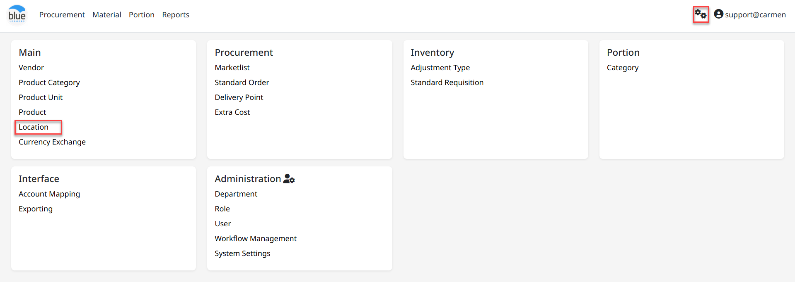
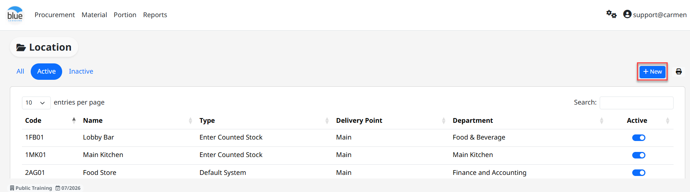
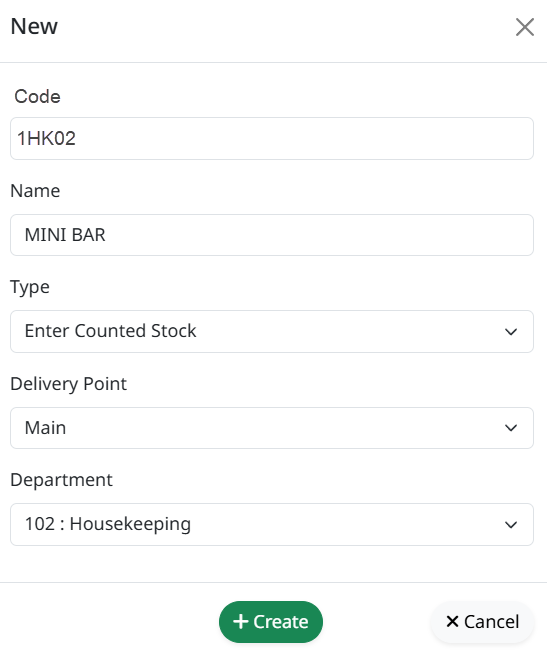
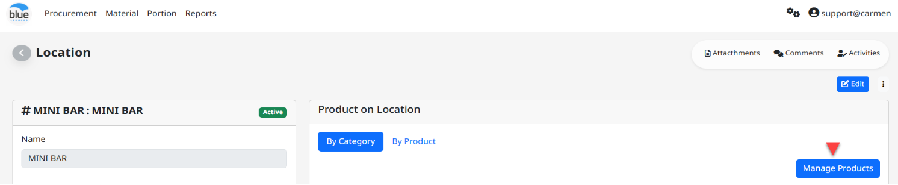
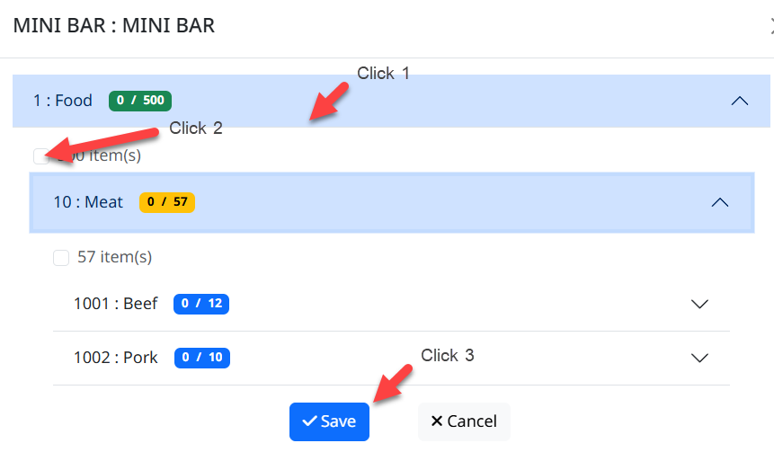
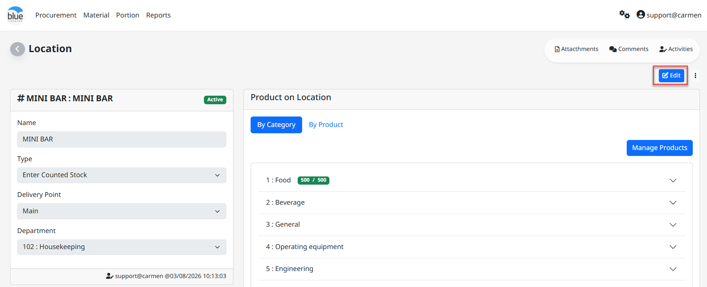
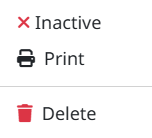
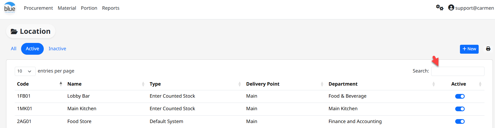

**Location (**คลังสินค้า/สถานที่**)**

**Location** คือ Function ในการสร้าง คลังสินค้า/สถานที่ เพื่อ สั่งซื้อ**,** รับ**,** เบิก**,** โอน หรือ ตรวจนับ

รายการสินค้าต่างๆ

สามารถเข้าใช้งานโดย **Click “****”** เพื่อเข้าสู่หน้าต่างตั้งค่า

และ Click “Location”

> เมื่อเข้าสู่หน้าต่างการสร้าง Location ระบบจะแสดง Tab View อยู่ 3 Tab View คือ

- All คือ แสดงเอกสารจากสถานะทุกสถานะ

- Active คือ แสดงสถานเอกสารเฉพาะสถานะ Active

- In Active คือ แสดงสถานะเอกสารเฉพาะสถานะ In Active

1.  **ขั้นตอนการสร้าง Location**

- Click **“**Create**”** เพื่อทำการสร้าง Location

กรอกข้อมูล Location ดังนี้

- “Code” เพื่อใส่รหัส Location Code

- “Store Name” เพื่อใส่ชื่อ Location

- “Type” เลือกปรเภท Store/Location โดยมีทั้งหมด 3 ประเภท ดังนี้

  - Enter Counted Stock (สำหรับ Location ที่ต้องทำการตรวจนับทุกสิ้นเดือน)

  - Default System (สำหรับ Location ที่ไม่จำเป็นต้องทำการตรวจนับ)

  - Default Zero (สำหรับ Location ที่มีการสั่งซื้อ แล้วตัดเป็น ต้นทุนหรือค่าใช้จ่าย)

- “Delivery Point” เพื่อเลือกจุดรับสินค้าของ Location ดังกล่าว

- “Department Name” เพื่อเลือก Department ของ Location ดังกล่าว

- Click “Create” เมื่อสร้าง Location หรือ Click “Cancel” เพื่อยกเลิก

- Click “Manage Products”

- Click เลือกหมวดสินค้าที่ต้องการจะ Assign Product และหากต้องการเลือกเป็นหมวดย่อยสามารถ Click เลือกที่ Sub category หรือ Item Group ได้

- Click “” เพื่อเลือกหมวดสินค้า หรือรายการสินค้าที่ต้องการ (Assign Item)

- Click “Save” เพื่อ บันทึก หรือ “Back” เพื่อ ย้อนกลับ

- Click “Edit” เมื่อต้องการแก้ไข Location Name หรือ Department 

- Click สัญลักษณ์ “” เมื่อต้องการแก้ไข Inactive, Print หรือ Delete

2.  การ ค้นหา และ View Location

    1.  สามารถค้นหา Location ที่ต้องการ โดย พิมพ์ค้นหา ในช่อง Search

    2.  การ View Location ทำได้โดยการเลือก Location ที่ต้องการ เพื่อ แสดงรายละเอียดของ Location นั้นๆ

