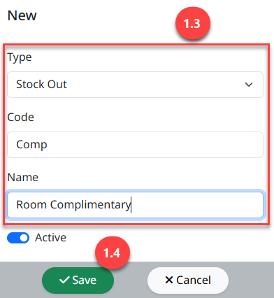

**Adjustment Type**

**Adjustment Type** คือ การสร้างประเภทเอกสารเพื่อใช้ในการปรับปรุง **Stock** ทั้งในกรณีเพิ่มยอด และลดยอดใน **Stock**

สามารถเข้าใช้งานโดย **Click “****”** เพื่อเข้าสู่หน้าต่างตั้งค่า

1.  **ขั้นตอนการสร้าง** **Adjustment**

    1.  Click “Adjustment Type”

    2.  Click “New” เพื่อสร้าง Adjust Type

    3.  ระบุรายละเอียดข้อมูลสำหรับสร้าง Adjust Type

    - Type เลือกประเภทการ Adjust

    - Code ระบุรหัสสำหรับ Adjust Type

    - Name ระบุชื่อ Adjust Type

4.  Click “Save” เพื่อบันทึก

Note: ในกรณีหยุดใช้งาน Adjust Type แล้ว ให้ทำการ Click สัญลักษณ์ “” เพื่อ Inactive
