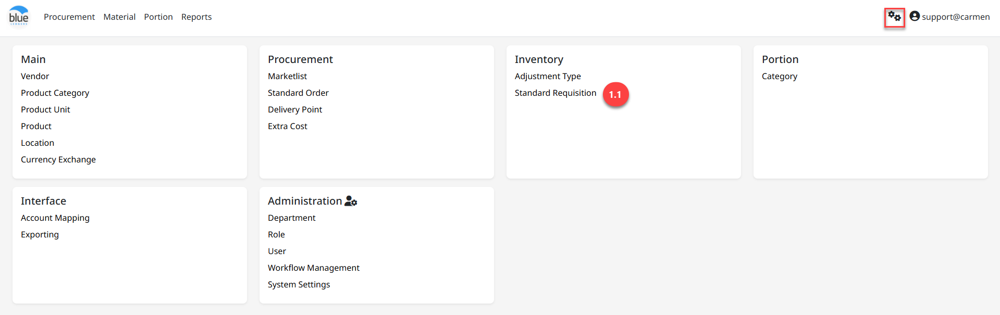
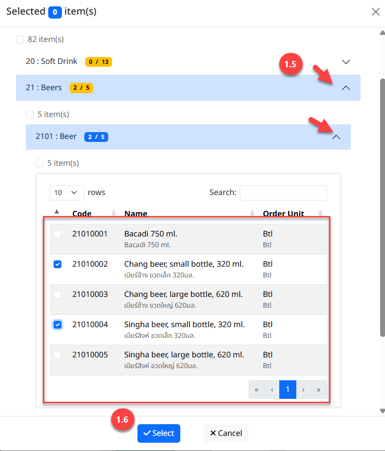

**Standard Requisition**

**Standard Requisition** คือ การสร้างเอกสารแม่แบบสำหรับการสร้าง Store Request

สามารถเข้าใช้งานโดย Click “” เพื่อเข้าสู่หน้าต่างตั้งค่า

1.  **ขั้นตอนการสร้างเอกสาร Standard Requisition**

    1.  Click “Standard Requisition”

    2.  Click “New” เพื่อสร้างเอกสาร

    3.  ระบุรายละเอียดข้อมูลสำหรับสร้าง Standard Requisition Template

    - Location เลือก Location ของผู้ขอเบิก

    - Description ระบุชื่อ Template

Note: ในกรณีหยุดใช้งาน Adjust Type แล้ว ให้ทำการ Click สัญลักษณ์ “” เพื่อ Inactive

4.  Click “Assign Product” เพื่อเลือกรายการสินค้า

5.  วิธีการเลือกสินค้าเพื่อให้แสดงใน Template

    - Click สัญลักษณ์ Drop Down List “  ” เพื่อค้นหารายการสินค้าที่ต้องการ

    - Click “” รายการสินค้าที่ต้องการ

6.  Click “Select” เพื่อบันทึกรายการสินค้า

7.  Click “Save” เพื่อบันทึก Template หรือ Click “Cancel” เพื่อยกเลิกการสร้างเอกสาร

