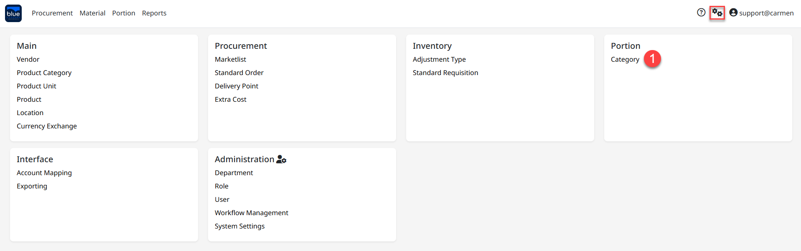
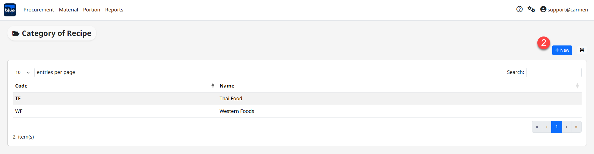
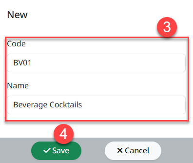
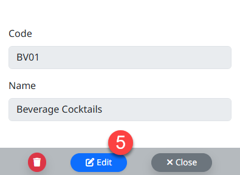

---
title: "Category of Recipe"
weight: 41
---
# Category of Recipe

Category of Recipe คือ การจัดประเภทของ Recipe เพื่อจัดหมวดหมู่ให้แก่สูตรปรุงอาหาร หรือสูตรปรุงของเครื่องดื่มเป็นหมวดหมู่ที่ถูกต้อง

สามารถเข้าใช้งานโดย Click "" เพื่อเข้าสู่หน้าต่างตั้งค่า

## ขั้นตอนการสร้าง Category

1. Click "Category" เพื่อเข้าสู่หน้าต่างการสร้างหมวดจองสูตรอาหาร

2. Click "New" เพื่อสร้าง Category

3. ระบุรายละเอียดข้อมูลสำหรับสร้าง Category

- **Code** ระบุรหัสหมวดของสูตรอาหารและเครื่องดื่ม

- **Name** ระบุชื่อของหมวดสูตรอาหารและเครื่องดื่ม

> **หมายเหตุ:** ในกรณีหยุดใช้งาน Category ให้ Click สัญลักษณ์ "" เพื่อเปลี่ยนสถานะเป็น Inactive

4. Click "Save" เพื่อบันทึกชื่อสูตรอาหารและเครื่องดื่ม

5. หากต้องการแกไข Category สามารถ Click "ชื่อหมวดสูตรอาหารและเครื่องดื่ม" จากนั้น Click "Edit" จากนั้นสามารถแก้ไขชื่อ

