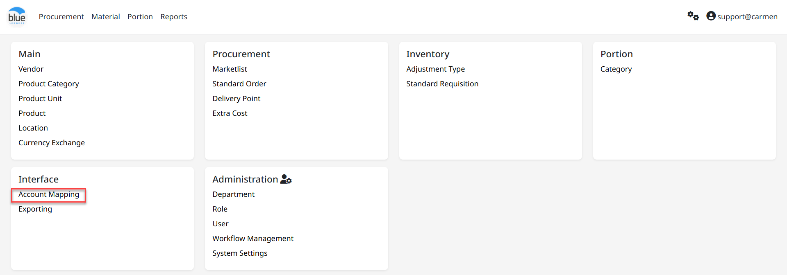
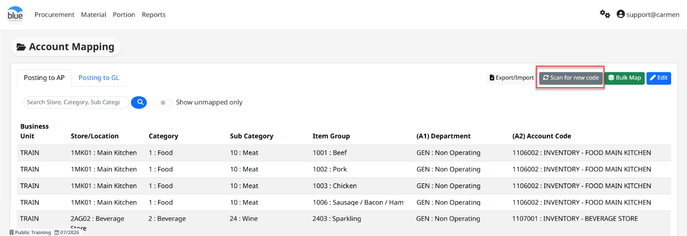
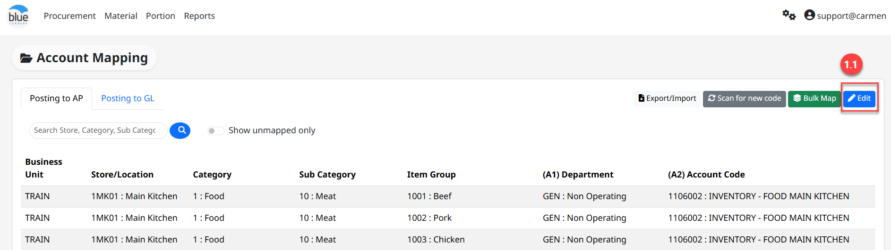
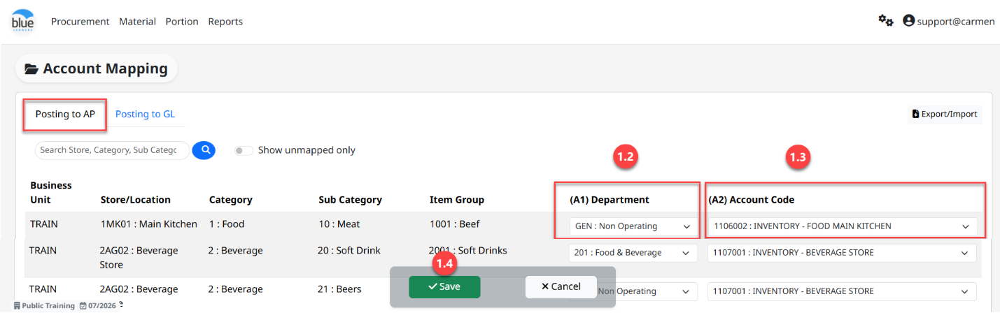
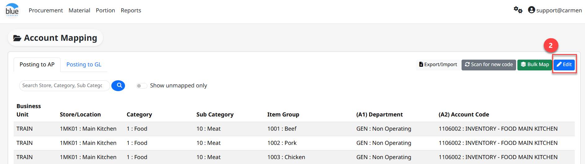
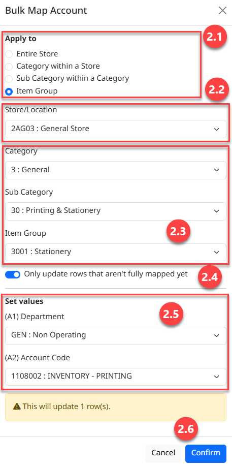
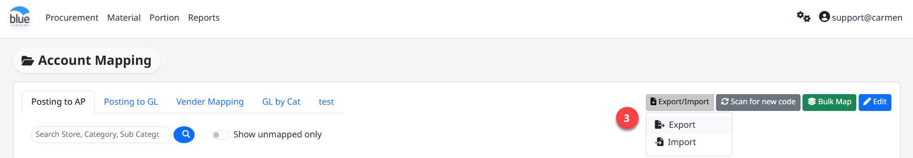
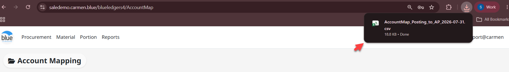
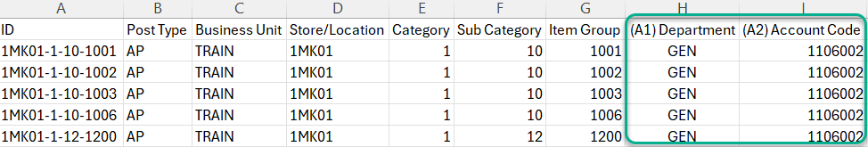
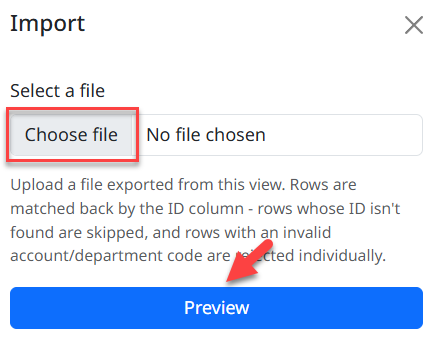

# Account Code Mapping (การผูกบัญชี สำหรับ Post ข้อมูลไป AP และ GL)

Account Code Mapping คือ Function ในการผูกผังบัญชีและ Department code ให้กับ transaction ใน BlueLedgers

สามารถเข้าใช้งานโดย **Click “****”** เพื่อเข้าสู่หน้าต่างตั้งค่า

**Click “Account Mapping”** ในส่วนงาน **Interface**

Account Mapping มีอยู่ 2 ส่วน คือ

- Interface AP คือ Mapping Acc. สำหรับบัญทึกบัญชี Receiving และ Credit Note เพื่อส่งไปตั้งหนี้ในระบบ AP

- Interface GL คือ Mapping Acc. สำหรับบัญทึกบัญชีในระบบ GL

เมื่อเข้าสู่หน้าต่าง Account Mapping ให้ทำการ Click “Scan for New Code” เพื่ออัพเดทข้อมูลใหม่ก่อนการ Mapping (เมื่อการรับสินค้าในระบบ Receiving ได้ทำการ commit แล้ว ระบบจึงจะดึงข้อมูลมาแสดงให้ทำการ mapping)

การ Mapping Code นั้น“Department” และผังบัญชี “Account” จะต้องสัมพันธ์กับ location และ Item Group. และมีสามารถทำได้ 3 วิธี คือ

1.  Mapping by Transaction โดยมีขั้นตอนดังนี้  
    1.1 Click “Edit” เพื่อให้สามารถระบุ Dept. Code และ Acc. Code ได้

1.2 ระบุ Department Code สำหรับบันทึกบัญชีทรัพย์สินและค่าใช้จ่ายให้ลงตามแผนก

1.3 ระบุ Acc. Code หรือรหัสบัญชีเพื่อบันทึกบัญชีบัญชีทรัพย์สินและค่าใช้จ่ายให้ถูกต้อง

1.4 Click “Save” เพื่อบันทึกข้อมูล

2.  การ Mapping Account โดยใช้คำสั่ง Bulk Map คือ การ Mapping Code เป็น Group Location ผูกเข้ากับ Product Category, Sub Category หรือ Item Group ซึ่งจะทำให้การใช้เวลาในการ Mapping Account ได้รวดเร็วยิ่งขึ้น

1.  เลือกลำดับของหมวดสินค้าที่ต้องการ Mapping ซึ่งประกอบไปด้วย

- “Entries Store” คือ การ Mapping Code ให้เข้า Location โดยไม่เลือกว่าเป็นสินค้าหมวดใด

- “Category within a Store” คือ การ Mapping Code ให้มีความสัมพันธ์กันระหว่าง Product Category กับ Location

- “Sub Category within a Category” คือ การ Mapping Code ให้มีความสัมพันธ์กันระหว่าง Product Category, Sub Category กับ Location

- “Item Group” คือ การ Mapping Code ให้มีความสัมพันธ์กันระหว่าง Product Category, Sub Category, Item Group กับ Location

2.  Store/Location เลือกสถานที่ต้นทางที่ทำการออก PR (Cost Center)

3.  Category เลือกหมวดของสินค้าที่เพื่อ Mapping Account Code ซึ่งในกรณีที่ในข้อ 2.1 เลือกเป็น Item group จะต้องทำการระบุข้อมูล Category, Sub Category และ Item Group ให้ถูกต้องและครบถ้วน

4.  “Only update rows that aren't fully mapped yet” คือ กำหนดให้ระบบทำการอัพเดทข้อมูลเฉพาะรายการที่ยังไม่ได้ Mapping Account Code

5.  Set Value คือ การระบุ Department Code และ Account Code ทั้งนี้จะต้องให้ Location สัมพันธ์กับ Department Code และ Account Code เพื่อจำแนกหมวดบัญชี

6.  Click “Confirm” เมื่อระบุข้อมูลการ Mapping Account code เสร็จเรียบร้อยหมดแล้ว

3.  การนำเข้าข้อมูล Mapping Account Code ผ่าน Excel File โดย Click “Import/Export” จากนั้น Click “Export”

- ระบบจะแสดง pop up ให้ download file โดย Click “Save”

เลือก “Save as” และบันทึกลง computer

- เปิด file หลังจากที่ save แล้ว

- ทำการ mapping ใน column ‘Department” และ “Account” ให้เรียบร้อย และบันทึก file

- ห้ามแก้ไขข้อมูลใน column อื่น ๆ โดยเด็ดขาด และต้อง save file ด้วยนามสกุล .csv เท่านั้น

- การ import mapping กลับเข้าระบบ

- Click “Import/Export”

- Click “Choose File” และทำการเลือก file .csv ที่ mapping เสร็จแล้ว

- Click “Preview” เพื่อตรวจสอบข้อมูล

- Click “Confirm” เพื่อบันทึกข้อมูล Mapping Account Code

- Click “Yes” เพื่อยืนยัน

