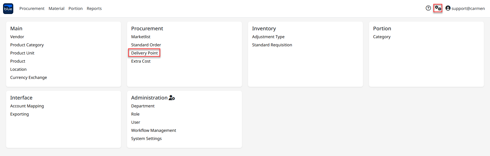
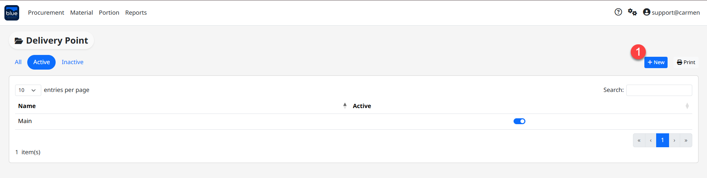
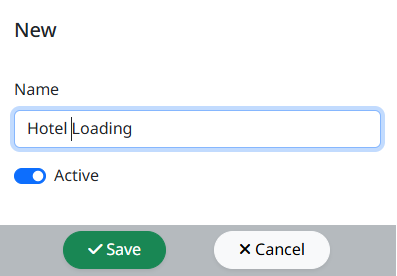
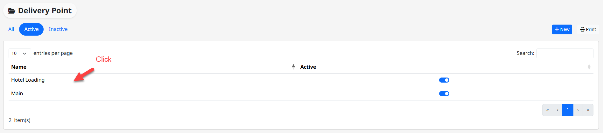
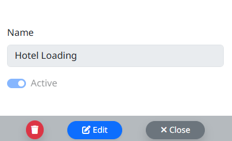
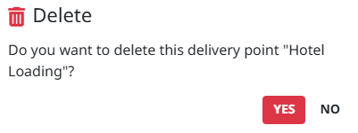

---
title: "Delivery Point"
weight: 4
---
# Delivery Point

**Delivery Point** คือ Function ในการสร้างจุดรับสินค้า หากมีจุดรับสินค้ามากกว่าหนึ่งจุด

สามารถเข้าใช้งานโดย **Click “****”** เพื่อเข้าสู่หน้าต่างตั้งค่า

## ขั้นตอนการสร้าง Delivery Point

1. Click **“**New**”** เพื่อทำการสร้าง Delivery Point

2. ระบุชื่อ Delivery Point ในช่อง “Name” จากนั้น Click “Save” เพื่อบันทึกข้อมูล

Note: Click เครื่องหมายถูก ออก ที่ “Active” หากไม่ต้องการใช้งาน Delivery Point ดังกล่าว

## ขั้นตอนการ Edit Delivery Point

- Click ที่รายชื่อ Delivery Point หากต้องการแก้ไขข้อมูล

- Click “Edit” ที่ Delivery Point ที่ต้องการ เพื่อทำการแก้ไข “Description”

- Click “Save” เพื่อ บันทึก หรือ “Cancel” เพื่อ ยกเลิก

## ขั้นตอนการลบ Delivery Point

- Click เครื่องหมายถูก ที่ Delivery Point ที่ต้องการ

- Click “Delete” เพื่อ ลบ

- Click “Yes” เพื่อ ยืนยัน หรือ “No” เพื่อ ยกเลิก

