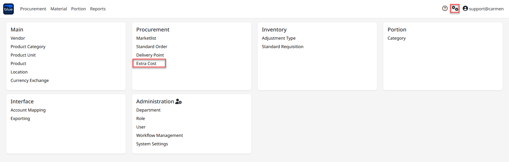
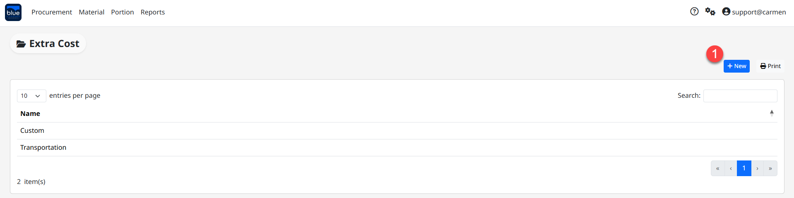
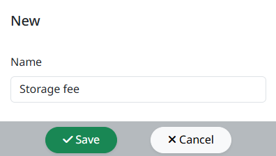
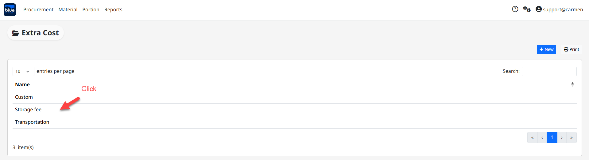
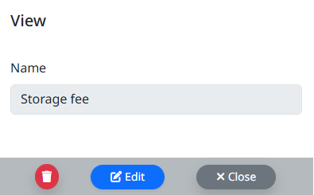

---
title: "Extra Cost Type"
weight: 24
---
# Extra Cost Type

Extra Cost Type คือ Function ในการสร้างประเภทค่าใช้จ่ายต่าง ๆ เช่น ค่าขนส่งจากต่างประเทศ**,** ค่าภาษีนำเข้า

เพื่อใช้ในการคำนวณ Extra cost เพื่อเพิ่มมูลค่า Inventory cost ให้กับสินค้าในเอกสาร Receiving ที่มีการสั่งซื้อ

สามารถเข้าใช้งานโดย **Click “****”** เพื่อเข้าสู่หน้าต่างตั้งค่า

## ขั้นตอนการสร้าง Extra Cost Type

1. Click **“**New**”** เพื่อทำการสร้าง Delivery Point

2. ระบุชื่อประเภทค่าใช้จ่ายในช่อง “Name” จากนั้น Click “Save” เพื่อบันทึกข้อมูล

Note: Click เครื่องหมายถูก ออก ที่ “Active” หากไม่ต้องการใช้งาน Delivery Point ดังกล่าว

## ขั้นตอนการ Edit Extra Cost

1. Click ที่รายชื่อ Extra Cost หากต้องการแก้ไขข้อมูล

2. Click “Edit” ที่ Extra Cost ที่ต้องการ เพื่อทำการแก้ไข “Description”

3. Click “Save” เพื่อ บันทึก หรือ “Cancel” เพื่อ ยกเลิก

## ขั้นตอนการลบ Extra Cost

4. Click เครื่องหมายถูก ที่ Extra Cost ที่ต้องการ

5. Click “Delete” เพื่อ ลบ

6. Click “Yes” เพื่อ ยืนยัน หรือ “No” เพื่อ ยกเลิก

