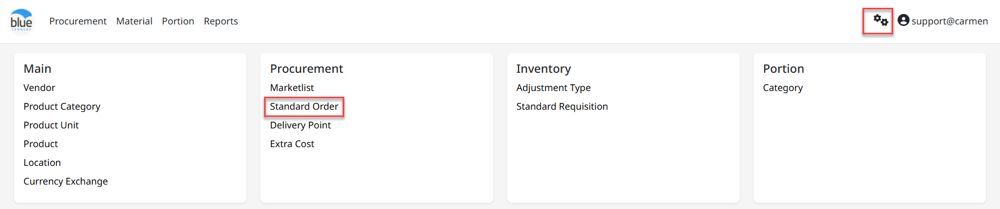
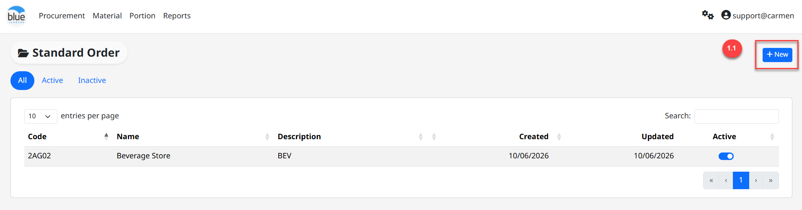
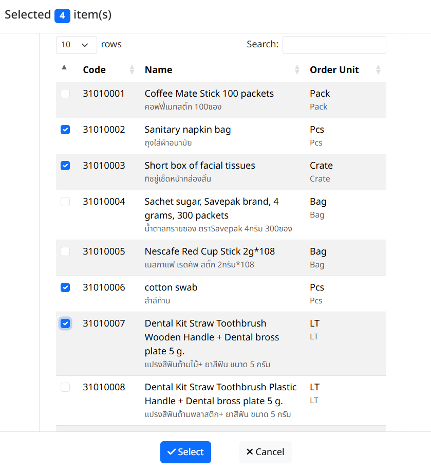
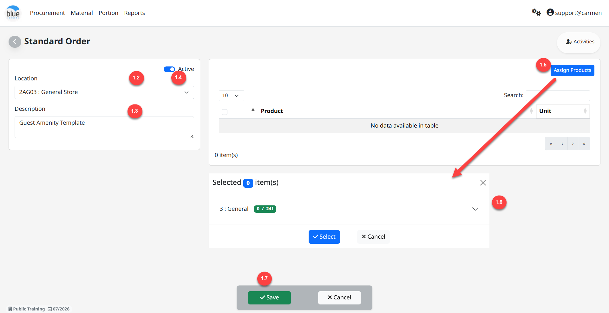
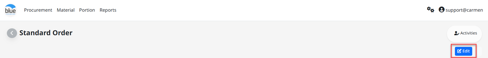
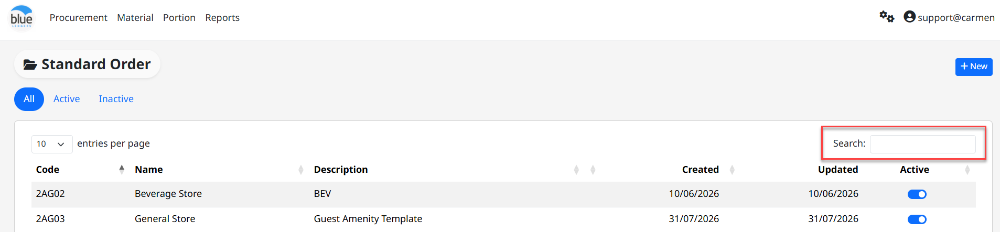

---
title: "Standard Order"
weight: 3
---
# Standard Order

**Configuration** คือ Module ที่ใช้สำหรับตั้งค่าการใช้งานต่างๆ ที่เกี่ยวข้องกับ Module Procurement

**Standard Order** คือ **Function** ในการสร้าง **Template** สำหรับรายการสินค้าประเภท General ที่มีการสั่งซื้อบ่อย ๆ เพื่อช่วยลดเวลาในการเลือกสินค้าตอนสร้าง **PR**

สามารถเข้าใช้งานโดย **Click “****”** เพื่อเข้าสู่หน้าต่างตั้งค่า จากนั้นเลือก **“**Standard Order**”**

1. ขั้นตอนการสร้าง Standard Order Template

1. Click “Create” เพื่อสร้าง Template

2. “Store Name” เพื่อเลือก Store/Location

3. Click เครื่องหมายถูก ออก ที่ “active” หากไม่ต้องการใช้งาน Template ดังกล่าว

4. “Description” เพื่อใส่คำอธิบาย Template

5. “Assign Item” โดยการ Click เครื่องหมายถูก ใน แต่ละหมวดหมู่ หรือ รายการสินค้า ที่ต้องการ

## 6. Click “ลูกศร” เพื่อเลือกรายการสินค้าสำหรับสร้าง Template เสร็จแล้ว Click “Select”

7. Click “Save” เพื่อ บันทึก หรือ “Back” เพื่อ ย้อนกลับ

2. Function อื่น ๆ ของ Standard Order หลังจากกด **“Save”**

1. “New” เพื่อสร้าง Standard Order ใหม่

2. “Edit” ใช้สำหรับ แก้ไข Standard Order ดังกล่าว

- **Click** ที่เอกสารที่ต้องการแก้ไข จากนั้น **Click “Edit”**

3. การ ค้นหา และ View Standard Order

2.

3.
