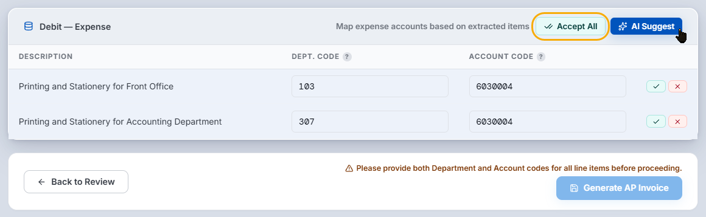

---

title: AI Suggestion

description: ขั้นตอนการใช้ AI แนะนำการบันทึกบัญชีโดยอัตโนมัติ

published: true

date: 2026-07-02T06:45:00.000Z

tags: carmen_cloud,documentation,ai

editor: markdown

dateCreated: 2026-07-02T06:23:00.000Z

---

ขั้นตอนการใช้ AI แนะนำการบันทึกบัญชีโดยอัตโนมัติ

## 1. ภาพรวมการทำงาน (Concept & Overview)

ฟีเจอร์ **AI Suggestion** ในระบบ Carmen ช่วยให้คำแนะนำ และเลือก `department code` และ `account code` โดยอัตโนมัติ โดย AI จะใช้ `description` หรือ `comment` เพื่อใช้ในการเลือก `department code` และ `account code`

ระบบจะตรวจสอบประวัติการบันทึกบัญชีในอดีต เพื่อให้คำแนะนำแม่นยำมากยิ่งขึ้น

## 2. เงื่อนไขก่อนเริ่มใช้งาน (Prerequisites)

- ผู้ใช้ต้องได้รับสิทธิ์การเข้าใช้งานโมดูล **Accounts Payable** และเข้าถึงเมนู **A/P Invoice** ได้
- ผู้ใช้ต้องได้รับสิทธิ์การเข้าใช้งานโมดูล **General Ledgers** และเข้าถึงเมนู **Journal Voucher** ได้

## 3. ขั้นตอนการทำงานอย่างละเอียด (Step-by-Step Instructions)

ตัวอย่างการใช้งาน **AI Suggestion** จากหน้าจอ **AI AP invoice automation**

### 3.1 กรอก Invoice Description

1. กรอกคำอธิบายในช่อง **INVOICE DESCRIPTION** เช่น `Telephone Fee for Dec 2025`

> **สำคัญมาก:** การกรอก Description ก่อน จะช่วยให้ AI แนะนำรหัสบัญชีได้แม่นยำยิ่งขึ้น

### 3.2 Debit - Expense

ให้ทำการ mapping `department code` และ `account code` ด้วยตนเอง หรือใช้ปุ่ม **AI Suggest**

#### วิธีการ mapping ด้วยตัวเอง

- ค้นหา หรือกรอก `department code` และ `account code` ที่ต้องการได้ทันที

#### วิธีการ mapping ด้วย AI

1. คลิกปุ่ม **AI Suggest**
2. ระบบจะตรวจสอบการบันทึกบัญชีจากประวัติเอกสารในระบบ และแสดง `department code` และ `account code` ให้โดยอัตโนมัติ
3. หากไม่พบประวัติการบันทึก ระบบจะให้คำแนะนำจาก `Invoice description` และ `item description` ประกอบกัน
4. เมื่อ AI แนะนำรหัสแผนก (`Dept Code`) และรหัสบัญชี (`Account Code`) ขึ้นมาให้แล้ว ให้ตรวจสอบความถูกต้อง
5. หากถูกต้อง ให้คลิกเครื่องหมายถูกสีเขียว `✓` ที่ด้านหลังของแถวนั้น ๆ เพื่อยืนยันการตั้งค่า หรือกดปุ่ม **Accept All** เพื่อยืนยันทั้งหมด
6. หากไม่ตรงความต้องการ สามารถคลิกรหัสและพิมพ์เพื่อค้นหาแก้ไขด้วยตนเองได้

## ตัวอย่างหน้าจอ

