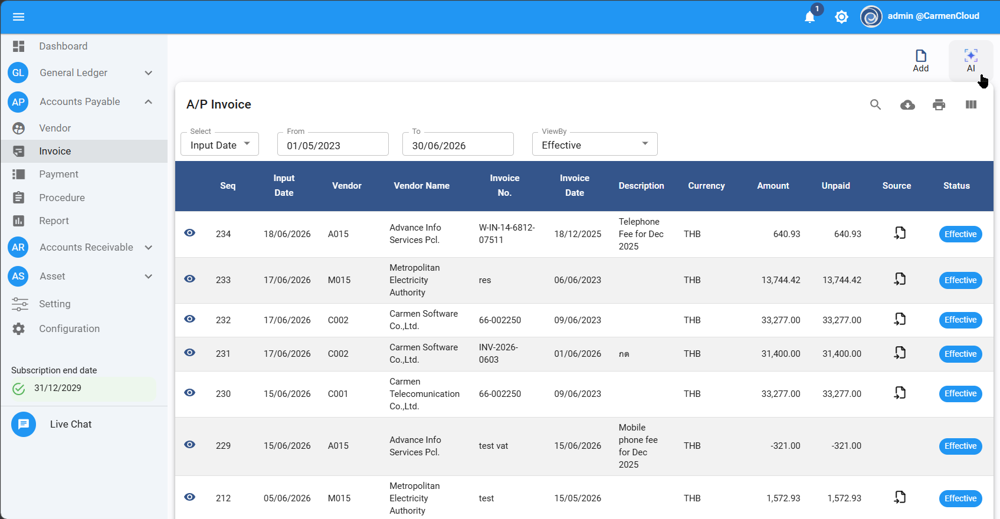
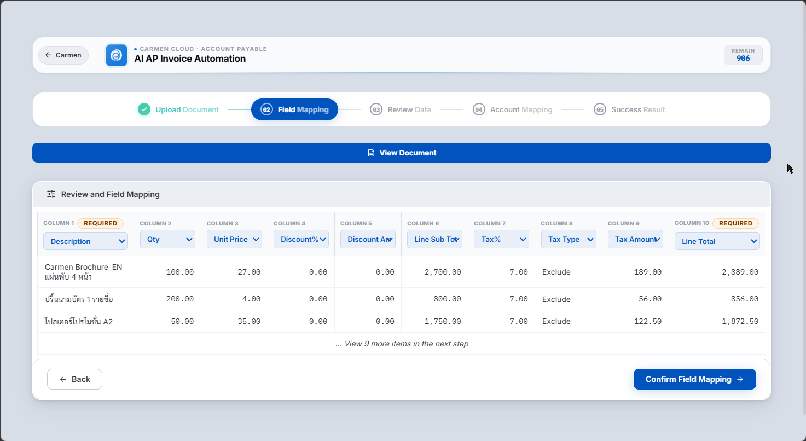
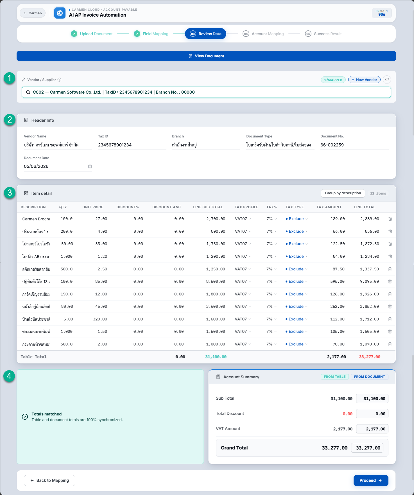
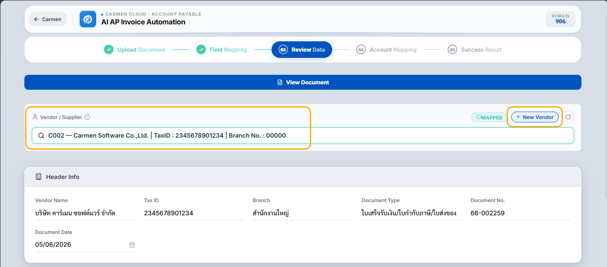
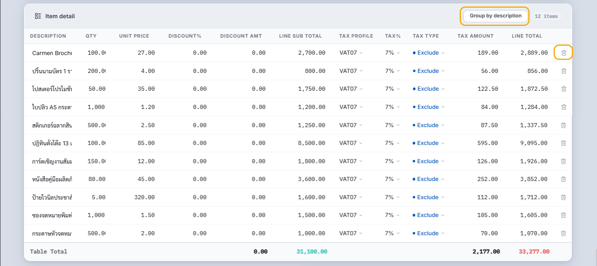
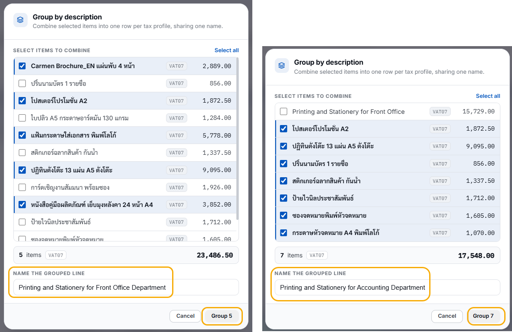
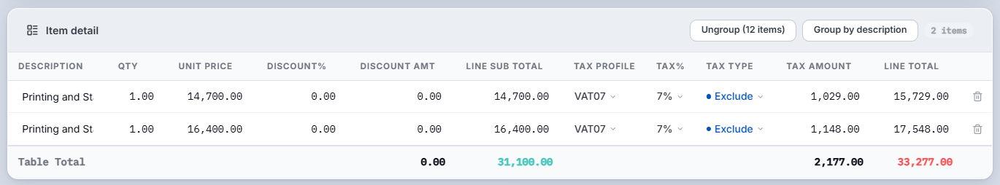
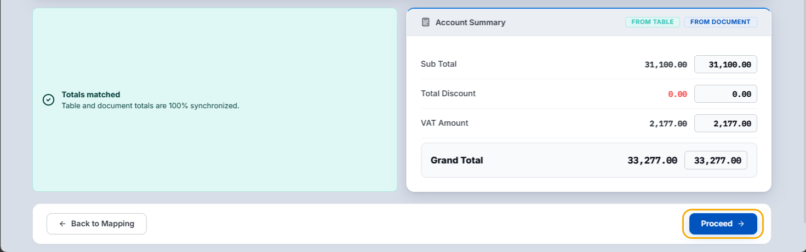
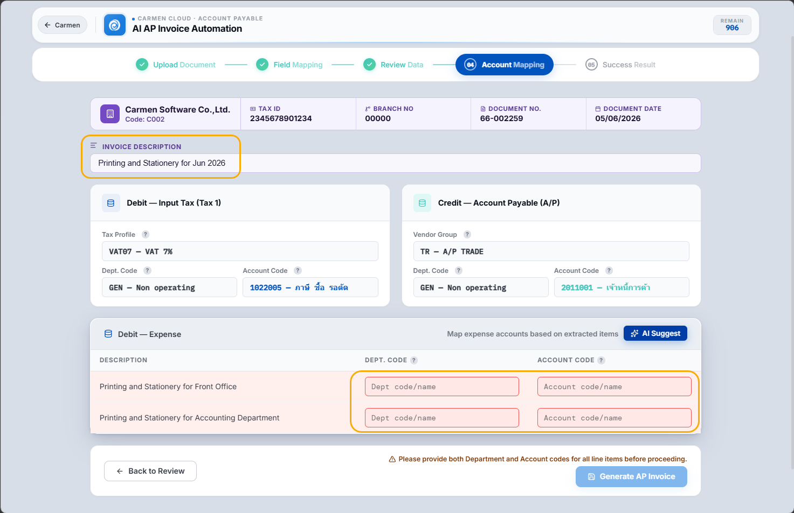
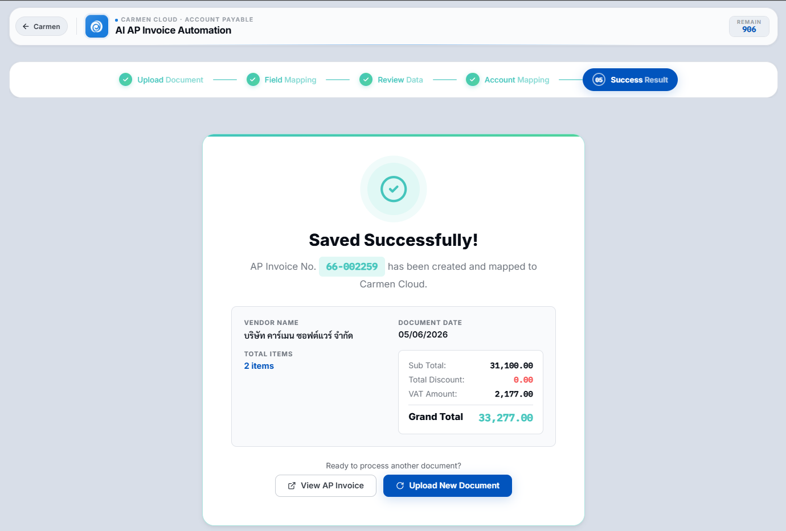

# AP Invoice by AI

ขั้นตอนการบันทึก A/P Invoice โดย AI

## 1. ภาพรวมการทำงาน (Concept & Overview)

ฟีเจอร์ **AI AP Invoice Automation** ในระบบ Carmen ช่วยให้ผู้ใช้งานสามารถบันทึกใบแจ้งหนี้หรือใบกำกับภาษีของซัพพลายเออร์ (**A/P Invoice**) ที่ไม่มีการออกใบสั่งซื้อ (**PR/PO**) หรือเอกสารการรับสินค้า (**GR**) มาก่อนหน้านี้ เช่น ค่าโทรศัพท์ ค่าน้ำ ค่าไฟ หรือค่าบริการทั่วไป ได้อย่างรวดเร็วและแม่นยำ

ระบบใช้เทคโนโลยี **OCR (Optical Character Recognition)** และ **AI** เพื่ออ่านข้อมูลจากเอกสารรูปภาพหรือไฟล์ PDF แล้วช่วยสร้างใบตั้งหนี้ให้อัตโนมัติ รวมถึงช่วยแนะนำรหัสแผนก (**Dept Code**) และรหัสบัญชีแยกประเภททั่วไป (**GL Account Code**) ที่เกี่ยวข้อง เพื่อลดความผิดพลาดและระยะเวลาในการกรอกข้อมูลด้วยมือ (**Manual Entry**)

## 2. เงื่อนไขก่อนเริ่มใช้งาน (Prerequisites)

- ผู้ใช้ต้องได้รับสิทธิ์เข้าใช้งานโมดูล **Accounts Payable** และเข้าถึงเมนู **A/P Invoice** ได้
- ต้องทำการขึ้นทะเบียนข้อมูลผู้ขาย (**Vendor Master**) ในระบบไว้ล่วงหน้า เพื่อให้ AI สามารถนำไปจับคู่ (**Mapping**) ได้อย่างถูกต้อง
- การอัปโหลดเอกสาร 1 ครั้ง คือการบันทึกใบแจ้งหนี้หรือใบกำกับภาษีต่อ 1 ใบ
- เตรียมไฟล์เอกสารใบแจ้งหนี้หรือใบกำกับภาษีให้อยู่ในรูปแบบ **JPG**, **PNG** หรือ **PDF**
- ขนาดไฟล์ต้องไม่เกิน **20 MB**
- ตัวหนังสือในเอกสารต้องชัดเจนเพียงพอให้ AI ตรวจสอบได้

## 3. ขั้นตอนการทำงานอย่างละเอียด (Step-by-Step Instructions)

### ขั้นตอนที่ 1: การเข้าสู่ฟังก์ชันและอัปโหลดเอกสาร (Upload Document)

1. ไปที่แถบเมนูด้านซ้าย เลือก **Accounts Payable**
2. คลิกเมนู **A/P Invoice**
3. ที่มุมขวาบนของหน้าจอ ถัดจากปุ่ม **Add** ให้คลิกปุ่ม **AI** ซึ่งเป็นปุ่มสีฟ้าที่มีไอคอนรูปประกายไฟ
4. ระบบจะทำการยืนยันเซสชันการใช้งานสักครู่ (**Authenticating...**) และนำเข้าสู่หน้าจอขั้นตอน **AP Invoice OCR**
5. ในแท็บ **Upload Document** ให้คลิกปุ่ม **Select Document** หรือลากไฟล์เอกสารมาวางในกรอบอัปโหลด
6. เมื่อเลือกไฟล์เรียบร้อยแล้ว ระบบจะประมวลผลและดึงข้อมูลจากเอกสาร
7. หากระบบตรวจพบว่าเลขที่เอกสารซ้ำ ระบบจะแจ้งเตือนให้ทราบ และสามารถเลือกได้ว่าจะดำเนินการต่อหรือไม่

### ขั้นตอนที่ 2: การตรวจสอบฟิลด์และข้อมูลของตารางสินค้า (Field Mapping)

1. หลังจากอ่านค่าสำเร็จ ระบบจะนำมาที่แท็บ **Field Mapping**
2. ระบบจะแสดงรายการรายละเอียดสินค้า/บริการ ราคา ต่อหน่วย และภาษีที่ AI ตรวจจับได้
3. หากต้องการตรวจสอบความถูกต้องเทียบกับต้นฉบับ ให้คลิกปุ่ม **View Document** ที่ด้านบน
4. ระบบจะเปิดหน้าต่างแสดงตัวอย่างเอกสาร (**Document Preview**) คู่ขนานที่ด้านซ้ายมือ
5. ตรวจสอบข้อมูลในแต่ละคอลัมน์ เช่น **Description**, **Qty**, **Unit Price**, **Tax%**
6. หากข้อมูลถูกต้องครบถ้วน ให้คลิกปุ่ม **Confirm Field Mapping** ที่มุมขวาล่าง
7. หากพบว่า column ที่อ่านข้อมูลมาไม่ถูกต้อง ให้คลิกที่ชื่อ column เพื่อเลือกเปลี่ยนเป็น column ที่ถูกต้อง

### ขั้นตอนที่ 3: ตรวจสอบความถูกต้องของข้อมูลทั้งหมด (Review Data)

ที่แท็บ **Review Data** หน้าจอจะประกอบด้วยข้อมูล 4 ส่วนหลัก:

- **Vendor / Supplier**
- **Header Info**
- **Item Detail**
- **Account Summary**

#### 3.1 Vendor / Supplier

ตรวจสอบว่าระบบเลือก Vendor ถูกรายหรือไม่ หากไม่ถูกต้องสามารถค้นหาและเปลี่ยนได้ที่ช่องค้นหา

- ระบบจะตรวจสอบเลขที่ **Tax ID** จากเอกสาร และเปรียบเทียบกับ **Tax ID** ของ Vendor
- หากพบ Vendor code ที่มีรหัส Tax ID ตรงกัน ระบบจะเลือก Vendor ให้โดยอัตโนมัติ
- หากไม่ถูกต้อง สามารถค้นหาและเลือก Vendor ที่ถูกต้องได้
- หากไม่มี Vendor อยู่ในระบบ สามารถกดปุ่ม **New Vendor** เพื่อเพิ่ม Vendor ได้ทันที

#### 3.2 Header Info

ตรวจสอบข้อมูลหัวเอกสาร เช่น:

- **Tax calculation type** เช่น Tax Exclude
- **Document No**
- **Document Date**
- **Branch** ของผู้เสียภาษี

#### 3.3 Item Detail

ระบบจะอ่านรายละเอียดจากเอกสารให้อัตโนมัติ ผู้ใช้ต้องตรวจสอบอีกครั้งเพื่อยืนยันว่าข้อมูลและตัวเลขถูกต้อง

- หากพบว่ามีข้อมูลหรือตัวเลขไม่ถูกต้อง สามารถปรับเปลี่ยนได้ทันที
- หากต้องการลบรายการที่ไม่ต้องการ ให้คลิกปุ่มรูปถังขยะ
- หากต้องการ group หลายรายการให้เป็นรายการเดียว ให้กดปุ่ม **Group by description**

#### 3.4 Group by description

กรณีต้องการ group หลายรายการ เช่น รวมเป็นค่าใช้จ่าย **Printing and Stationery** ของ 2 แผนก ให้ดำเนินการดังนี้:

1. เลือก item ที่ต้องการ group รวมกัน
2. ใส่คำอธิบายที่ field **Name the grouped line**
3. กดปุ่ม **Group**
4. ทำซ้ำขั้นตอนเดิมเพื่อ group รายการที่ 2
5. หลังจาก group แล้ว item จะถูกสรุปเหลือรายการตามที่กำหนด

#### 3.5 Account Summary

ระบบจะเปรียบเทียบตารางสรุปยอดระหว่างค่าที่คำนวณจากตารางรายการ **Item Detail** (**From Table**) และค่าที่ระบุบนเอกสารจริง (**From Document**)

- หากยอดตรงกัน 100% ระบบจะแสดงสัญลักษณ์เครื่องหมายถูกสีเขียว **Totals matched**
- หากข้อมูลไม่ตรงกัน ให้แก้ไขข้อมูลใน **Item Detail** ให้ถูกต้องก่อน จึงจะดำเนินการต่อได้
- เมื่อตรวจสอบแล้วไม่มีจุดผิดพลาด ให้คลิกปุ่ม **Proceed** ที่มุมขวาล่าง

### ขั้นตอนที่ 4: การกำหนดรหัสบัญชีและแผนก (Account Mapping)

1. ระบบจะนำเข้าสู่แท็บ **Account Mapping** ซึ่งเป็นขั้นตอนสำคัญในการกำหนดปลายทางบัญชี
2. กรอกคำอธิบายในช่อง **INVOICE DESCRIPTION** เช่น `Telephone Fee for Dec 2025`
3. การกรอก Description ก่อนกด AI Suggest เป็นจุดสำคัญ เพราะช่วยให้ AI แนะนำรหัสบัญชีได้แม่นยำมากขึ้น

#### 4.1 Debit - Input Tax

ระบบจะนำข้อมูล **Department Code** และ **Account Code** ที่ mapping เอาไว้ใน Vendor มาแสดงผลให้

#### 4.2 Credit - Account Payable

ระบบจะนำข้อมูล **Department Code** และ **Account Code** ที่ mapping เอาไว้ใน Vendor มาแสดงผลให้

#### 4.3 Debit - Expense

ผู้ใช้สามารถ mapping **Department Code** และ **Account Code** ได้ 2 วิธี:

##### วิธีที่ 1: Mapping ด้วยตนเอง

- ค้นหา หรือกรอก **Department Code** และ **Account Code** ที่ต้องการได้ทันที

##### วิธีที่ 2: Mapping ด้วย AI Suggest

1. คลิกปุ่ม **AI Suggest**
2. ระบบจะตรวจสอบการบันทึกบัญชีจากประวัติเอกสารในระบบ
3. ระบบจะแสดง **Department Code** และ **Account Code** ให้อัตโนมัติ
4. หากไม่พบประวัติการบันทึก ระบบจะให้คำแนะนำจาก **Invoice Description** และ **Item Description** ประกอบกัน
5. เมื่อ AI แนะนำรหัสแผนกและรหัสบัญชีขึ้นมาแล้ว ให้ตรวจสอบความถูกต้อง
6. หากถูกต้อง ให้คลิกเครื่องหมายถูกสีเขียว **✓** ด้านหลังของแถวนั้นเพื่อยืนยัน
7. หรือกดปุ่ม **Accept All** เพื่อยืนยันทั้งหมด
8. หากไม่ตรงความต้องการ สามารถคลิกรหัสและพิมพ์เพื่อค้นหาแก้ไขด้วยตนเองได้

เมื่อกำหนดฝั่งบัญชีครบถ้วนและกดยืนยันแล้ว ให้คลิกปุ่ม **Generate AP Invoice** ที่มุมขวาล่าง

### ขั้นตอนที่ 5: บันทึกข้อมูลสำเร็จและตรวจสอบเอกสาร (Success Result)

1. ระบบจะแสดงข้อความสีเขียว **Saved Successfully!** พร้อมแสดงเลขที่เอกสารที่ระบบ Carmen สร้างขึ้น
2. หากต้องการเข้าดูรายละเอียด Invoice ที่สร้างขึ้น ให้คลิกปุ่ม **View AP Invoice** ด้านซ้าย จากนั้นระบบจะแสดงเอกสารให้ทันที
3. หากต้องการสแกนใบแจ้งหนี้ใบอื่นต่อ ให้คลิกปุ่ม **Upload New Document**

## 4. สิ่งที่ต้องระวังและข้อผิดพลาดที่พบบ่อย (Warning & Common Errors)

### แจ้งเตือน “No Invoice Description”

**สาเหตุ:** กดปุ่ม **AI Suggest** โดยที่ยังไม่ได้กรอกข้อความในช่อง **INVOICE DESCRIPTION**

**วิธีแก้ไข:** ให้พิมพ์คำอธิบายรายละเอียดบริการเป็นภาษาอังกฤษ เช่น `Internet Service Fee` จากนั้นค่อยกด **AI Suggest** อีกครั้ง เพื่อให้โมเดล AI นำคำศัพท์เหล่านั้นไปประเมินหมวดหมู่บัญชีได้ถูกต้อง

### ปุ่ม Generate AP Invoice กดไม่ได้ หรือระบบเตือนให้ตรวจสอบบัญชีก่อน

**สาเหตุ:** ลืมกดยืนยันการ Mapping บัญชีในตารางด้านล่าง หรือบางช่องของบัญชีค้างเป็นช่องว่างสีแดง

**วิธีแก้ไข:** ตรวจสอบให้แน่ใจว่าได้คลิกปุ่มเครื่องหมายถูกสีเขียว **✓** หลังช่องบัญชีที่ AI แนะนำ เพื่อยอมรับการ mapping เรียบร้อยแล้ว

### ยอดเงินในตารางเปรียบเทียบไม่ตรงกัน หรือ Totals matched ไม่ขึ้นสีเขียว

**สาเหตุ:** ตัวเลขหลังทศนิยม หรือยอดภาษีมูลค่าเพิ่มจากการอ่าน OCR คลาดเคลื่อนจากเอกสารจริงเล็กน้อย

**วิธีแก้ไข:** ย้อนกลับไปขั้นตอน **Field Mapping** หรือตรวจสอบยอดที่ระบุใน **Header Info** ว่าเป็น **Tax Exclude** หรือ **Tax Include** ให้ตรงกับเอกสารแนบ

## 5. คำถามที่พบบ่อย (FAQ for AI Retrieval)

### Q: เอกสารประเภทใดบ้างที่เหมาะกับฟังก์ชัน AI AP Invoice OCR นี้?

**A:** เหมาะกับเอกสารประเภทใบแจ้งหนี้ ใบกำกับภาษี หรือใบเสร็จรับเงิน สำหรับการใช้จ่ายประจำขององค์กรที่อยู่นอกเหนือระบบจัดซื้อ (**Non-PO**) เช่น ค่าโทรศัพท์รายเดือน ค่าไฟ ค่าน้ำ ค่าเช่าอาคาร หรือค่าธรรมเนียมวิชาชีพต่าง ๆ

### Q: ไฟล์ที่สแกนมีหลายรายการ (Multiple Items) แต่ทำไม AI ถึงแสดงรายการเดี่ยวในสรุป?

**A:** ระบบ AI และ OCR จะสแกนและดึงรายการหลักตามลักษณะการเรียงของเอกสาร หากรายการไม่ครบถ้วน ผู้ใช้สามารถใช้ระบบ **Split Screen** ในขั้นตอน **Field Mapping** เพื่อตรวจสอบ และสามารถพิมพ์แก้ไขข้อมูล หรือเพิ่มแถวรายการเข้าไปได้ด้วยตนเอง

### Q: ทำไม AI แนะนำแผนก (Dept Code) หรือรหัสบัญชี (Account Code) ไม่ตรงกับที่ใช้งานจริง?

**A:** แนะนำให้ตรวจสอบที่ช่อง **INVOICE DESCRIPTION** และคำอธิบายรายการ (**Description**) ในตารางว่าระบุคำอธิบายได้ชัดเจนเพียงพอหรือไม่ หากยังไม่ตรง สามารถคลิกที่ฟิลด์นั้นเพื่อเปิดเมนู dropdown และเลือกแผนกหรือบัญชีแยกประเภทที่ต้องการแบบ manual ได้

### Q: ระบบจำกัดขนาดไฟล์ที่ต้องการสแกนหรือไม่ และอัปโหลดไฟล์อะไรได้บ้าง?

**A:** ระบบรองรับไฟล์ประเภท **JPG**, **PNG** และ **PDF** โดยขนาดของไฟล์ต้องไม่เกิน **20 MB** ต่อการอัปโหลด 1 ครั้ง
