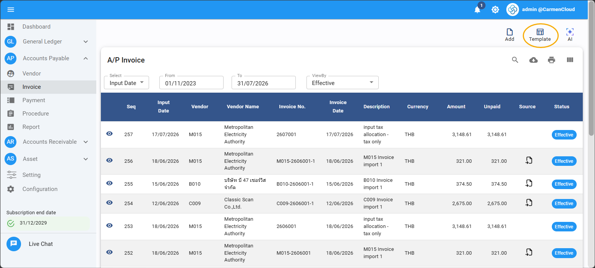
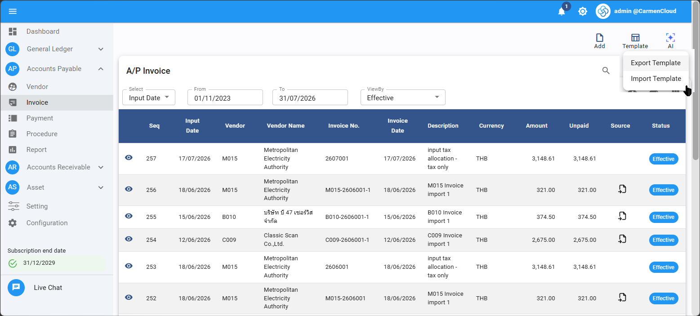
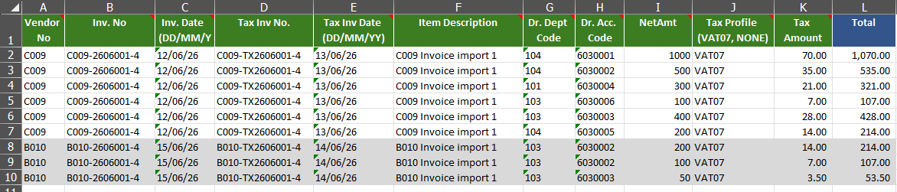
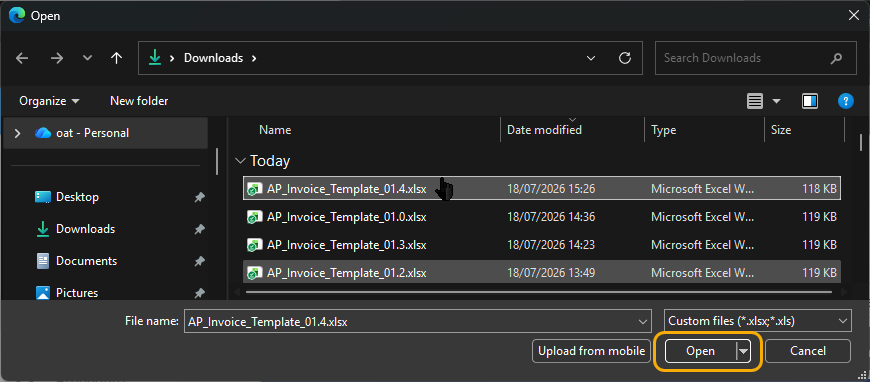
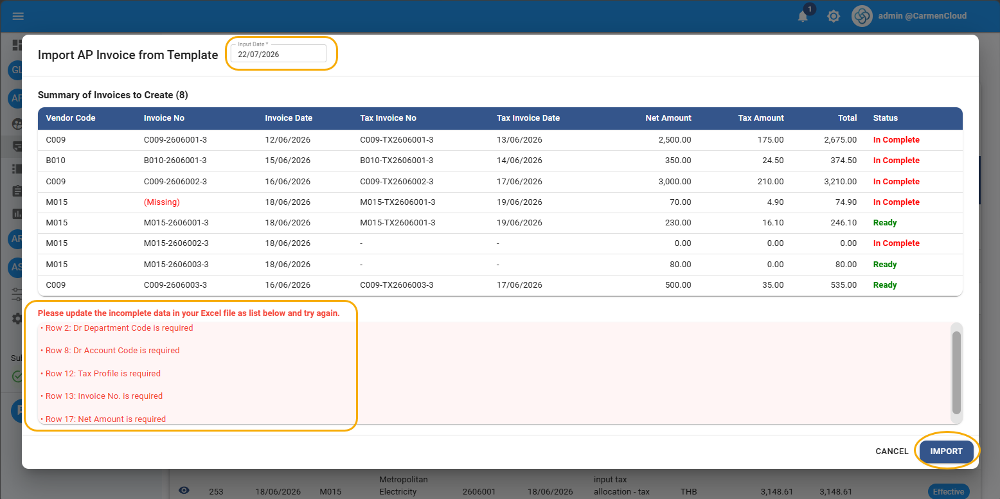
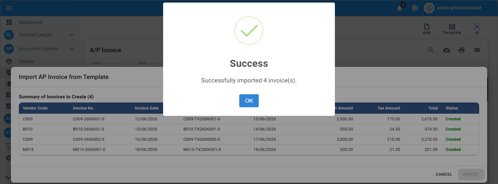

---
title: "Invoice by Template"
weight: 12
---
# ขั้นตอนการสร้าง A/P Invoice โดยใช้ Import Template

ฟังก์ชัน **Import Template** ใช้สำหรับสร้าง A/P Invoice หลายใบจากไฟล์ Excel ในครั้งเดียว โดยผู้ใช้งานสามารถดาวน์โหลดไฟล์ต้นแบบจากระบบ กรอกข้อมูล แล้วนำไฟล์กลับเข้าสู่ระบบเพื่อตรวจสอบและบันทึก Invoice

## 1. เข้าสู่หน้า A/P Invoice

1. เข้าสู่โมดูล **Accounts Payable**
2. เลือกเมนู **Invoice**
3. ระบบจะแสดงหน้า **A/P Invoice** และปุ่ม **Template** บริเวณด้านขวาบน

## 2. ดาวน์โหลด Excel Template

1. คลิกปุ่ม **Template**
2. เลือก **Export Template**
3. ระบบจะดาวน์โหลดไฟล์ Excel Template สำหรับใช้บันทึกข้อมูล Invoice

## 3. บันทึกข้อมูลใน Excel Template

กรอกข้อมูลลงในไฟล์ Excel Template ตามรายละเอียดด้านล่าง

> **หมายเหตุ:** เครื่องหมาย **\*** ในคู่มือนี้ใช้ระบุว่าเป็นข้อมูลบังคับเท่านั้น โดยเครื่องหมายดังกล่าวไม่ได้แสดงอยู่ในชื่อคอลัมน์ของไฟล์ Excel Template

| Field | รายละเอียด |
|---|---|
| **\* Vendor No** | รหัส Vendor ต้องตรงกับข้อมูลที่มีอยู่ในระบบ |
| **\* Inv. No** | เลขที่ Invoice ตามเอกสารที่ได้รับจาก Vendor |
| **\* Inv. Date** | วันที่ Invoice ในรูปแบบ `DD/MM/YY` |
| Tax Inv No. | เลขที่ใบกำกับภาษีตามเอกสารที่ได้รับจาก Vendor |
| Tax Inv Date | วันที่ใบกำกับภาษีในรูปแบบ `DD/MM/YY` |
| Item Description | รายละเอียดรายการสินค้า หรือบริการ |
| **\* Dr. Dept Code** | Department Code สำหรับบันทึกบัญชีด้าน Debit |
| **\* Dr. Acc. Code** | Account Code สำหรับบันทึกบัญชีด้าน Debit |
| **\* NetAmt** | จำนวนเงินก่อนภาษี |
| **\* Tax Profile** | ประเภทภาษี เช่น `VAT07` หรือ `NONE` |
| Tax Amount | จำนวนเงินภาษี หากไม่มีภาษีให้กรอก `0` |
| Total | จำนวนเงินรวมภาษี สามารถเว้นว่างได้ เนื่องจากระบบจะคำนวณให้อัตโนมัติ |

### หมายเหตุในการกรอกข้อมูล

- สามารถบันทึก Invoice หลายใบในไฟล์เดียวกันได้ โดยไม่ต้องเว้นบรรทัดระหว่าง Invoice
- ต้องกรอกข้อมูลให้ครบทุกบรรทัด หากหลายบรรทัดเป็น Invoice ใบเดียวกัน ให้กรอกข้อมูลส่วนที่ซ้ำกันในทุกบรรทัด
- Department Code และ Account Code สำหรับภาษีซื้อและเจ้าหนี้ ระบบจะใช้ค่า Default ที่กำหนดไว้ใน **Vendor Profile**

## 4. Import Excel Template เข้าสู่ระบบ

1. กลับไปที่หน้า **A/P Invoice**
2. คลิกปุ่ม **Template**
3. เลือก **Import Template**
4. ระบบจะแสดงหน้าต่างสำหรับเลือกไฟล์
5. เลือกไฟล์ Excel Template ที่กรอกข้อมูลแล้ว จากนั้นคลิก **Open**

## 5. ตรวจสอบข้อมูลก่อน Import

ระบบจะแสดงหน้าต่าง **Import AP Invoice from Template** พร้อมสรุป Invoice ที่พบในไฟล์

1. ระบุวันที่ในช่อง **Input Date**
2. ตรวจสอบสถานะของแต่ละ Invoice
   - **Ready** หมายถึงข้อมูลจากไฟล์ Excel ถูกต้องและครบถ้วน พร้อมนำเข้าระบบ
   - **In Complete** หมายถึงข้อมูลไม่ครบถ้วนหรือไม่ถูกต้อง ให้ตรวจสอบรายละเอียดข้อผิดพลาดในกล่องด้านล่าง แล้วแก้ไขไฟล์ Excel ก่อนนำเข้าใหม่
3. เมื่อข้อมูลถูกต้องครบถ้วนแล้ว ให้คลิก **Import**

ตัวอย่างข้อความตรวจสอบข้อมูลที่ระบบอาจแสดง:

- `Dr Department Code is required`
- `Dr Account Code is required`
- `Tax Profile is required`
- `Invoice No. is required`
- `Net Amount is required`

## 6. การตรวจสอบเพิ่มเติมและผลลัพธ์

หลังจากคลิก **Import** ระบบจะตรวจสอบข้อมูลเพิ่มเติม เช่น

- Invoice Number ซ้ำภายใต้ Vendor เดียวกัน
- วันที่เอกสารอยู่ใน Period ที่ปิดไปแล้ว

เมื่อข้อมูลถูกต้อง ระบบจะแสดงข้อความ **Success** พร้อมจำนวน Invoice ที่นำเข้าเรียบร้อยแล้ว ให้คลิก **OK** เพื่อปิดข้อความ

