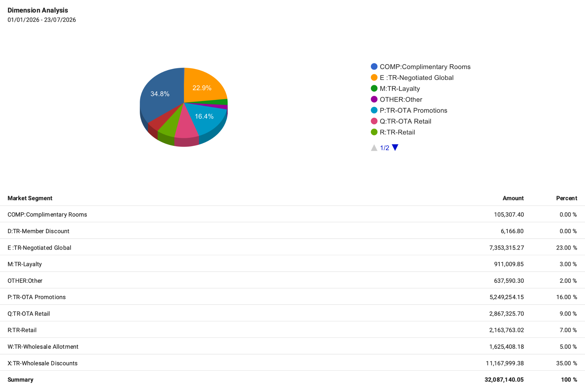
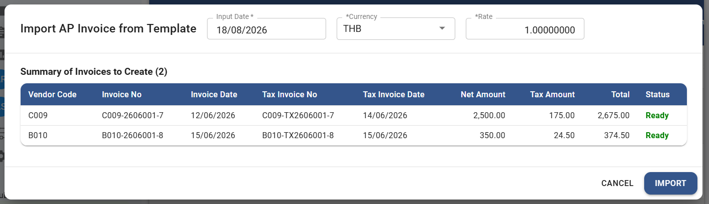

# August 2026 Release Information

Designed to deliver seamless financial workflows and refined system precision, the August 2026 update empowers your team with enhanced automation, optimized navigation, and strengthened performance across key modules.

## Dashboard Module

### Dashboard – Dimension Analysis – Enhanced Dimension Description Display in Analysis Graphs

- Note : Improved data clarity across visual analytics by displaying full dimension descriptions directly on Dimension Analysis graphs for faster insight.
- From : Dashboard 🡪 Dashboard 🡪 Dimension Analysis

    

## Asset Module

### Asset – Report – Accelerated Asset Report Generation

- Note : Boosted system performance to deliver significantly faster generation and retrieval of asset reports, empowering seamless reporting.
- From : Asset Module 🡪 Report

## Accounts Payable Module

### AP – Invoice – Flexible Multi-Currency Support for AP Invoice Excel Import

- Note : Enhanced the AP Invoice Excel import template to allow specifying currency codes and exchange rates directly, simplifying multi-currency transaction entry and accelerating batch uploads.
- From : Accounts Payable Module 🡪 AP Invoice

    

### AP – Invoice – Accelerated AP Invoice Loading

- Note : Optimized data retrieval speed for AP Invoices, allowing teams to review and process vendor records with minimal wait times.
- From : Accounts Payable Module 🡪 AP Invoice

### AP – Payment – High-Performance Invoice Selection in AP Payment

- Note : Streamlined invoice selection within payment processing for smoother, faster disbursement workflows.
- From : Accounts Payable Module 🡪 Payment

## Accounts Receivable Module

### AR – Invoice – High-Speed AR Invoice Rendering

- Note : Accelerated display of customer invoice records to enhance billing review and operational productivity.
- From : Accounts Receivable Module 🡪 AR Invoice

### AR – Receipt – Faster Invoice Selection in AR Receipt

- Note : Quickened invoice lookup and selection during receipt entry to facilitate rapid reconciliation of receivables.
- From : Accounts Receivable Module 🡪 Receipt
