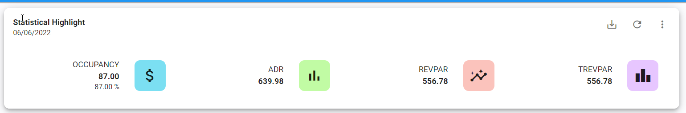
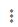
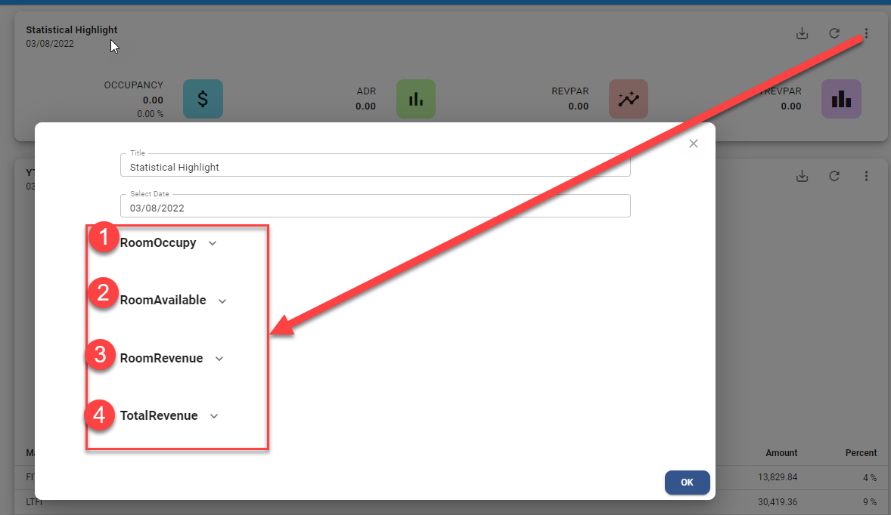
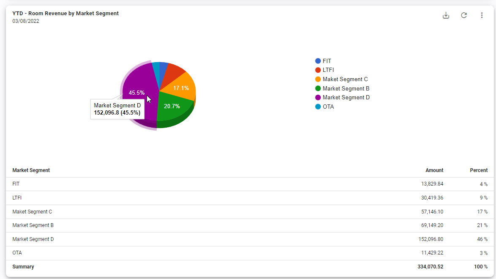
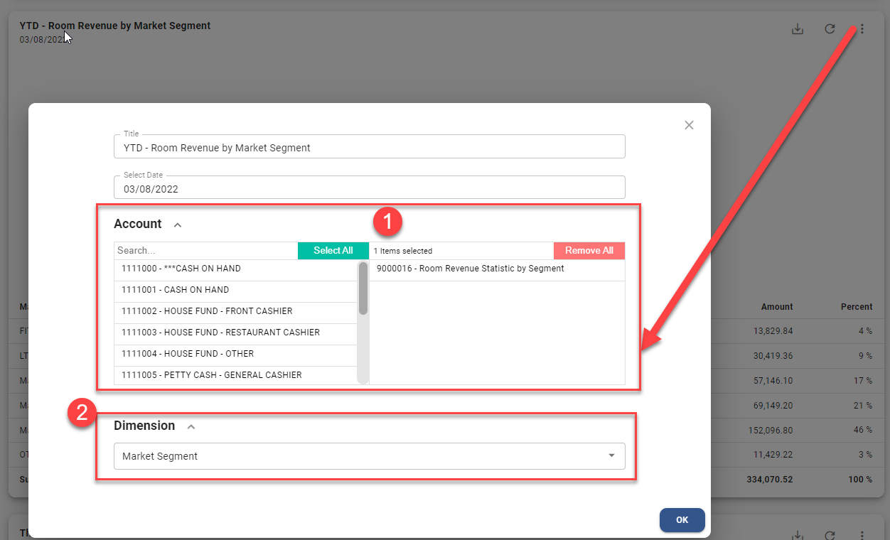
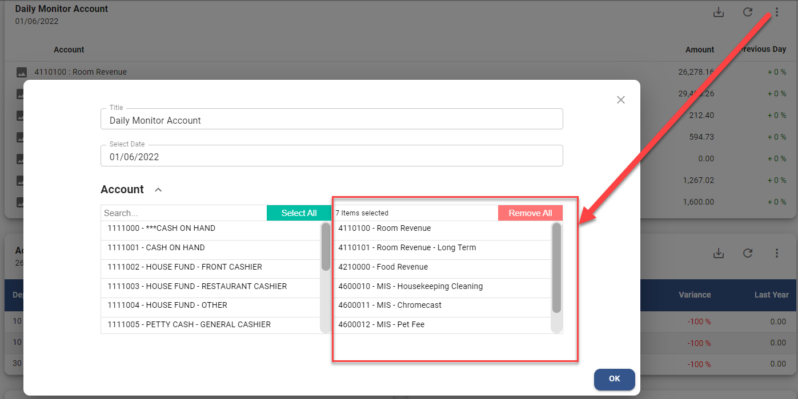

# Dashboard

Dashboard จะนำข้อมูลที่มีการบันทึกใน JV มาแสดงผล

## Statistical Highlight

ข้อมูลทางสถิติการเข้าพักของแขกและแสดงรายได้เฉลี่ยการขายห้องพักในแต่ละวัน โดยจะแสดงข้อมูลดังต่อไปนี้

- OCCUPANCY > แสดง % อัตราการเข้าพัก
- ADR Average Daily Rate > รายได้ค่าห้องพักเฉลี่ยต่อห้องพักที่ขายได้
- REVPAR, Revenue Per Available Room > **รายได้ค่าห้อง** เฉลี่ยต่อห้องพักทั้งหมด (ที่สามารถขายได้)
- TREVPAR, Total Revenue Per Available Room > **รายได้ทั้งหมด** เฉลี่ยต่อห้องพักทั้งหมด (ที่สามารถขายได้)

โดยระบบจะ Default ข้อมูลของเมื่อวานให้ หรือผู้ใช้งานสามารถเลือกวันที่ที่ต้องการจะดูข้อมูลได้

### วิธีการตั้งค่าเพื่อแสดงข้อมูล

1. Click ที่ปุ่ม  ด้านหลังของ Dashboard
2. กำหนดข้อมูลดังต่อไปนี้

1. Room Occupy — Click เลือก Account Code ที่ใช้ในการบันทึกข้อมูล **สถิติของห้องพักที่ขายได้**
2. Room Available — Click เลือก Account Code ที่ใช้ในการบันทึกข้อมูล **สถิติของห้องพักทั้งหมดมีไว้เพื่อขาย**
3. Room Revenue — Click เลือก Account Code ที่ใช้ในการบันทึก **รายได้ห้องพัก**
4. Total Revenue — Click เลือก Account Code ที่ใช้ในการบันทึก **รายได้ทั้งหมด**
5. กดปุ่ม **OK** เพื่อบันทึกข้อมูล

## Dimension Analysis

ข้อมูลรายได้ห้องพัก **โดยแยกตาม Market Segment** ซึ่งในระบบจะแยกการบันทึกบัญชี โดยใช้ Dimension filed เป็นตัวแยก

และแสดงยอดรวมตาม Year to Date คือยอดรวมตั้งแต่วันแรกของปี จนถึงวันปัจจุบัน หรือวันที่ที่กำหนดไว้ โดยจะแสดงข้อมูลดังต่อไปนี้

- แผนภูมิวงกลมแสดงอัตราส่วนรายได้ค่าห้องพักของแต่ละ Market Segment
- Market Segment > แสดงคำอธิบายรายการของแต่ละ Market Segment
- Amount > แสดง **ยอดรวม** ของแต่ละ Market Segment
- Percent > แสดงเปอร์เซ็นต์ของ **รายได้** แต่ละ Market Segment ตามอัตตาส่วนของรายได้ค่าห้องพักทั้งหมด

### วิธีการตั้งค่าเพื่อแสดงข้อมูล

1. Click ที่ปุ่ม  ด้านหลังของ Dashboard
2. กำหนดข้อมูลดังต่อไปนี้

1. Account — Click เลือก Account Code ที่ใช้ในการบันทึก **รายได้ห้องพัก**
2. Dimension — เลือก Dimension ที่ใช้ระบุ Market Segment
3. กดปุ่ม **OK** เพื่อบันทึกข้อมูล

## This Year VS Last Year

กราฟแท่งแสดงยอดรวม เปรียบเทียบข้อมูลระหว่าง **ยอด Actual ปีปัจจุบัน** กับ **ยอด Actual ของปีที่แล้ว** 12 เดือน ทั้งนี้ยังสามารถเลือกดูข้อมูลย้อนหลังของปีที่ผ่านมาแล้วได้ด้วย โดยจะแสดงข้อมูลดังต่อไปนี้

- แท่งสีเทา แสดงยอด Actual ของปีที่แล้ว หรือปีก่อนหน้า
- แท่งสีฟ้า แสดงยอด Actual ปีปัจจุบัน หรือปีที่กำหนดไว้

### วิธีการตั้งค่าเพื่อแสดงข้อมูล

1. Click ที่ปุ่ม  ด้านหลังของ Dashboard
2. กำหนดข้อมูลดังต่อไปนี้

1. Account — Click เลือก Account Code ที่ต้องการให้ระบบแสดงผลรวม
2. Department — Click เลือก Department ที่ต้องการให้ระบบแสดงผลรวม
3. กดปุ่ม **OK** เพื่อบันทึกข้อมูล

## Monthly P&L Summary

ผลรวมกำไรขาดทุนในแต่ละเดือน สำหรับไม่ต้องตั้งค่าระบบจะแสดงผลรวม โดยจะแสดงข้อมูลดังต่อไปนี้

- TOTAL REVENUE > แสดงยอดรวมของรายได้
- TOTAL COST & EXPENSE > แสดงยอดรวมของต้นทุนและค่าใช้จ่าย
- TOTAL PROFIT > แสดงผลรวมกำไร/ขาดทุน
- GOAL THIS MONTH TO COMPLETION > แสดงส่วนต่างระหว่าง Net Profit Actual กับ budget Profit

### วิธีการตั้งค่าเพื่อแสดงข้อมูล

ไม่ต้องตั้งค่า

## Daily Monitor Account

แสดงยอดรวมของรหัสบัญชี (ตามที่เดตอัพไว้) เป็นแบบรายวัน โดยจะแสดงข้อมูลดังต่อไปนี้

- Account > แสดงรหัสและชื่อของ Account Code
- Amount > แสดงยอดรวมของวันที่ที่เรียกดู
- Previous Day > แสดงการเปรียบเทียบผลต่างขอวันที่เรียกดูข้อมูลและวันก่อนหน้าเป็นแบบ %

### วิธีการตั้งค่าเพื่อแสดงข้อมูล

1. Click ที่ปุ่ม  ด้านหลังของ Dashboard
2. กำหนดข้อมูลดังต่อไปนี้

1. Account — Click เลือก Account Code ที่ต้องการให้ระบบแสดงผลรวม
2. กดปุ่ม **OK** เพื่อบันทึกข้อมูล
